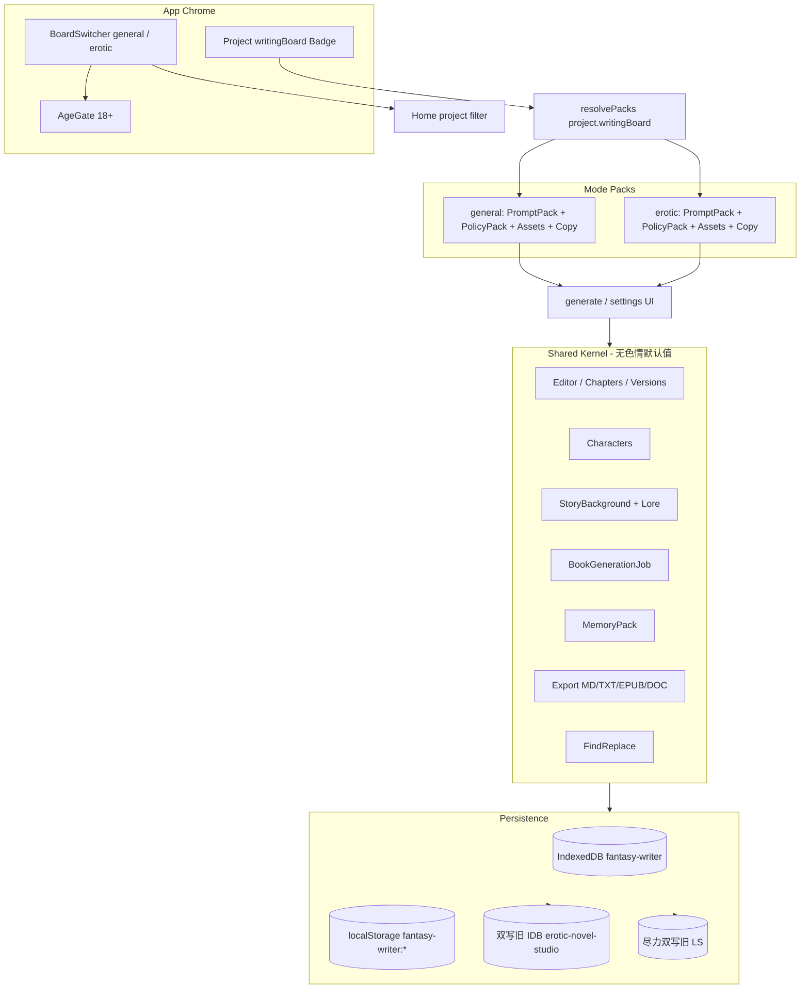
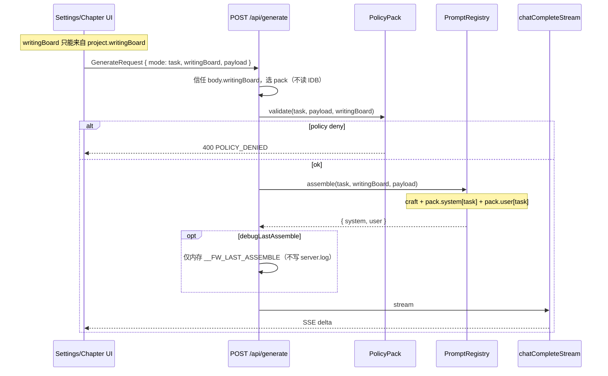
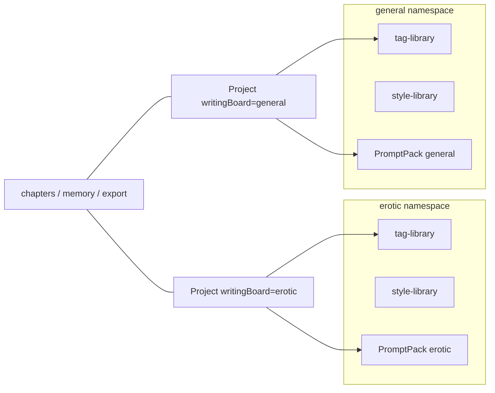

# Fantasy Writer（幻想作家）项目重构规划与开发方案

| 字段 | 值 |
|------|-----|
| **文档标题** | Fantasy Writer / 幻想作家 — 产品与架构重构规划 |
| **作者** | Grisia Studio 工程负责人 |
| **日期** | 2026-08-17（初稿） / 2026-08-18 评审修订 / **2026-08-19 第三轮修订** |
| **状态** | Revised（round 3） |
| **基线版本** | `h-novelist` **1.8.1**（`package.json`） |
| **目标版本** | 2.0.0（M4 品牌落地） / 中间里程碑按 1.9.x 发过渡包 |
| **适用仓库** | `D:\Grisia Studio\H Nove List` |
| **schemaVersion** | 现网隐式 `1`（`NovelProject` 无该字段） → 目标 **`2`** |

---

## Overview

H-NoveList 1.8.1 已是一套可工作的 **local-first AI 长篇写作桌面/Web 应用**：设定 → 大纲 → 流式正文 → 全书队列 / 记忆包 / 版本 / 查找替换 / 多格式导出均已落地。但它的品牌、存储键、默认标签、生成参数、`ADULT_SYSTEM` 提示词栈全部把产品钉死在「色情小说专用工具」上。

本方案将产品正式更名为 **Fantasy Writer / 幻想作家**，在**不重写技术栈、不削弱 18+ 能力**的前提下，把产品升级为两个一等公民写作台：

- **常规小说写作**（`writingBoard: "general"`）：主流 / 类型 / 文学向。UI 文案写「常规」或「文学」，**枚举值禁止用 `"literary"`**（与现网 `WritingStyle = "literary"` 撞名）。
- **色情小说写作**（`writingBoard: "erotic"`）：成年情色虚构，18+，现有能力完整保留。

共享内核（编辑器、章节、人物、世界、导出、全书任务、记忆包、版本、查找替换）一份实现；隔离层（策略、提示词、安全审核、标签/文风库、文案、默认工作流）以 **feature pack / strategy object** 注入。所有现有项目迁移为 `writingBoard=erotic` + 默认卷。

**存储合同（M0–M3）**：新键 `fantasy-writer:*` 为主；旧键 `erotic-novel-studio:*` / `h-novelist:*` **双读 + 双写**——旧 IDB **必须**双写，旧 localStorage **尽力**双写（配额失败不阻断、不回滚失败）。M4 停止写入旧键，保留只读一轮。不是「只读兼容后只写新键」。

**安装包合同**：artifact 文件名**不得**从带空格的 `productName` 推导。2.0.0 必须同时发布 `Fantasy-Writer-Setup-2.0.0.exe` 与字节相同的 `H-NoveList-Setup-2.0.0.exe`，否则库存 1.8.1 客户端看不见更新。

---

## Background & Motivation

### 当前产品事实（已对照仓库复核）

| 项 | 证据 |
|----|------|
| 包名 / 版本 | `package.json`：`name=h-novelist`，`version=1.8.1`，`productName=H-NoveList`，`appId=com.hnovelist.app` |
| 栈 | Next.js **16.2.12** App Router + React **19.2.4** + Tailwind **4** + Electron **37.10.3** + electron-builder NSIS + `openai` SDK 7.x |
| 主存 | `src/lib/storage.ts`：IndexedDB `erotic-novel-studio` v1 store `kv`；localStorage 镜像（`saveProjects` 已 catch 配额失败） |
| 存储键 | `erotic-novel-studio:projects` / `tag-library` / `style-library` / `reader-prefs` / `usage-stats` / `backup-meta` |
| 主题/偏好键 | `src/lib/theme.ts`：`h-novelist:theme`、`h-novelist:app-prefs`；类型是 **`AppPrefs`**（`theme` + `autoConsistencyAfterBookJob`），**没有**并行的 AppPreference |
| 主题事件 | `ThemeToggle.tsx` / `AppSettingsMenu.tsx` 派发 `h-novelist-theme-change` |
| 项目页签键 | `src/app/project/[id]/page.tsx`：`h-novelist:project-tab:${id}` |
| 桌面桥 | `electron/preload.cjs` 暴露 `window.eroticNovelStudio`；`src/lib/desktop.ts` 读取同名 |
| 域模型 | `src/lib/types.ts`：`NovelProject` 无 `writingBoard`、无卷；`GenerationSettings.eroticLevel` 硬编码 1–5；`OutlineChapter.eroticNote`；`LearnedStyle.erotic`；`DEFAULT_TAG_LIBRARY` 仅性行为标签；`WritingStyle` 已含 `"literary"`；`PlotThreadStatus = "planted" \| "active" \| "resolved"`；`BookGenerationJob.mode = "all" \| "missing" \| "retry_errors"` |
| 提示词 | `src/lib/prompts.ts`：全局 `ADULT_SYSTEM` + `SETTING_SYSTEM`；`formatSettings()` 永远输出「色情尺度：n/5」；`formatTagBlock` 写死「强制行为标签」；user builder 硬编码 `情色说明：${chapter.eroticNote}` |
| 生成 API | `src/app/api/generate/route.ts`：跑在 Next standalone **Node 进程**；**读不到** renderer IndexedDB；`body.mode` 是 16 种**任务类型**；`polish_chapter_outline` 无标签则 400 |
| 前端封装 | `src/lib/api.ts`：`postGenerate` / `streamGenerate` 接受 `Record<string, unknown>`；约 28 处调用散布在 7 个文件 |
| 持久化钩子 | 真实写盘路径是 `src/hooks/useProjectStore.ts` 防抖调用 `upsertProject`；`createEmptyProject` **仅** `src/app/page.tsx` 一处调用 |
| UI | 首页 `src/app/page.tsx` 三 Tab；项目页三阶段；`SettingsPanel` 首字段「色情尺度」；`TagsPanel`「本书强制标签 / 行为标签」 |
| 桌面更新 | `electron/main.cjs` **仅** `SETUP_RE = /H-NoveList-Setup-...exe/`；`scripts/publish-update.mjs` `findLatestSetup` 同正则；扫描 `H-NoveList-Updates`、`%APPDATA%\h-novelist\updates` |
| 名称锁 | `scripts/rename-lock.mjs` 把 `package-lock.json` 的 `name` 强制写回 `h-novelist` |
| 已有能力（必须保留） | 记忆包 `src/lib/memory-pack.ts`；全书队列 `src/lib/book-job.ts`；导出 MD/TXT/EPUB/DOC `src/lib/export-book.ts`；章版本 `MAX_CHAPTER_VERSIONS=12`；伏笔 `PlotThread`；场景 `ChapterScene`；用量统计 |
| 测试 / CI | `package.json` **无** `scripts.test`；仓库 **无** `.github/workflows`；无根 LICENSE |
| CSP | `next.config.ts` / `layout.tsx` **无** Content-Security-Policy；`THEME_BOOT_SCRIPT` 经 `dangerouslySetInnerHTML` 内联 |

### 痛点

1. **品牌与定位锁死**：安装包、窗口标题、README、EPUB author、`config.env` 注释全部是 H-NoveList；无法对常规作者诚实介绍产品。
2. **单一提示词栈污染**：任何「文学细腻」风格仍被 `ADULT_SYSTEM` 强制写成成人情色；`formatSettings()` 永远输出「色情尺度：n/5」。
3. **资产库不可分**：全局标签库默认「口交/肛交/…」，常规项目打开就会看见。
4. **无写作台字段、无卷**：长篇类型小说缺少 作品→卷→章 结构。
5. **内核与色情模块编译期耦合**：`prompts.ts` 一个文件同时服务设定扩写、大纲、正文、改写、学习文风。

### 为什么现在做

内核（队列、记忆包、版本、导出、一致性）已经够用，缺的是 **IA 与策略层**。继续在 `ADULT_SYSTEM` 上打补丁只会让常规模式永远漏色情，或反过来削弱 18+ 能力。双写作台必须作为一等字段进入 schema v2，而不是 UI 开关。

---

## Goals & Non-Goals

### Goals

1. 官方品牌落地：**Fantasy Writer / 幻想作家**。安装包文件名必须是连字符 `Fantasy-Writer-Setup-x.y.z.exe`。
2. 两个一等写作台并存，一键切换看板，互不污染。
3. 共享内核复用现有实现，不重写编辑器 / 队列 / 导出。
4. 色情模式能力 **不降级**：尺度 1–5、行为标签硬性落实、`more_erotic`/`less_erotic` 改写、成人设定扩写、文风档案的情色技法字段全部保留。
5. 常规模式 **零色情泄漏**：system / **user** prompt、默认标签、UI 文案、生成参数、学习文风默认字段均不得注入情色指令或成人标签。
6. 全部旧项目 → `writingBoard=erotic` + `schemaVersion=2` + 默认卷；M0–M3 **双写**旧 IDB + 尽力双写旧 LS。
7. 可执行分期：M0–M4，每期有验收标准与独立可审 PR。
8. **库存 1.8.1 必须能直接升到 2.0.0**（跳级升级是硬性要求，不是「则更佳」）。

### Non-Goals

- 不重写为 Flutter / Spring / Vue / Python / Tauri。
- 不 fork NovelForge、SillyTavern 或任何 GPL/AGPL 源码入库。
- 不做云同步、多租户 SaaS、账号系统。
- M4 之前不做完整知识图谱 / Neo4j / 向量 RAG。
- 不做角色卡市场、插件商店。
- 不删除或「洗白」色情写作能力。
- 不把项目 `writingBoard` 做成可随看板一键改写的软字段（必须走显式转换向导）。
- **2.0 不设第三块「mature 但不色情」写作台**。`contentRating` 仅预留字段，政策与 UI 不读它。
- 2.0 不把 Character Card V2 做成必做导入（M3 只加 `aliases` / `speechStyle`）。

---

# 1. 执行摘要

Fantasy Writer 是 H-NoveList 的就地演化，不是新产品重写。

**一句话决策**：保留 Next.js 16 + Electron 37 + IndexedDB local-first；把「写作台」做成与项目同级的一等公民 `writingBoard: "general" | "erotic"`；用 PromptPack / PolicyPack / AssetLibrary 三件套隔离；Node 生成路由**信任**请求体里的 `writingBoard`（它读不到 IDB）。

**交付切片**：

| 里程碑 | 版本建议 | 核心交付 | 用户可感知 | 粗估人日（单人） |
|--------|----------|----------|------------|------------------|
| M0 | 1.9.0 | `schemaVersion` + `writingBoard` + 存储双读双写；更新器双正则 | 旧数据不丢；UI 仍像 H-NoveList | 4.5 |
| M1 | 1.9.5 | 双看板 IA + prompt/policy 拆分 + 库按 writingBoard 命名空间 + 泄漏门禁 | 首页可切「常规 / 色情」；项目带徽章 | 9.5（含 PR0–PR7） |
| M2 | 1.10.0 | 常规模式完整工作流，泄漏测试全绿 | 可认真写一部非成人长篇 | 4 |
| M3 | 1.11.0 | 卷结构 + Lore 条目 + Prompt Workshop lite | 长篇分卷；可改提示词模板 | 6 |
| M4 | 2.0.0 | 品牌全面更名、**双 artifact**、停双写、导出按卷 | 对外只叫 Fantasy Writer | 4 |

M1 不是「6–10 个可审 PR 即可」的轻松切片：它覆盖 PR0–PR7、vitest、全部 generate 调用点、Settings/Tags 隔离。合计约 **28 人日** 到 M4 品牌包。

**关键数字（规划假设，用于排期与测试）**

- 现网单用户项目数：个位数～数十。按 **50 项目 × 平均 30 章 × 3k 字** 估算：正文约 4.5M 汉字 ≈ 9–13 MB JSON；加版本栈（每章最多 12 版）上限约 **80–120 MB / 库**。M0–M3 双 IDB 写入使磁盘约 **2×**（160–240 MB），可接受。
- 生成延迟目标（相对 1.8.1 不退化）：大纲 JSON < 20s（4k tokens）；单章流式首字节 < 2s（网络允许时）；全书队列与现网一致可暂停/续跑。
- 看板切换：< 50ms，只改 chrome，不重载项目数据。
- 迁移：冷启动 `initStorage()` 一次完成，目标 < 500ms（50 项目）。
- Lore 注入上限：**8 条 / 合计 2000 字**。

**最高优先级风险**

1. 常规模式提示词泄漏色情（产品级 bug，P0）。
2. 更名导致 Electron `userData` 路径漂移，API Key / 更新目录丢失（P0）。
3. 误把项目 `writingBoard` 跟看板开关绑死，写脏数据（P0）。
4. 2.0 只发 `Fantasy-Writer-Setup-*.exe`，库存 1.8.1 升不上去（P0）。

---

# 2. 调研报告（项目对比表 + 可借鉴结论）

调研日期：**2026-08-17**。星标与许可证均来自 GitHub 页面或仓库 README / LICENSE，**未编造**。活动列以仓库近期可见提交 / Release 为准；「活跃」= 近数月仍有提交或发版说明。2026-08-18 评审复核：novel-studio 栈更正为 Go；RisuAI slug 更正大小写；StoryMoss 钉死调研日数字。

## 2.1 常规 / 长篇写作类

| 项目 | 星标（2026-08-17） | 许可证 | 栈 | 核心能力 | 架构要点 | 许可证风险 |
|------|-------------------|--------|-----|----------|----------|------------|
| [vkbo/novelWriter](https://github.com/vkbo/novelWriter) | **3100** | **GPLv3** | Python + Qt6 / PyQt6 | 多文档长篇编辑、类 Markdown、synopsis / 交叉引用、纯文本稳健存储 | 无 AI；项目=多小文件，适合 VCS | **禁止拷代码**；只借 IA |
| [RhythmicWave/NovelForge](https://github.com/RhythmicWave/NovelForge) | **1100** | **AGPLv3 + 商用授权** | Electron + Vue3 + FastAPI + SQLite（图谱可选 Neo4j） | Schema 卡片、@DSL 上下文、知识图谱、Prompt Workshop、工作流、卷/阶段/章 | 卡片类型可自定义；审核结果卡片化 | **禁止 vendor AGPL**；产品形态过重 |
| [NousResearch/autonovel](https://github.com/NousResearch/autonovel) | **1500** | **仓库未见 LICENSE 文件**（调研日文件树无 LICENSE；有 PIPELINE.md / ANTI-SLOP.md / canon.md） | Python 管线 | foundation / draft / revision、anti-slop、`canon.md`、voice fingerprint、evaluate 循环 | 文档即世界状态；不是产品 UI | 无许可声明则**不得复制源码**；只借流程思想 |
| [Deng-m1/MaliangAINovalWriter](https://github.com/Deng-m1/MaliangAINovalWriter) | **851** | **Apache-2.0** | Flutter + Spring Boot 3 + Mongo + Chroma | 作品→卷→章→场景、提示词/预设、Next Outline、LLM 可观测性 | 重 SaaS / 管理后台 | 许可宽松，但栈与本产品不匹配，**不 fork** |
| [heider-x/vela](https://github.com/heider-x/vela) | **520** | **GPL-3.0** | Electron + React + TS + SQLite RAG | 本地 LLM + RAG 小说 IDE、大纲→章→Rewrite/Refine/Review | 与本栈最像，但 GPL | **禁止拷代码** |
| [Nigh/show-me-the-story](https://github.com/Nigh/show-me-the-story) | **476** | **MIT** | 单文件 Go + Vite/Svelte Web UI | 大纲后逐章、审核、伏笔、事实核查、叙事记忆、全书抛光 | 项目=目录 JSON/MD；上下文随章数线性增长有量化表 | 可合法参考实现思路；**不整仓搬迁** |
| [zy-zmc/tianming-novel-ai-writer](https://github.com/zy-zmc/tianming-novel-ai-writer) | **397** | **MIT**（README 另声明商用需联系作者） | .NET 8 + WPF | 15 维事实快照、12 类变更声明、6 道生成门禁 | 「状态回写」抗长篇漂移 | 思想可借鉴；商用条款需法务再确认 |
| [olivierkes/manuskript](https://github.com/olivierkes/manuskript) | **2400** | **GPL-3.0+** | Python / Qt | 雪花法、情节线、人物、非 AI 写作环境 | 经典桌面长篇 IA | 禁止拷代码 |
| [notnotype/neuro-book](https://github.com/notnotype/neuro-book) | **506** | **AGPL-3.0-only** | Nuxt 本地工作区 | 文件型 Project Workspace、Markdown Studio、lorebook、多智能体 | 小说 IDE + 角色扮演混合 | 禁止 vendor |
| [YuanShiJiLoong/author](https://github.com/YuanShiJiLoong/author) | **194** | **AGPL-3.0** | AI 写作平台（富文本） | 小说/剧本向编辑 + AI | 产品重叠但许可不可用 | 禁止拷代码 |
| [Xiaoyangy/novel-studio](https://github.com/Xiaoyangy/novel-studio) | **79** | **Apache-2.0** | **Go**，本地优先 | 多智能体世界推演、按弧规划、RAG、逐章审核、断点恢复 | 引擎而非桌面产品 | 可读协议/状态机，不换栈 |
| [raestrada/storycraftr](https://github.com/raestrada/storycraftr) | **155** | **MIT** | Python CLI | 世界、大纲、章节的 CLI 工作流 | 非 GUI | 可参考目录约定 |
| [jackaduma/Recurrent-LLM](https://github.com/jackaduma/Recurrent-LLM) | **205** | **MIT** | Python | RecurrentGPT：长文本循环状态 | 论文实现，非产品 | 可借鉴「短状态卡」抗漂移 |
| [91zgaoge/StoryMoss](https://github.com/91zgaoge/StoryMoss) | **52** | **ISC**（README badge） | Tauri 2 + React + Rust | 幕前/幕后双界面、伏笔、StyleDNA、资产回流 | 重代理编排；测试密度高 | 许可宽松，但产品复杂度远超本阶段 |

## 2.2 成人 / 无审查 / RP 写作类（本产品必须覆盖）

| 项目 | 星标（2026-08-17） | 许可证 | 栈 | 核心能力 | 架构要点 | 许可证风险 |
|------|-------------------|--------|-----|----------|----------|------------|
| [SillyTavern/SillyTavern](https://github.com/SillyTavern/SillyTavern) | **32200** | **AGPLv3** | Node 本地前端 | WorldInfo / lorebooks、prompt presets、角色卡、扩展、无审查能力 | **预设与隔离**是业界标准 | **禁止 fork 进本仓库**；只借概念 |
| [kwaroran/RisuAI](https://github.com/kwaroran/RisuAI) | **1600** | **GPL-3.0** | Svelte 跨端 | 多 API、插件、lore、资源进对话 | 插件隔离思路 | 禁止拷代码 |
| [agnaistic/agnai](https://github.com/agnaistic/agnai) | **771** | **AGPL-3.0** | TypeScript 多用户聊天 | 多引擎、角色、preset | 多租户 SaaS 向 | 禁止 vendor |
| [malfoyslastname/character-card-spec-v2](https://github.com/malfoyslastname/character-card-spec-v2) | **183** | **规范文档，未见软件许可证** | Markdown 规格 | Character Card V2 字段（personality / scenario / first_mes / alternate_greetings / extensions） | 互操作标准 | 可按规格**自研导入导出**，不复制他人卡站代码 |
| [LostRuins/koboldcpp](https://github.com/LostRuins/koboldcpp) | **11400** | **AGPLv3**（Lite UI 亦 AGPL；底层 ggml/llama.cpp 为 MIT） | C++/Python 本地推理 | 一键跑 GGUF、面向创意写作 / 无审查本地前端谱系 | 是推理前端，不是长篇 IDE | 禁止拷代码；M4+ 可「连接」而非内嵌 |

## 2.3 能力维度对照（对 Fantasy Writer 的映射）

图例：● 强 / ◐ 有 / ○ 无或极弱。本产品列以 **1.8.1 现状** 计。

| 维度 | novelWriter | NovelForge | autonovel | 马良 | Vela | show-me-the-story | SillyTavern | **H-NoveList 1.8.1** | **FW 目标 M4** |
|------|-------------|------------|-----------|------|------|-------------------|-------------|----------------------|----------------|
| 编辑器 / 章节管理 | ● | ● | ◐ | ● | ● | ● | ○（聊天） | ● 章+场景+版本 | ● + 卷 |
| 人物 / 世界 | ◐ | ● 卡片 | ● md 层 | ● 设定树 | ● | ● | ● 角色卡+WI | ◐ Character + StoryBackground | ● + LoreEntry |
| 大纲 / 情节 | ◐ | ● | ● | ● 三级大纲 | ● | ● | ○ | ● Outline + PlotThread | ● + 卷大纲 |
| 多卷 | ◐ 文件夹 | ● | ◐ part | ● | ◐ | ◐ 按卷核查 | ○ | **○** | ● M3 |
| AI 生成 / 续写 | ○ | ● | ● 管线 | ● | ● | ● | ● 对话 | ● 流式+队列 | ● 保持 |
| 文风 / 热度控制 | ○ | ◐ | ● voice.md | ◐ 预设 | ◐ | ● skills | ● preset | ● 尺度1–5+学习文风 | ● 分 writingBoard |
| 多模式切换 | ○ | ○ | ○ | ○ | ○ | ○ | ◐ preset | **○** | **● 一等** |
| 内容隔离 / 配置 | ○ | ◐ 提示词工坊 | ◐ 文件层 | ● 预设 | ◐ | ◐ 项目 prompts | **● preset/WI** | **○ 单栈** | **● pack** |
| 导入导出 | ● | ● | ● PDF/ePub | ◐ txt | ◐ | ● TXT/MD | 角色卡 | ● JSON/MD/TXT/EPUB/DOC | ● + 卡规格可选 |

## 2.4 「可借鉴 / 可改造 / 需自研」清单（带证据）

### 可借鉴（只借 IA / 协议 / 流程，不进仓库源码）

| 想法 | 来源 | 落到本项目的位置 |
|------|------|------------------|
| 多文档 + 卷/文件夹 IA | novelWriter、manuskript | M3 `Volume`；项目树左栏 |
| 作品→卷→章→场景 四级 | 马良 README「层级化内容管理」 | 域模型 v2；现有 `ChapterScene` 已是第四级雏形 |
| Schema / 卡片类型 | NovelForge Schema-first | M3 Lore / 角色扩展用 **自研瘦 Schema**，不引入其 DSL |
| Prompt Workshop + 知识库注入 | NovelForge、马良「提示词/预设管理」 | M3 `PromptPack` 可编辑模板；**自研**，字段远少于 NovelForge |
| @ 引用上下文 | NovelForge @DSL | **不进 M3 必做**。推到 M3+ / 2.1：`@char:name` / `@lore:id` / `@vol:prev`，自己写解析 |
| foundation→draft→revision、canon、anti-slop | autonovel `PIPELINE.md` / `ANTI-SLOP.md` / `canon.md` | M2 常规模式增加「文笔守则」层；一致性已有 `consistency_check` |
| 叙事记忆 / 伏笔状态机 | show-me-the-story | 已有 `PlotThread`（现网枚举是 **`planted \| active \| resolved`**，不是 progressing）；补超期告警即可 |
| 短状态回写抗漂移 | 天命「事实快照」、Recurrent-LLM、本仓库 `memory-pack.ts` | **已有** `buildMemoryPack`；常规模式复用，不注入情色 |
| WorldInfo / lorebooks 按关键词激活 | SillyTavern | M3 `LoreEntry.keys` + 生成前检索；**自研 ~80 行**，上限 8 条 / 2k 字 |
| Prompt Preset 隔离 | SillyTavern / RisuAI / Agnai | `PromptPack` + `PolicyPack` 按 `WritingBoard` 分文件 |
| Character Card V2 字段超集 | character-card-spec-v2 | 2.0 **不加** `cardV2?` 字段。M3 只扩 `aliases?` / `speechStyle?`；完整导入推后 |
| 幕前写作 / 幕后资产 | StoryMoss | 已有三阶段（设定/创作/检视）对应；不必上双窗口 |
| BYOK + 本地优先 | Vela、本仓库 `src/lib/ai.ts` | **已有**：Key 在 `.env.local` / `userData/config.env` |

### 可改造（本仓库已有雏形，按 writingBoard 拆开）

| 现有模块 | 文件 | 改造 |
|----------|------|------|
| 单一 `ADULT_SYSTEM` | `src/lib/prompts.ts` | PR4 **原文搬迁**到 `prompts/erotic.ts`；PR5 再接线 `craft` + `general` pack |
| `GenerationSettings.eroticLevel` | `src/lib/types.ts` | 常规看板 UI 隐藏且 **不注入** prompt；色情看板保留 |
| `DEFAULT_TAG_LIBRARY` | `types.ts` + `storage.ts` | 命名空间 `erotic.tags` / `general.tags` |
| `LearnedStyle.erotic` | `types.ts` | **保留**可选 `erotic?: string`（仅 erotic 档案）；**不**改名为 `modeExtras`。新增 `writingBoard` 字段 |
| 首页三 Tab | `src/app/page.tsx` | 顶栏看板开关 + 项目按 `writingBoard` 分组 |
| `SettingsPanel` / `TagsPanel` 文案 | 对应组件 | 走 `copy.ts` pack；常规绑定类型标签，色情绑定行为标签 |
| `/api/generate` | `route.ts` + `api.ts` | 请求体强制带 `writingBoard`；服务端**信任该字段**组 pack，不读 IDB |
| 存储键 / IDB 名 | `storage.ts` | 双读；双写旧 IDB + 尽力双写旧 LS |
| 桌面桥名 | `preload.cjs` / `desktop.ts` | 双暴露一个过渡期 |

### 需自研（对标没有可安全复制的实现，或产品差异要求自建）

1. **双一等写作台 + 项目 writingBoard 不可被看板误改** — 调研对象全部没有「常规/色情」产品级隔离。
2. **模式泄漏测试套件** — 必须自研，作为 P0 门禁。
3. **就地迁移 `erotic-novel-studio:*` → `fantasy-writer:*`** — 无现成工具。
4. **转换向导**（erotic ↔ general）— 涉及标签剥离 / 尺度字段 / 二次确认 / 文风快照清理。
5. **桌面更名双正则 + 双 artifact 更新器** — 本仓库 `SETUP_RE` 与 `userData` 路径是私有约定。
6. **PolicyPack**（18+、禁未成年人色情、常规模式禁注入成人标签）— 产品红线，必须自研并测试。

## 2.5 技术选型与「为什么不 fork」

### 推荐默认：就地演化当前栈

| 层 | 选型 | 理由 |
|----|------|------|
| UI | **保持** Next.js 16 App Router + React 19 + Tailwind 4 | 项目页、流式 SSE、三阶段导航已绑定；`next.config.ts` 已 `output: "standalone"` |
| 桌面 | **保持** Electron 37 + electron-builder NSIS | 安装包、更新扫描、`config.env` 路径已跑通 1.8.1 |
| 数据 | **保持** IndexedDB 主存 + localStorage 镜像 | 单机 local-first；50 项目量级足够；**M3 不上 SQLite**（双 IDB 已 2× 磁盘，换引擎收益低于迁移风险） |
| AI | **保持** OpenAI 兼容 SDK → DeepSeek 默认 | `src/lib/ai.ts` 已支持 Base URL / 模型 / 桌面 `APP_CONFIG_PATH` |
| 模式层 | **新增** TS strategy packs | **静态 import 两边 pack + ESLint `no-restricted-imports`**。不用动态 import（Next 路由分析更简单，测试策略一致） |

### 备选否决

**备选 A — 重写成 NovelForge 形态（Vue + FastAPI + SQLite）**  
否决。AGPL 污染；后端进程模型与当前「Electron 嵌 Next standalone」冲突；用户数据在浏览器 IDB，搬迁成本高于功能收益。

**备选 B — fork SillyTavern 做长篇前端**  
否决。AGPLv3；ST 是 **多轮角色扮演前端**，没有章节队列、全书导出、三阶段长篇 IA。WorldInfo/preset 思想用约 200 行自研即可。

**备选 C — 换成 Vela / 马良栈**  
否决。Vela 是 GPL-3.0；马良是 Flutter+Spring 云端。都与「已有 1.8.1 桌面分发 + 本地 IDB」冲突。

**备选 D — 单文件 `prompts.ts` 里 `if (writingBoard)`**  
否决，采用分 pack 文件。理由见 4.6。

**备选 E — 第三块「mature 但不色情」写作台**  
否决。2.0 只有 `general | erotic`。`contentRating` 预留但不驱动政策。

**结论**：在 `src/lib/prompts.ts` / `types.ts` / `storage.ts` / 首页与项目页 **就地拆包**。M1 需要 PR0–PR7（约 9.5 人日），不是「几个下午」。完整 M4 不需要新语言或新运行时。

---

# 3. 产品与品牌重构说明

## 3.1 品牌

| 项 | 旧 | 新 |
|----|----|----|
| 对外英文名 | H-NoveList | **Fantasy Writer** |
| 对外中文名 | （无正式中文名 / 内部「色情小说工作室」语义） | **幻想作家** |
| 一句话定位 | AI 人物/大纲/正文编辑器（实际=成人情色） | 双写作台：常规小说与色情小说，本地优先，互不污染 |
| 包名 `package.json.name` | `h-novelist` | M4 **默认仍保持** `h-novelist` 直到 `app.getPath("userData")` 验收证明不会漂；若漂则先做目录拷贝，再评估改 name |
| `productName` | `H-NoveList` | 显示名 **`Fantasy Writer`**（M4）。**禁止**依赖它生成 artifact 文件名 |
| `build.win.artifactName` | `${productName}-Setup-${version}.${ext}` | **显式** `"Fantasy-Writer-Setup-${version}.${ext}"`（见 KD10） |
| `nsis.shortcutName` | `H-NoveList` | `Fantasy Writer`（可含空格） |
| `appId` | `com.hnovelist.app` | **永久保留** `com.hnovelist.app` |
| 快捷方式 | H-NoveList | Fantasy Writer（幻想作家） |
| 窗口标题 | H-NoveList | Fantasy Writer |
| 安装包文件名（主） | `H-NoveList-Setup-x.y.z.exe` | `Fantasy-Writer-Setup-x.y.z.exe` |
| 安装包文件名（兼容副本） | — | **`H-NoveList-Setup-x.y.z.exe`（同一二进制 copy，2.0.0 强制）** |

定位扩展 **不是**「从色情转型文学」，而是：

- 常规小说写作 = 一等公民
- 色情小说写作 = 一等公民
- 二者共存、一键切看板、**内容与策略不交叉**

### 3.1.1 安装包文件名铁律（KD10）

现网 `package.json`：

```json
"productName": "H-NoveList",
"win": { "artifactName": "${productName}-Setup-${version}.${ext}" }
```

今天碰巧能得到 `H-NoveList-Setup-1.8.1.exe`，只因为 `productName` 无空格。若 M4 把 `productName` 改成 `Fantasy Writer` 却不改 `artifactName`，electron-builder 会吐出 **`Fantasy Writer-Setup-2.0.0.exe`（空格）**，**匹配不上**任何计划中的正则。

**冻结三组独立字符串**：

| 用途 | 值 | 可否含空格 |
|------|----|------------|
| 显示名（快捷方式 / 卸载项 / 窗口） | `Fantasy Writer` / `幻想作家` | 可以 |
| artifact 文件名模板 | `Fantasy-Writer-Setup-${version}.${ext}` | **不可以** |
| 兼容副本文件名 | `H-NoveList-Setup-${version}.${ext}` | 不可以（保持 1.8.1 原样） |

备选（同样合法，次选）：`productName: "Fantasy-Writer"` + `shortcutName: "Fantasy Writer"`。无论选哪条，**artifact 必须写死连字符模板**，禁止 `${productName}-Setup-...`。

### 3.1.2 两套 SETUP_RE（必须同时写进代码与测试）

**库存 1.8.1**（`electron/main.cjs` L12，**不会**被我们改到用户机器上）：

```js
/H-NoveList-Setup-(\d+\.\d+\.\d+(?:-[0-9A-Za-z.]+)?)\.exe$/i
```

只认 `H-NoveList-Setup-*.exe`。看不见 `Fantasy-Writer-Setup-2.0.0.exe`，也看不见带空格的 `Fantasy Writer-Setup-2.0.0.exe`。

**M0+ 客户端**（`electron/main.cjs` 的 `versionFromSetupName` 与 `scripts/publish-update.mjs` 的 `findLatestSetup` **同一捕获合同**）：

```js
/^(?:H-NoveList|Fantasy-Writer)-Setup-(\d+\.\d+\.\d+(?:-[0-9A-Za-z.]+)?)\.exe$/i
```

**捕获合同（写死）**：品牌前缀必须是**非捕获组** `(?:…)`。**group 1 永远是 semver**。现网两处提取器都读 `m[1]`：

```js
// electron/main.cjs versionFromSetupName
return m ? m[1] : null;

// scripts/publish-update.mjs findLatestSetup
return { name, version: m[1], path: full, mtime: st.mtimeMs };
```

禁止改成「group 1 = 品牌、group 2 = 版本」再去改提取器。两处正则字面量若不完全相同，捕获组序号必须相同，且 group 1 必须是版本。验收**禁止**只断言 `.test() === true`。

单测必须覆盖（断言的是 `versionFromSetupName(...)` / `m[1]` 返回值）：

| 输入 | 1.8.1 `m[1]` | M0+ `versionFromSetupName` |
|------|--------------|----------------------------|
| `H-NoveList-Setup-1.9.0.exe` | `"1.9.0"` | `"1.9.0"` |
| `H-NoveList-Setup-2.0.0.exe` | `"2.0.0"` | `"2.0.0"` |
| `Fantasy-Writer-Setup-2.0.0.exe` | `null` | `"2.0.0"` |
| `Fantasy Writer-Setup-2.0.0.exe`（空格） | `null` | `null`（防回归） |

M0 双正则只服务 **已经打过 1.9.x 补丁** 的客户端。库存 1.8.1 要升 2.0，**只能**靠兼容副本文件名。见 6.5 / KD10。

## 3.2 两个写作台的产品差异

| 面 | 常规 `general` | 色情 `erotic` |
|----|----------------|---------------|
| 默认受众文案 | 「类型 / 文学 / 网文长篇」 | 「成年向情色虚构 · 18+」 |
| 进入门槛 | 无年龄墙（仍禁止未成年人色情；常规可写非色情未成年角色须走政策包） | **首次进入看板必须确认 18+** |
| 默认标签库 | `DEFAULT_GENERAL_TAG_LIBRARY`（流派/桥段，见附录 A.9） | **保留**现网 `DEFAULT_TAG_LIBRARY` 性行为标签 |
| TagsPanel 绑定 | `project.tags` = **类型标签**（词汇表来自 general pack） | `project.tags` = **行为标签**（现网语义） |
| 生成参数 | 人称、篇幅、文风、类型、节奏；**无色情尺度滑条**；不发送「色情尺度」行 | **完整保留** 尺度 1–5 + 行为标签硬性落实 |
| 文风预设 | 隐藏 `passionate` / `restrained`（偏情色编码）；已存值只读显示 | 全套 `WritingStyle` |
| System prompt | 文学工艺 + 禁止主动写色情 + 不注入成人标签 | 现 `ADULT_SYSTEM` **原文**保留（PR4 不改字） |
| 改写模式 | polish / expand / shorten / dialogue / custom | 另加 `more_erotic` / `less_erotic` |
| 大纲字段 | UI 隐藏 `eroticNote`；JSON 用可选 `intensityNote`（解析后写入 `eroticNote` 以兼容存储） | 保留 `eroticNote` |
| 空状态 | 「从一句话梗概开始一部长篇」 | 「从人物欲望与冲突开始一部成人小说」 |
| 默认工作流 | 设定 → 卷/大纲 → 正文 → 检视 | 设定（含尺度/标签）→ 大纲（含情色规划）→ 正文 → 检视 |

## 3.3 看板开关 vs 项目 writingBoard（产品铁律）

```
AppPrefs.defaultBoard        ← 用户上次停留的看板（可随时点）
NovelProject.writingBoard    ← 创建时选定，此后不可被看板改写
```

- 首页顶栏：**常规 | 色情** 分段控件。只过滤项目列表、切换空状态/默认库/文案。
- 新建项目：落在**当前看板**对应 `writingBoard`；二次确认「这是一部常规小说 / 这是一部 18+ 色情小说」。调用点是 `src/app/page.tsx` 的 `createEmptyProject(name, writingBoard)`。
- 进入已有项目：chrome 跟随 **项目 writingBoard**，不跟随看板。若用户在项目内点看板想看另一边，弹：「离开本书，回到首页的「常规/色情」列表？」而不是改 `project.writingBoard`。
- 转换：设置 → 「转换写作台…」向导（见 6.4），两步确认 + 差异预览。
- **生成请求**必须带 `body.writingBoard = project.writingBoard`，**禁止**填 `AppPrefs.defaultBoard`。

## 3.4 用户旅程

### 旅程 A — 常规长篇（类型/文学）

1. 打开 Fantasy Writer，看板停在「常规」（或点一次切换）。
2. 首页只列 `writingBoard=general` 的书；标签库是流派标签；看不到口交等默认项。
3. 「新建」→ 确认「常规小说」→ 进入设定：人物 / 世界 / **无尺度滑条** / 可选类型标签。
4. AI 扩写人物：system 为文学设定编辑（A.3）；**user 用 A.3.1 general 句**（年龄是自由字段，不写「成年年龄 / 适合成人情色」）。
5. 生成大纲：章节有冲突与节拍；JSON 字段用 `intensityNote`（可选）；**不要求** `eroticNote`。
6. 一键全书队列 + 记忆包（角色状态卡 + 前情 + 伏笔），与现网相同。
7. 检视：一致性、大纲对照、查找替换、导出 MD/EPUB。EPUB author = `Fantasy Writer`（M4）。

### 旅程 B — 色情长篇（18+，能力不弱于 1.8.1）

1. 切到「色情」看板；若从未确认过 18+，先模态确认。
2. **升级用户**（迁移后 `defaultBoard=erotic`）：M1 后**首次**冷启动撞 AgeGate（出示条件：`defaultBoard==="erotic" && !adultConfirmedAt`）。确认 → 写 `AppPrefs.adultConfirmedAt`（ISO），**本用户配置此后冷启动不再出门**。拒绝 → 只留常规空看板，**数据不删**，不写 `adultConfirmedAt`，下次冷启动再出门。
3. 标签库仍是（或包含）口交/肛交/… 默认集；可继续维护。
4. 新建或打开旧书：生成参数第一项仍是「色情尺度 1–5」，文案与 `EROTIC_LEVEL_LABELS` 一致。
5. 大纲强制规划标签落实；`eroticNote` 保留；`polish_chapter_outline` 仍要求有标签才能优化。
6. 正文 / 续写 / `more_erotic` 全部走成人 pack；未成年人禁令不变。
7. 导出、队列、版本、记忆包行为与 1.8.1 等价。

### 旅程 C — 看板误触

用户在色情书的正文页误点顶栏「常规」→ 模态：「当前书是色情写作台作品。切换看板将返回首页常规列表，不会修改本书。」选项：取消 / 回首页常规。

## 3.5 品牌更名落地清单

清单由仓库检索 `H-NoveList|h-novelist|erotic-novel-studio|eroticNovelStudio|ENS_|ens-` 生成，并补评审点名的漏项。

| # | 位置 | 现网值 | 目标值 | 里程碑 | QA 说明 |
|---|------|--------|--------|--------|---------|
| 1 | `package.json` `name` | `h-novelist` | 默认保持；仅当 userData 验收通过才改 `fantasy-writer` | M4 专项 | 见 8.5 / `rename-lock.mjs` |
| 2 | `package.json` `productName` | `H-NoveList` | `Fantasy Writer`（显示） | M4 | **不**用它拼 artifact |
| 3 | `package.json` `appId` | `com.hnovelist.app` | **保持** | — | |
| 4 | `package.json` `description` / `author` | H-NoveList… | Fantasy Writer / 幻想作家 | M4 | |
| 5 | `build.nsis.shortcutName` / `uninstallDisplayName` | H-NoveList | Fantasy Writer | M4 | |
| 6 | `build.win.artifactName` | `${productName}-Setup-${version}.${ext}` | **`"Fantasy-Writer-Setup-${version}.${ext}"`** | M4 | 禁止空格文件名 |
| 7 | `electron/main.cjs` `SETUP_RE` | 仅 `H-NoveList-Setup-` | **双正则**（3.1.2） | M0 即双认，M4 主新 | |
| 8 | `electron/main.cjs` 窗口 `title` | H-NoveList | Fantasy Writer | M4（M1 可先改 Web） | 安装器对话框仍旧到 M4 |
| 9 | 桌面更新目录 | `H-NoveList-Updates` | 双扫 + `Fantasy-Writer-Updates` | M0 双扫，M4 主写新 | |
| 10 | `scripts/publish-update.mjs` | `findLatestSetup` 只认 `H-NoveList-Setup`；注释写死旧名 | 双正则；M4 **复制两份文件名** | M0 双认，M4 双发布 | |
| 11 | `%APPDATA%\h-novelist` | Electron userData | M4 验收 `app.getPath("userData")` 仍以 `h-novelist` 结尾；否则拷 `config.env` | M4 | `scripts/rename-lock.mjs` 继续锁 lockfile name |
| 12 | `src/app/layout.tsx` `title` | H-NoveList | Fantasy Writer · 幻想作家 | M1 | |
| 12b | `src/app/layout.tsx` `description` | 「可调尺度与文风」 | 「常规与 18+ 双写作台 · 本地优先」 | M1 | 评审漏项 |
| 13 | `src/app/page.tsx` `<h1>` | H-NoveList | 幻想作家 / Fantasy Writer | M1 | |
| 14 | `src/lib/ai.ts` 配置文件头注释 | `# H-NoveList · API 配置` | `# Fantasy Writer · API 配置` | M4 | |
| 15 | `src/lib/export-book.ts` EPUB author | `H-NoveList` | `Fantasy Writer` | M4 | |
| 16 | `src/lib/storage.ts` 键与 IDB | `erotic-novel-studio*` | 双读双写 `fantasy-writer*` | M0 | 见 6.1 矩阵 |
| 17 | `src/lib/theme.ts` 键 | `h-novelist:*` | 双读双写 `fantasy-writer:theme` / `app-prefs`；**`THEME_BOOT_SCRIPT` 必须双读** | M0 | |
| 18 | 项目 Tab 键 | `h-novelist:project-tab:` | `fantasy-writer:project-tab:`（双读双写） | M0 | |
| 19 | `electron/preload.cjs` | `eroticNovelStudio` | 双暴露 `fantasyWriter` + 旧名 | M0 | |
| 20 | `src/lib/desktop.ts` | `window.eroticNovelStudio` | 优先新名，回退旧名 | M0 | |
| 21 | `README.md` | 全篇 H-NoveList / 色情尺度 | 双写作台说明 | M1 改定位，M4 改名 | |
| 22 | 备份文件名 | `ens-backup-YYYY-MM-DD.json` | `fw-backup-YYYY-MM-DD.json` | M1 | |
| 23 | EPUB bookId 前缀 | `ens-` | `fw-` | M4 | |
| 24 | `PORT` 环境变量名 | `ENS_PORT` | 兼容 `ENS_PORT` + `FW_PORT` | M0 | |
| 25 | docs / 本文件 | — | `docs/Fantasy-Writer-重构规划与开发方案.md` | 本文 | |
| 26 | 自定义事件 | `h-novelist-theme-change` | M0–M3 **双派发**新旧名；M4 只派新名 `fantasy-writer-theme-change`；监听两边 | M0 / M4 | |
| 27 | `scripts/rename-lock.mjs` | 写死 `h-novelist` | **保持**直到正式改 `package.json.name`；改 name 的同一 PR 改此脚本 | M4 条件 | |
| 28 | `electron/main.cjs` 对话框 | `未找到安装包…H-NoveList-Setup`；`title: "选择 H-NoveList 安装包"` | M4 改为 Fantasy Writer 文案，并同时提示两种文件名 | M4 | **M1 QA 不得因这些旧文案失败** |
| 29 | `UpdatePanel` / `AppSettingsMenu` | 空状态、`ens-backup-` 文案 | M1 备份文件名；M4 更新器空状态 | 分里程碑 | |
| 30 | `scripts/publish-update.mjs` 文件头注释 | 「桌面/H-NoveList-Updates」 | 并列新旧目录 | M0 | |

**M4 grep 验收**：对源码跑 `H-NoveList|h-novelist|erotic-novel-studio|eroticNovelStudio|ENS_|ens-`，允许残留仅：Changelog、迁移注释、双正则字面量、`rename-lock.mjs`（若 name 未改）、兼容副本文件名、1.8.1 对照测试夹具。

---

# 4. 目标架构与双模式隔离方案

## 4.1 Proposed Design

### 逻辑架构



### 请求时序（生成）— Node **不能**读 IDB

`POST /api/generate` 跑在 Next standalone Node 进程（`src/app/api/generate/route.ts`）。项目状态活在 **renderer** IndexedDB / localStorage（`src/lib/storage.ts`）。服务端没有 `getProject(id)`，今天也不收 `projectId`。因此 **不存在** `assert writingBoard === storedProject.writingBoard` 这种保证。

隔离靠三件事，全部可测：

1. 渲染进程 **只**从 `project.writingBoard` 填 `body.writingBoard`（类型强制；禁止用 `defaultBoard`）。
2. 服务端 **信任** `body.writingBoard`，用对应 PolicyPack 校验**请求载荷**（tags、`eroticLevel`、rewrite mode、`extraInstructions`），再 `assemble()`。
3. 泄漏测试夹具覆盖 assemble 输出 + 全部任务路径。

`upsertProject` / `useProjectStore` 用同一把锁拒绝静默改 `writingBoard`。



### 数据流（隔离）



### 目录结构（建议）

```
src/
  app/
    page.tsx                          # 看板 + 项目列表；createEmptyProject(name, writingBoard)
    project/[id]/page.tsx             # 三阶段；chrome 来自项目 writingBoard
    api/generate/route.ts             # 信任 body.writingBoard
    api/config/route.ts               # 不变
  components/
    chrome/BoardSwitcher.tsx
    chrome/ModeBadge.tsx
    chrome/AgeGate.tsx
    chrome/ConvertModeWizard.tsx
  hooks/
    useProjectStore.ts                # 防抖 persist + writingBoard 锁 + 按台加载库
  lib/
    mode.ts                           # WritingBoard 类型与守卫
    flags.ts                          # 功能开关解析
    types.ts                          # 域模型 v2（扩展，不打碎）
    theme.ts                          # 扩展现有 AppPrefs；双读 THEME_BOOT_SCRIPT
    storage.ts                        # 双读；双写旧 IDB + 尽力双写旧 LS
    prompts/
      craft.ts                        # 共享工艺（不提色情、不写「成年人同意」）
      registry.ts                     # assemble(task, writingBoard)
      general.ts
      erotic.ts
    policy/
      general.ts
      erotic.ts
      minors.ts                       # 性+未成年正则表（两台共用）
    assets/
      general-defaults.ts             # DEFAULT_GENERAL_TAG_LIBRARY
      erotic-defaults.ts              # 迁入 DEFAULT_TAG_LIBRARY
    copy/
      general.ts
      erotic.ts
    memory-pack.ts                    # 保持，不读色情默认
    book-job.ts                       # 新增 volumeId?，不复用 job.mode
    export-book.ts
    ai.ts
    api.ts                            # GenerateRequest 强类型
  electron/
    main.cjs                          # 双 SETUP_RE
    preload.cjs                       # 双桥名
```

**编译期隔离规则（KD18）**：两边 pack **静态 import** 进 `registry.ts`。`lib/assets/erotic-defaults.ts` 与 `lib/prompts/erotic.ts` **不得**被 `general` pack 或 kernel 组件静态 import。ESLint `no-restricted-imports`：

```
src/lib/prompts/general.ts   禁止 import ../prompts/erotic 或 ../assets/erotic-defaults
src/lib/policy/general.ts    同上
src/components/**            禁止直接 import erotic-defaults
```

测试 grep **组装结果**，不只 grep import。动态 import 可选，**不是**本方案默认。

## 4.2 WritingBoard 一等字段（扩展现有 `AppPrefs`）

**禁止**新增并行的 `AppPreference` 类型。现网唯一偏好接口是 `src/lib/theme.ts` 的 `AppPrefs`，存于 `h-novelist:app-prefs`。就地扩展：

```typescript
/** 写作台。对外文案：常规 / 色情。禁止使用 "literary"（与 WritingStyle 撞名）。 */
export type WritingBoard = "general" | "erotic";

export interface AppPrefs {
  theme: AppTheme;                              // 现网
  autoConsistencyAfterBookJob: boolean;         // 现网
  schemaVersion?: 2;                            // 新增
  defaultBoard?: WritingBoard;                  // 新增；缺省见 KD17；全新安装首次询问前不得写入
  adultConfirmedAt?: string;                    // ISO；每用户配置确认一次；有值则跳过 AgeGate
  flags?: Record<string, boolean>;              // 与 FW_FLAG_* 合并，见 5.0
}

export interface PromptPack {
  id: string;
  writingBoard: WritingBoard;
  version: string;
  system: {
    setting: string;
    outline: string;
    chapter: string;
    rewrite: string;
    styleLearn: string;
  };
  /** user builder 也按台打包，不只 system */
  user: {
    outline: (ctx: OutlineUserCtx) => string;
    chapter: (ctx: ChapterUserCtx) => string;
    continue: (ctx: ContinueUserCtx) => string;
    rewrite: (ctx: RewriteUserCtx) => string;
    scene: (ctx: SceneUserCtx) => string;
    polishOutline: (ctx: PolishUserCtx) => string;
    optimizeSettings: (ctx: OptimizeUserCtx) => string;
    learnStyle: (ctx: LearnStyleUserCtx) => string;
    expandCharacter: (ctx: ExpandCharacterUserCtx) => string;
    optimizeCharacter: (ctx: OptimizeCharacterUserCtx) => string;
    expandBackground: (ctx: ExpandBackgroundUserCtx) => string;
    optimizeBackground: (ctx: OptimizeBackgroundUserCtx) => string;
    expandCast: (ctx: ExpandCastUserCtx) => string;
  };
  extraRules: string[];
}

export interface PolicyPack {
  id: string;
  writingBoard: WritingBoard;
  requireAdultConfirmation: boolean;
  forbidMinorSexualContent: true;
  allowEroticScale: boolean;
  allowActTags: boolean;
  allowRewriteModes: Array<
    | "polish"
    | "expand"
    | "shorten"
    | "dialogue"
    | "custom"
    | "more_erotic"
    | "less_erotic"
  >;
  bannedPromptSubstrings: string[];
}
```

绑定点：

| 对象 | 字段 | 可变性 |
|------|------|--------|
| `AppPrefs` | `defaultBoard?` | 用户随时改；全新安装询问前缺省 |
| `NovelProject` | `writingBoard` | 创建后只读；仅 `convertProjectWritingBoard` 可写 |
| PromptPack / PolicyPack / AssetLibrary | `writingBoard` | 内置只读；用户自定义包可编辑 |

AgeGate 状态机（**每用户配置确认一次**，不是每次冷启动）：

```
出示  ⇔  defaultBoard === "erotic" && !adultConfirmedAt
确认  →  写 adultConfirmedAt = now ISO；进入色情看板
拒绝  →  不写 adultConfirmedAt；只显示常规空看板；数据不删；下次冷启动再出示
之后  →  只要 adultConfirmedAt 有值，冷启动跳过 AgeGate
擦除  →  清空 app-prefs 后视同未确认
```

M1 升级用户：迁移写入 `defaultBoard=erotic` 且尚未有 `adultConfirmedAt` → **第一次**启动出门；确认后本配置不再出门。

`THEME_BOOT_SCRIPT` 必须同时读新旧 theme / app-prefs 键，否则改键后首屏闪错主题（脚本在编译期内联键名）。

## 4.3 隔离必须覆盖的五层

1. **Prompt registry（system + user）**  
   删除「全站一个 `ADULT_SYSTEM`」。组装公式：

   ```
   system = CRAFT_SYSTEM
          + pack.system[task]
          + pack.extraRules
          + (learnedStyleGuide? 仅当 style.writingBoard === project.writingBoard)
   user   = pack.user[task](payload)
   ```

   - `CRAFT_SYSTEM`：**禁止**写「成年人同意」。只保留格式、人称、文风优先、禁止未成年人色情。全文见附录 A.1。
   - `erotic.system.chapter`：现 `ADULT_SYSTEM` **原文**（PR4 不改字）。
   - `general.system.chapter`：类型/文学作者；禁止主动写入色情场面；**不**改用成人标签库。
   - extraInstructions：常规台 **允许**用户自然语言（含成年性描写），但 **不**升级标签库、**不**切换 erotic pack。性+未成年组合由 `policy/minors.ts` 拒绝。见 KD14。
   - 设定任务 user（`expand_character` / `optimize_character` / `expand_background` / `optimize_background` / `expand_cast`）、rewrite 收束句、`pack.system.styleLearn` 必须按台打包。不得把 erotic 的「成年年龄 / 均为成年人 / 所有角色为成年人 / 成人虚构作品」留给 general。逐字见 A.3.1 / A.7。

2. **Safety policy**  
   - 两台：禁止未成年人色情。色情台年龄字段必须是明确成年数字（沿用现设定 prompt）。
   - 常规台：`allowEroticScale=false`，`allowActTags=false`，`more_erotic` / `less_erotic` 从 UI 与 API 双删。
   - 色情台：保留 18+ 规则与热度尺。
   - 检测器是 **已评审正则表**（附录 A.8），不是 LLM。常规书写「未成年配角」而无性动词 → 放行。

3. **Asset libraries**  
   ```
   fantasy-writer:libraries = {
     general: { tags: string[], styles: LearnedStyle[] },
     erotic:  { tags: string[], styles: LearnedStyle[] }
   }
   ```
   迁移：现 `tag-library` + `DEFAULT_TAG_LIBRARY` → `erotic.tags`；`style-library` 全部进 `erotic.styles`（补 `writingBoard: "erotic"`）。文学库给 `DEFAULT_GENERAL_TAG_LIBRARY`。

   **应用学习文风**：仅当 `style.writingBoard === project.writingBoard`。否则忽略 `learnedStyleId` / `learnedStyleGuide`，避免色情 `styleGuide`（含「情色写法」）注入常规请求。

4. **UI copy / 空状态 / 默认工作流**  
   `copy/general.ts` vs `copy/erotic.ts`。常规 Settings **不渲染**色情尺度；即使 `settings.eroticLevel` 仍在 JSON 里，也 **不**送进 prompt。

5. **Home 过滤与项目内开关**  
   见 3.3。内核模块（`memory-pack.ts`、`book-job.ts`、`export-book.ts`）**不读取** `DEFAULT_TAG_LIBRARY`，不 import erotic pack。

各表面的逐字对照见 **附录 A**。没有附录 A，工程师不得发明 `general.ts` 产品政策。

## 4.4 API / Interface Changes

### `POST /api/generate`（`src/app/api/generate/route.ts`）

现网：`Body.mode` 表示 **任务类型**（`outline` | `chapter` | `rewrite` | `continue` | `chapter_summary` | `consistency_check` | `outline_vs_content` | `scene_plan` | `scene_chapter` | `expand_character` | `optimize_character` | `expand_background` | `optimize_background` | `expand_cast` | `optimize_settings` | `learn_style` | `polish_chapter_outline`），与写作台撞名。

**不改任务字段名，不引入 `taskMode`。** 新增并列字段 `writingBoard`：

```typescript
export type GenerateTaskMode =
  | "outline" | "chapter" | "rewrite" | "continue"
  | "chapter_summary" | "consistency_check" | "outline_vs_content"
  | "scene_plan" | "scene_chapter"
  | "expand_character" | "optimize_character"
  | "expand_background" | "optimize_background" | "expand_cast"
  | "optimize_settings" | "learn_style" | "polish_chapter_outline";

export type GenerateRequest = {
  mode: GenerateTaskMode;          // 任务类型，沿用 body.mode
  writingBoard: WritingBoard;      // M1 起前端必填；只许来自 project.writingBoard
  stream?: boolean;
  // …现有 characters / background / settings / …
};
```

兼容策略：

- M0（PR5 **之前**）：`writingBoard` 可选，缺省=`erotic`（当时只有 erotic pack，保护旧客户端）。
- M1（**PR5 起**）：前端 `generateBody` 始终发送该字段。服务端**不**比对 IDB，只按 `body.writingBoard` 选 pack。缺字段或非法值（非 `"general"|"erotic"`）→ 400 `WRITING_BOARD_REQUIRED`。**禁止**服务端回退为 erotic。
- 常规请求走 `assemble(..., "general")`；**禁止**再调用无参的旧 `buildChapterSystemPrompt()`。
- 无参旧函数仅作为 `@deprecated` 薄封装留给 PR4 字节兼容测试，PR5 起 route 不再调用。

`/api/config` 不变。桌面 IPC 方法名不变，只改扫描正则与文案。

### 前端 `postGenerate` / `streamGenerate`（`src/lib/api.ts`）

PR5 **必须**把 `Record<string, unknown>` 改成 `GenerateRequest`。TypeScript 才会抓住漏传。

调用点（现网约 28 处，7 个文件，全部列入 PR5）：

- `src/components/BackgroundPanel.tsx`
- `src/components/CharactersPanel.tsx`
- `src/components/ChaptersReader.tsx`
- `src/components/SettingsPanel.tsx`
- `src/components/ToolsPanel.tsx`
- `src/components/StyleLearnPanel.tsx`
- `src/app/project/[id]/page.tsx`

封装：

```typescript
export function generateBody(
  project: NovelProject,
  task: GenerateTaskMode,
  rest: Omit<GenerateRequest, "mode" | "writingBoard">
): GenerateRequest {
  return { mode: task, writingBoard: project.writingBoard, ...rest };
}
```

禁止任何调用点手写 `"general"` / `"erotic"` 字符串来「猜」看板。

## 4.5 Data Model Changes

在 `src/lib/types.ts` **扩展**现有接口，不重命名 `NovelProject`。

```typescript
export const CURRENT_SCHEMA_VERSION = 2 as const;

export function defaultVolumeId(projectId: string): string {
  return `${projectId}:vol:1`;
}

export interface Volume {
  id: string;            // 默认卷必须是 `${project.id}:vol:1`，禁止每次 normalize 随机 UUID
  order: number;
  title: string;
  summary: string;
}

export interface LoreEntry {
  id: string;
  title: string;
  body: string;
  keys: string[];
  category: "place" | "org" | "item" | "rule" | "other";
  enabled: boolean;
}

/** 预留；2.0 政策与 UI 不读取。禁止据此做第三写作台。 */
export type ContentRating = "unrated" | "general" | "mature" | "adult";

export interface GenerationSettings {
  writingStyle: WritingStyle;
  customStyle: string;
  learnedStyleId: string;
  learnedStyleGuide: string;
  learnedStyleName: string;
  person: NarrativePerson;
  length: "short" | "medium" | "long";
  language: "zh" | "en";
  chapterCount: number;
  extraInstructions: string;
  eroticLevel: EroticLevel;     // 常规 normalize 保留数值，assemble 不读
}

export interface LearnedStyle {
  id: string;
  name: string;
  writingBoard: WritingBoard;  // 新；旧数据 → erotic
  createdAt: string;
  updatedAt: string;
  sourceLabel: string;
  sourceChars: number;
  overall: string;
  vocabulary: string;
  rhythm: string;
  narrative: string;
  dialogue: string;
  sensory: string;
  structure: string;
  avoid: string;
  styleGuide: string;
  fingerprints: string[];
  /** 仅 erotic 档案；常规学习不请求、不落盘。不改名为 modeExtras。 */
  erotic?: string;
}

export interface OutlineChapter {
  id: string;
  volumeId?: string;
  order: number;
  title: string;
  summary: string;
  keyPoints: string;
  tags: string[];
  eroticNote: string;          // 存储字段保留；常规 UI 隐藏
  intensityNote?: string;      // 常规大纲 JSON 别名；parse 时写入 eroticNote 若后者为空
}

export interface BookGenerationJob {
  id: string;
  status: "idle" | "running" | "paused" | "done" | "error";
  items: { /* 现网不变 */ }[];
  currentChapterId: string | null;
  createdAt: string;
  updatedAt: string;
  mode: "all" | "missing" | "retry_errors";  // 现网语义，禁止复用
  volumeId?: string;                         // M3「仅生成本卷」走这个字段
}

export interface NovelProject {
  id: string;
  name: string;
  schemaVersion: 2;
  writingBoard: WritingBoard;
  contentRating: ContentRating;   // 预留；默认 erotic→adult，general→unrated
  createdAt: string;
  updatedAt: string;
  characters: Character[];
  background: StoryBackground;
  lore?: LoreEntry[];
  volumes?: Volume[];
  settings: GenerationSettings;
  tags: string[];                 // general=类型标签；erotic=行为标签。同一字段，词汇表由 pack 定义
  archivedActTags?: string[];     // 转换向导归档用；assemble 永不读取
  outline: Outline | null;
  chapters: ChapterContent[];
  plotThreads?: PlotThread[];     // status: planted | active | resolved
  bookJob?: BookGenerationJob | null;
  promptPackId?: string;
}

export function createEmptyProject(
  name: string,
  writingBoard: WritingBoard
): NovelProject { /* volumes[0].id = `${id}:vol:1` */ }

export function assertWritingBoardImmutable(
  prev: NovelProject | undefined,
  next: NovelProject
): void {
  if (prev && prev.writingBoard !== next.writingBoard) {
    throw new Error("WRITING_BOARD_LOCKED");
  }
}
```

`assertWritingBoardImmutable` 由 **`upsertProject` 与 `useProjectStore` 共用**。任何面板 `setProject({ ...p, writingBoard })` 都会在 persist 前被拒。

转换向导是**唯一**合法改台路径，且**禁止**调用 `createEmptyProject`（它造空书，会抹掉章节/大纲）。存储层只允许下面这个函数改 `writingBoard`：

```typescript
/** 向导会话一次性令牌。过期或校验失败 → 抛 CONVERT_UNLOCK_INVALID */
export type ConvertUnlockToken = { nonce: string; issuedAt: number };

/**
 * 存储层唯一允许改 writingBoard 的入口。
 * 调用方先深克隆当前 NovelProject，按 §6.4 做剥离，再交给本函数写入目标台并 persist。
 * upsertProject / useProjectStore 仍走 assertWritingBoardImmutable，拒绝静默改写。
 */
export function convertProjectWritingBoard(
  project: NovelProject,
  to: WritingBoard,
  opts: { unlockToken: ConvertUnlockToken }
): NovelProject;
```

- **另存**（默认）：深克隆 → 新 `id` + 新书名 → 剥离字段 → `convertProjectWritingBoard(clone, to, { unlockToken })`。源项目不动。
- **原地**（危险选项）：对同一 `id` 调用同一函数（仍需 `unlockToken`）。
- `unlockToken` 由 `ConvertModeWizard` 签发，单次有效。

`Character` **扩展不替换**：仅加可选 `aliases?: string[]`、`speechStyle?: string`。不加 `cardV2?`。

### 迁移策略（normalizeProject）

`normalizeProject` 是现网唯一兼容入口（`storage.ts` 读路径与 `useProjectStore` 每次 load 都走它）。因此默认卷 id **必须确定性**，否则每次读都会换 `volumeId`，多 Tab 还会分叉。

1. `schemaVersion` 缺省或 `< 2` → 视为 v1。
2. `writingBoard` 缺省；若读到历史草稿 `mode: "literary"` → 映射为 `"general"`；其余 → **`"erotic"`**。
3. `contentRating` 缺省 → erotic 则 `adult`，general 则 `unrated`。
4. `volumes` 空 → 插入 `{ id: `${project.id}:vol:1`, order: 1, title: "第一卷", summary: "" }`；现有大纲章 `volumeId` 指向它。
5. 标签、伏笔、bookJob、learnedStyle 字段补齐逻辑保持 1.8.1 行为；旧 `LearnedStyle` 补 `writingBoard: "erotic"`。
6. 写出时一律 `schemaVersion: 2`。

**不写破坏性 down-migration**。回滚 = 安装旧包 + **旧 IDB 镜像**（M0–M3 双写期）或用户恢复 `fw-backup-*.json`。旧 LS 镜像尽力而为，失败不构成回滚失败。

## 4.6 Alternatives Considered

### 方案 1 — 单一项目 + 每章「热度」（否决）

在 `ChapterContent` 上加 `heat`，不设 WritingBoard。首页无法分组；默认标签仍混用；`ADULT_SYSTEM` 仍全局。

### 方案 2 — 两个独立应用 / 两套仓库（否决）

队列、记忆包、导出、桌面更新要维护两份；违背共享内核。

### 方案 3 — 就地双 pack（**采用**）

一个应用、一个内核、两套 pack。项目带不可变 `writingBoard`。

### 方案 4 — 单文件 `if (writingBoard)`（否决）

泄漏测试确实 grep 输出、不 grep import，单文件在测试层面「也能绿」。仍否决：

- ESLint `no-restricted-imports` 无法阻止共享 helper 把「色情尺度」漏进常规分支。
- copy / assets / policy 会再次长出同样的 if 树。
- reviewer 读 `general.ts` 时不应先看见成人默认字符串。

分文件的成本是 3 个小模块，换来机械边界。值得。

### 方案 5 — M3 上 SQLite（推迟）

80–120 MB / IDB 可接受。双 IDB 写入使磁盘约 2×，仍低于换引擎 + 一次全量搬迁的风险。M4 停旧 IDB 写入后磁盘回到 1×。

## 4.7 Security & Privacy Considerations

### 威胁模型

| ID | 威胁 | 严重度 | 缓解 |
|----|------|--------|------|
| T1 | 未成年人色情生成 | **Critical** | 两台 PolicyPack 均 `forbidMinorSexualContent`。检测器 = **附录 A.8 已评审正则**（性 AND 未成年）。常规允许非性未成年配角。误伤记 `usage.policyDenied`。改正则表必须第二人审。 |
| T2 | API Key 打进安装包 / 前端 | **Critical** | Key 只在服务端 `src/lib/ai.ts` 读 `.env.local` 或 Electron `userData/config.env`。安装包 asar **禁止**带 Key。验收：对 `dist-installer` 做字符串扫描。 |
| T3 | 模式泄漏（常规请求带上成人 system / 默认性行为标签） | **High（产品 bug）** | 组装单测 + 请求夹具；CI 失败即不可发版。见第 8 章。 |
| T4 | 看板开关误改 `project.writingBoard` | **High** | 新建只走 `createEmptyProject`；改台只走 `convertProjectWritingBoard(..., { unlockToken })`。`upsertProject` / `useProjectStore` 仍拒绝静默改写。 |
| T5 | 本地 XSS 读 IDB 小说正文 | Medium | **现状：仓库无 CSP。** 禁止对用户正文 `dangerouslySetInnerHTML`（EPUB 内部 XML 继续 `escapeXml`）。CSP 是 M4 **可选**任务（须兼容 `THEME_BOOT_SCRIPT` 的 hash/nonce），**不是**「持续 CSP」。 |
| T6 | 更新器扫到恶意 exe | Medium | 仅匹配文件名正则；不静默安装；需用户点「安装」。 |
| T7 | 备份 JSON 含全文被同步盘泄漏 | Low / 接受 | local-first 固有；备份文件名改 `fw-backup-`；文档说明。 |
| T8 | 18+ 看板被未成年人直接看到默认标签 | Medium | `AgeGate` **每用户配置确认一次**，写入 `adultConfirmedAt`；未确认不渲染 erotic 默认标签。升级用户 `defaultBoard=erotic`，M1 后**首次**冷启动出门；确认后不再出门（见 3.4 / 8.2）。 |

**原则**：18+ only for erotic board；**任何模式都不写未成年人色情**；Key never in installer；mode leakage = 发版阻断。

## 4.8 Observability

现网已有 `UsageStats.byMode`（**任务** mode，不是 WritingBoard）和 `getEnvDiagnostics()`（无 Key 明文）。

增强：

| 信号 | 实现 | 用途 |
|------|------|------|
| `usage.byWritingBoard.general/erotic` | `recordUsage` 增加维度 | 看双板是否真在用 |
| `usage.policyDenied` | policy 拒绝时 +1 | 抓误伤 |
| `diag.lastPromptPackId` | 仅开发/桌面日志，**不落全文 prompt** | 排泄漏 |
| `__FW_LAST_ASSEMBLE` | `debugLastAssemble` flag 打开时写 **内存** `{ writingBoard, task, system, user, bannedHits }` | 调试；**禁止** append 到 `server.log` |
| 生成错误 | 保持现网 Toast + `/api/generate` 401/500 | 不退化 |
| 迁移 | `console` + 首页一次性「已从 H-NoveList 导入 n 部作品」 | 可支持 |

**不**把章节正文、API Key、完整 prompt 打到远程。无远程遥测。

8.3 验收 **不**靠抓包/读日志。靠：(1) 与 UI 同路径的 `assemble` 夹具；(2) 可选内存 dump。

告警（单机产品的「告警」= UI）：

- 常规生成若 policy 检测到禁用子串 → 红条「已拦截一次提示词泄漏，请升级或回报」。
- 更新扫描 0 个包且用户刚更名 → 提示双目录与双文件名。

## 4.9 共享内核 vs 模式包：模块边界

| 可留在 kernel | 必须进 pack |
|---------------|-------------|
| `ChapterContent` / versions / scenes | `EROTIC_LEVEL_LABELS` 的 **展示** |
| `BookGenerationJob`（含新 `volumeId?`） | `DEFAULT_TAG_LIBRARY` |
| `buildMemoryPack` / `selectLoreForPrompt` | `ADULT_SYSTEM` / `SETTING_SYSTEM` |
| `export-book`（author 字符串用品牌常量） | TagsPanel / Settings 文案 |
| `GlobalFindReplace` | `more_erotic` 按钮 |
| `PlotThread` | 18+ AgeGate |
| `progress.ts` | 常规默认流派标签 |

`formatSettings(settings, writingBoard)`：`general` 输出不含「色情尺度」行，learned 段不含「情色写法」。

---

# 5. 功能分期与里程碑

## 5.0 Flag 解析（`src/lib/flags.ts`）

```typescript
const MILESTONE_DEFAULTS: Record<string, boolean> = {
  dualBoard: false,            // PR6 合入末尾才翻 true
  modeScopedPrompts: false,
  libraryNamespaces: false,
  volumesUi: false,
  loreUi: false,
  promptWorkshop: false,
  brandRenameComplete: false,
  debugLastAssemble: false,
};

export function resolveFlag(name: string, prefs: AppPrefs): boolean {
  const env = process.env[`FW_FLAG_${name}`] ?? process.env[`FW_FLAG_${name.toUpperCase()}`];
  if (env === "1" || env === "true") return true;
  if (env === "0" || env === "false") return false;
  if (prefs.flags && name in prefs.flags) return Boolean(prefs.flags[name]);
  return MILESTONE_DEFAULTS[name] ?? false;
}
```

优先级：**环境变量 `FW_FLAG_*` > `AppPrefs.flags` > 里程碑默认**。桌面经 `userData/config.env` 注入。`dualBoard` 在 PR6 的 Settings/Tags 隔离与泄漏测试全绿之前必须保持 false。

| Flag | 默认 M0 | M1 | M2 | M3 | M4 |
|------|---------|----|----|----|----|
| `dualBoard` | false | true（PR6 完成后） | true | true | true |
| `modeScopedPrompts` | false | true | true | true | true |
| `libraryNamespaces` | 双写，UI 仍单库 | true | true | true | true |
| `volumesUi` | 数据有默认卷，UI 隐藏 | false | false | true | true |
| `loreUi` | false | false | false | true | true |
| `promptWorkshop` | false | false | false | true | true |
| `brandRenameComplete` | false | false | false | false | true |
| `debugLastAssemble` | false | false | false | false | false |

回滚：关 flag 即回到上一视觉；schema v2 向前兼容 v1 读取（旧 1.8.1 不认识新字段，JSON 仍合法）。

若必须回退到 1.8.1：依赖 M0–M3 **旧 IDB 双写**。LS 双写失败不破坏这条路径。M4 停止双写前必须公告。

### M0 — 品牌并列 + schemaVersion + writingBoard 字段（无双看板 UX）

**优先级 P0。建议版本 1.9.0。约 4.5 人日。**

任务：

1. `CURRENT_SCHEMA_VERSION = 2`；`NovelProject.writingBoard` 默认 erotic。
2. `normalizeProject` / `createEmptyProject` 写入默认卷，id = `${project.id}:vol:1`。
3. `storage.ts`：按 6.1 矩阵双读；旧 IDB 必双写；旧 LS 尽力双写。
4. IDB：优先开 `fantasy-writer`；若空则从 `erotic-novel-studio` 拷 `projects` 与 `auto-backup`。
5. preload 双暴露；SETUP_RE 双认；publish-update 双目录 + 双正则（**尚不**要求双 artifact，1.9.x 文件名仍是 `H-NoveList-Setup-*.exe`）。
6. 扩展 `AppPrefs`；`THEME_BOOT_SCRIPT` 双读；主题事件双派发。
7. 不改首页 IA。

验收见第 8 章 M0 + 附录 B。

### M1 — 双看板 IA + prompt/policy 拆分 + 库隔离

**P0。版本 1.9.5。约 9.5 人日（PR0–PR7）。**

任务：

1. `BoardSwitcher` + 首页过滤 + `ModeBadge` + AgeGate（**每用户配置确认一次**，写入 `adultConfirmedAt`；不是每次冷启动）。
2. PR4 原文搬迁；PR5 接线 general pack + `GenerateRequest` + 全调用点 + 泄漏测试。
3. 标签/文风库按 writingBoard 分桶；旧库进 erotic。
4. **SettingsPanel / TagsPanel 隔离与双看板同一发布切片**（见 PR 计划：PR6 依赖 PR5 泄漏门禁，并吸收原 PR7 的隔离）。
5. 泄漏测试接入 `npm test`（vitest）+ CI。
6. **禁止**在泄漏测试与 Settings 隔离变绿之前把 `dualBoard` 设 true，也禁止切 1.9.5。

### M2 — 常规模式工作流闭环

**P0。版本 1.10.0。约 4 人日。**

任务：

1. 常规设定/大纲/正文/续写/润色全路径不用成人 system / user。
2. 常规默认标签 + 空状态 + 优化参数不输出 `eroticLevel` 语义。
3. `learn_style` 常规路径不请求 `erotic` 字段。
4. 转换向导 MVP（默认另存）。
5. README 双写作台说明。

### M3 — 卷 + Lore + Prompt Workshop lite

**P1。版本 1.11.0。约 6 人日。**

任务：

1. 卷 UI：创建/重排/按卷生成队列（`BookGenerationJob.volumeId`）。
2. `LoreEntry` CRUD + `selectLoreForPrompt(project, chapterText)` 纯函数；命中上限 **8 条 / 合计 2000 字**；接入 `buildMemoryPack` / `buildPriorContextBlock`（签名变更列入 PR10）。
3. 内置 pack 只读预览 + 用户自定义 `extraRules` 文本框。
4. Character 可选 `aliases` / `speechStyle`。
5. **不含** `@char/@lore/@vol` 解析（推 2.1）。

### M4 — 抛光 / 导出 / 桌面更名 / 迁移烘烤

**P0 品牌。版本 2.0.0。约 4 人日。依赖卷导出（PR9）已合。**

任务：

1. 执行第 3.5 清单剩余项。
2. 停止双写旧 IDB 与旧 LS（保留只读一轮 + 修复工具 `importFullBackup`）。
3. EPUB author / 备份文件名 / 窗口标题 / 安装器对话框。
4. **强制双发布** `Fantasy-Writer-Setup-2.0.0.exe` + `H-NoveList-Setup-2.0.0.exe`（同一二进制）。
5. 验收 `app.getPath("userData")`；若不以 `h-novelist` 结尾，即使未改 `name` 也拷 `config.env`。
6. 导出目录预览按卷分组（故 PR12 **依赖 PR9**）。
7. 可选：加 CSP（hash/nonce 覆盖 `THEME_BOOT_SCRIPT`）。非发版阻断。

桌面更新兼容：M0+ 双正则（3.1.2）。扫描目录并集：`Fantasy-Writer-Updates`、`H-NoveList-Updates`、`userData/updates`、桌面、下载、文档。

---

# 6. 数据迁移与工程落地计划

## 6.1 存储键全矩阵

读序一律 **新 → 旧**。双写期（M0–M3）：旧 IDB **必须成功**（失败则整次 save 失败并 Toast）；旧 LS **尽力**（catch 配额，与现网 `saveProjects` 一致）。M4：停止写入旧键，读仍回退一轮。

| 资源 | 旧 | 新 | 读序 | 双写 | 停写 |
|------|----|----|------|------|------|
| 项目列表 LS | `erotic-novel-studio:projects` | `fantasy-writer:projects` | 新 LS 不覆盖新 IDB；IDB 为准 | LS 尽力 | M4 |
| 项目 IDB | DB `erotic-novel-studio` / store `kv` / key `projects` | DB `fantasy-writer` / `kv` / `projects` | 新 IDB → 旧 IDB → 旧 LS | **旧 IDB 必写** | M4 |
| 自动备份 IDB | 同旧 DB `auto-backup` | 新 DB `auto-backup` | 新 → 旧（M0.4 首次拷） | 必写 | M4 |
| 迁移快照 | — | `kv.migration-backup-v2` | 只写一次 | — | 永久保留 |
| 标签库 | `erotic-novel-studio:tag-library` | `fantasy-writer:libraries` → `erotic.tags` | 新 libraries → 旧 tag-library → `DEFAULT_TAG_LIBRARY` | 旧键尽力（写 erotic 桶快照） | M4 |
| 文风库 | `erotic-novel-studio:style-library` | `fantasy-writer:libraries` → `erotic.styles` | 同上 | 同上 | M4 |
| 阅读偏好 | `erotic-novel-studio:reader-prefs` | `fantasy-writer:reader-prefs` | 新 → 旧 → `DEFAULT_READER_PREFS` | LS 尽力 | M4 |
| 用量统计 | `erotic-novel-studio:usage-stats` | `fantasy-writer:usage-stats` | 新 → 旧 | LS 尽力 | M4 |
| 备份元数据 | `erotic-novel-studio:backup-meta` | `fantasy-writer:backup-meta` | 新 → 旧 | LS 尽力 | M4 |
| 主题 | `h-novelist:theme` | `fantasy-writer:theme` | **`THEME_BOOT_SCRIPT` 双读**；运行时新 → 旧 | 两键都写 | M4 |
| 应用偏好 | `h-novelist:app-prefs` | `fantasy-writer:app-prefs` | 新 → 旧；字段合并进现有 `AppPrefs` | 两键都写 | M4 |
| 项目页签 | `h-novelist:project-tab:${id}` | `fantasy-writer:project-tab:${id}` | 新 → 旧 | 两键都写 | M4 |
| 主题事件 | `h-novelist-theme-change` | `fantasy-writer-theme-change` | 监听两边 | 双派发 | M4 只派新 |
| 名称锁 | `scripts/rename-lock.mjs` → `h-novelist` | 保持 | n/a | n/a | 改 name 的同一 PR |
| 安装器对话框 | `H-NoveList-Setup` 文案 | M4 双文件名文案 | n/a | n/a | M4 |

`initStorage` 算法：

```
open IDB fantasy-writer v1
if kv.projects 非空
    normalize 全部 → cache
    // 仍双写旧 IDB（M0–M3），保证回滚镜像是新数据
    return
else
    尝试 IDB erotic-novel-studio / kv.projects
    否则 localStorage erotic-novel-studio:projects
    迁移前把旧 projects 写入 kv.migration-backup-v2
    normalize（writingBoard=erotic, schemaVersion=2, volume id = `${id}:vol:1`）
    写入 fantasy-writer
    双写旧 IDB；尽力双写旧 LS
拷 auto-backup（若新库无）
迁移 libraries / reader-prefs / usage-stats / backup-meta / theme / app-prefs / project-tab
    按上表
    app-prefs.defaultBoard：有旧项目 → erotic；否则不写，等首次启动询问（KD17）
```

**幂等**：重复启动不得复制项目。以 `id` 去重。

**PR2 回归测试**：`saveProjects` 之后分别打开两个 IDB 名，`projects` 的 id 集合必须相等。

### 6.1.1 全量备份导入（现网没有 `importFullBackup`）

现网只有 `downloadFullBackup()`（`storage.ts` L360），形状：

```json
{
  "exportedAt": "ISO",
  "projects": [NovelProject],
  "tagLibrary": ["..."],
  "styleLibrary": [LearnedStyle],
  "usageStats": { "totalRequests": 0 }
}
```

**PR2** 落地 `importFullBackup(json)`（无新 UI，可供测试与控制台调用）：

- 识别字段：有 `projects` 数组即接受；缺省 `tagLibrary` / `styleLibrary` / `usageStats` / `readerPrefs` / `appPrefs`。
- 每本书 `normalizeProject`；按 `id` 去重（已存在则跳过，不覆盖，保证幂等）。
- 标签/文风写入对应 writingBoard 桶；无 `writingBoard` 的旧档案进 erotic。
- 不删除现有书。
- 同时接受 `ens-backup-*.json` 与 `fw-backup-*.json`。

**PR12** 在设置页加「修复工具」按钮：选文件 → `importFullBackup` → Toast 导入 n 本。这是 M4 停双写后的回滚通道，不是新备份格式。

单书导入继续用现网 `importProjectJson`。

## 6.2 `normalizeProject` 伪代码

```typescript
export function normalizeProject(p: NovelProject): NovelProject {
  const base = /* 现网 1.8.1 补 tags/plotThreads/bookJob/learnedStyle */;
  const writingBoard: WritingBoard =
    p.writingBoard === "general" ||
    (p as { mode?: string }).mode === "literary" ||
    (p as { mode?: string }).mode === "general"
      ? "general"
      : "erotic";
  const volumes =
    Array.isArray(p.volumes) && p.volumes.length
      ? p.volumes
      : [{ id: defaultVolumeId(p.id), order: 1, title: "第一卷", summary: "" }];
  const defaultVolId = volumes[0].id;
  return {
    ...base,
    schemaVersion: 2,
    writingBoard,
    contentRating: p.contentRating ?? (writingBoard === "erotic" ? "adult" : "unrated"),
    volumes,
    lore: Array.isArray(p.lore) ? p.lore : [],
    archivedActTags: Array.isArray(p.archivedActTags) ? p.archivedActTags : [],
    outline: base.outline
      ? {
          ...base.outline,
          chapters: base.outline.chapters.map((c) => ({
            ...c,
            volumeId: c.volumeId || defaultVolId,
            intensityNote: c.intensityNote || "",
            eroticNote: c.eroticNote || c.intensityNote || "",
          })),
        }
      : null,
  };
}
```

## 6.3 工程任务（与人无关，按文件）

| 序号 | 任务 | 主要文件 |
|------|------|----------|
| E1 | 类型与 normalize | `src/lib/types.ts` |
| E2 | 双读双写存储 + importFullBackup | `src/lib/storage.ts`, `src/lib/idb.ts` |
| E3 | 扩展 `AppPrefs` + 双读 boot script | `src/lib/theme.ts` |
| E4 | Prompt 原文搬迁 | `src/lib/prompts.ts` → `src/lib/prompts/erotic.ts`（PR4） |
| E5 | general pack + policy + 正则表 | `src/lib/prompts/general.ts`, `src/lib/policy/*` |
| E6 | `GenerateRequest` + 7 个调用文件 | `route.ts`, `api.ts`, 见 4.4 |
| E7 | 首页看板 + 创建流 | `src/app/page.tsx` |
| E8 | 项目页徽章、面板分支、writingBoard 锁 | `project/[id]/page.tsx`, `useProjectStore.ts`, Settings/Tags/Outline |
| E9 | 桌面双正则/双桥/双 artifact | `electron/main.cjs`, `preload.cjs`, `desktop.ts`, `publish-update.mjs` |
| E10 | 测试 + CI | `src/lib/**/*.test.ts`, `vitest.config.ts`, `package.json#scripts.test`, `.github/workflows/test.yml` |
| E11 | 文档与 README | `README.md`, `docs/` |
| E12 | flags | `src/lib/flags.ts` |

引入 **vitest**（仅 devDependency）。`package.json` 增加 `"test": "vitest run"`。PR0 同时加 GitHub Actions（`on: [push, pull_request]`，`npm test`）。若仓库暂时不能开 Actions，PR 模板必须写明「合并前本地 `npm test` 全绿」，1.9.5 发版检查单同条。无 runner 则「泄漏测试为发版门禁」不成立。

测试策略：

- 单测：`normalizeProject` 旧夹具 → `writingBoard=erotic`、`volumes[0].id === `${id}:vol:1``；连续两次 normalize id 不变。
- 单测：双 IDB 打开后 id 集合相等。
- 单测：`assemble("chapter","general")` 快照 **不得**匹配 `/色情尺度|行为标签|ADULT|口交|成年人同意/`。
- 单测：`assemble("chapter","erotic")` **必须**含 18+ 与尺度说明，且与 1.8.1 `ADULT_SYSTEM` 字节相同（PR4）。
- 单测：常规 `PolicyPack.allowActTags===false` 时 `formatTagBlock` 不输出「强制行为标签」。
- 单测：`versionFromSetupName` 覆盖 3.1.2 四行表，且断言 `m[1]`：`H-NoveList-Setup-1.9.0.exe` → `"1.9.0"`，`Fantasy-Writer-Setup-2.0.0.exe` → `"2.0.0"`。禁止只测 `.test()`。
- 组件测（M1）：BoardSwitcher 不调用 `upsertProject` 改 writingBoard。
- 手工：附录 B。

## 6.4 转换向导

`ConvertModeWizard`（默认 **另存**，KD15）：

1. 显示源/目标 writingBoard、将删除或忽略的字段。
2. **erotic → general**（写进**新项目**，源项目不动）：
   - `project.tags`（行为标签）→ `archivedActTags`，新项目 `tags = []`（或用户勾选保留为类型标签的子集）。
   - `settings.eroticLevel` 保留数值但 UI/assemble 忽略。
   - `eroticNote` 保留为私有存储，UI 隐藏。
   - **清空** `learnedStyleId` / `learnedStyleGuide` / `learnedStyleName`；不把色情 `styleGuide` 快照带进常规书。
   - 不拷贝 erotic-only 文风引用。
3. **general → erotic**：保留类型标签；用户可再勾选行为标签；不自动填 `eroticLevel` 以外的默认（沿用 3）。
4. 输入新书名确认。
5. **禁止**调用 `createEmptyProject`（它造空书，会抹掉章节/大纲）。正确路径：
   - 深克隆当前 `NovelProject`（另存：新 `id` + 新书名；原地：同一 `id`）。
   - 按上表做剥离 / 归档。
   - 调用 **`convertProjectWritingBoard(project, to, { unlockToken })`** 写入目标 `writingBoard` 并 persist。该函数是存储层**唯一**允许改 `writingBoard` 的入口。
   - `upsertProject` / `useProjectStore` 仍走 `assertWritingBoardImmutable`，拒绝一切静默改写。
   - 源项目（另存路径）`writingBoard` 不变。

原地转换仅作为向导里的危险选项（二次输入书名），仍走同一剥离规则 + 同一 `convertProjectWritingBoard`。

## 6.5 Docs / Release / Rollback

- 每个里程碑在 README Changelog 追加一节。
- **1.9.x** 产物文件名仍是 `H-NoveList-Setup-x.y.z.exe`（库存 1.8.1 与 M0 客户端都能扫到）。
- **2.0.0 强制双产物**（同一 NSIS 二进制 copy）：
  1. `Fantasy-Writer-Setup-2.0.0.exe`（品牌主文件）
  2. `H-NoveList-Setup-2.0.0.exe`（库存 1.8.1 `SETUP_RE` 能看见的唯一名字）
- `scripts/publish-update.mjs` 必须 `findLatestSetup` 认两种前缀，并把**两份**拷到 `H-NoveList-Updates`、`Fantasy-Writer-Updates`、`userData/updates`。
- 双文件名发布持续到 **2.1 公告**之后；2.0.0 当天不是「则更佳」，是验收复选框。
- Rollback：NSIS 覆盖安装旧版；双写期数据仍在**旧 IDB**。M4 停双写后 rollback 需用户导入 `fw-backup` / 修复工具。

支持的升级路径：

| 路径 | 是否支持 | 机制 |
|------|----------|------|
| 1.8.1 → 1.9.x → 2.0 | 支持 | 全程 `H-NoveList-Setup-*` |
| **1.8.1 → 2.0 跳级** | **必须支持** | 2.0 双 artifact；1.8.1 吃到 `H-NoveList-Setup-2.0.0.exe` |
| 1.9.x → 2.0 | 支持 | 双正则，两份都能吃 |

---

# 7. 风险与待决问题

## 7.1 风险登记

| ID | 风险 | 严重度 | 缓解 |
|----|------|--------|------|
| R1 | 常规模式泄漏成人 prompt/标签 | P0 | 泄漏测试门禁；registry 单一入口；user builder 也打包 |
| R2 | 改 `productName` / `name` 导致 userData 丢失 Key | P0 | M4 前不改 name；改 productName 后必须 log `userData`；`rename-lock.mjs` 继续锁 lockfile |
| R3 | 更新器只认新文件名，1.8.1 升不上去 | P0 | M0 双正则；**2.0 强制双 artifact** |
| R4 | 双写导致 IDB 与 LS 不一致 | P1 | 仍以新 IDB 为准；旧 LS 失败可忽略 |
| R5 | 大项目 localStorage 镜像失败（现网已知） | P2 | 保持 ignore；回滚信旧 IDB 与备份 |
| R6 | 拆 prompts.ts 引起回归 | P1 | PR4 原文搬迁 + 字节快照；PR5 再接线 |
| R7 | 用户以为看板开关会「把书变成常规」 | P1 | 文案 + 模态；writingBoard 不可静默变 |
| R8 | 常规作者用 extraInstructions 强行要色情 | P2 | 允许成年自然语言；不升级标签库、不切换 pack；文档说明「请改用色情写作台」 |
| R9 | GPL/AGPL 代码被误粘贴 | P0 | PR 模板声明；Code review 禁外来大段 |
| R10 | 无测试框架导致 M1 延期 | P1 | PR0 先加 vitest + `npm test` + CI |
| R11 | PR6 单独合入导致常规书仍显示色情尺度 | P0 | `dualBoard` 在隔离完成前为 false；PR6 吸收 Settings/Tags 隔离 |
| R12 | 转换后 `learnedStyleGuide` 复活情色写法 | P0 | 向导清空快照；assemble 校验 `style.writingBoard` |

## 7.2 已拍板问题（不再开放）

| # | 原问题 | 决定 |
|---|--------|------|
| Q1 | `appId` / `name` 是否永久保留 | **`appId=com.hnovelist.app` 永久保留。`name=h-novelist` 保持到 userData 验收通过。** |
| Q2 | 常规台是否硬拦成年性描写 | **不硬拦。** 无尺度 UI、不注入「色情尺度」、不发行为标签、不切 erotic pack。`extraInstructions` 用户自担。硬拦仅「性 AND 未成年」。见 KD14、附录 A.8。 |
| Q3 | 转换向导默认另存还是原地 | **默认另存。** |
| Q4 | 谁看到哪块默认看板 | **有旧数据 → `defaultBoard=erotic`，M1 后首次冷启动撞 AgeGate（每配置确认一次，写入 `adultConfirmedAt`）。全新安装 → 首次启动问一次。** |
| Q5 | M3 是否做 Card V2 导入 | **否。** 只加 `aliases` / `speechStyle`。 |
| Q6 | 产品开源许可证 | **2.0 不新增根 LICENSE（保持专有）。禁止吸入 AGPL/GPL。** 不阻塞 PR1；负责人可事后改为 Apache-2.0，但不要用 AGPL。 |

---

# 8. 验收标准

总原则：团队只凭本文即可开写；每条验收可勾选。手工步骤见附录 B。

## 8.1 M0

- [ ] 旧 `erotic-novel-studio:projects` 在清空新键后仍能启动列出全部书。
- [ ] 每本书 `writingBoard==="erotic"` 且 `schemaVersion===2` 且 `volumes[0].id === `${id}:vol:1``。
- [ ] 两次 `normalizeProject` 默认卷 id 相同。
- [ ] 新 IDB 与旧 IDB 的 project id 集合相等（双写）。
- [ ] 新键 `fantasy-writer:projects` 有数据；旧 IDB 在双写期仍有最新内容。
- [ ] `reader-prefs` / `usage-stats` / `backup-meta` / `project-tab` / theme / app-prefs 均按 6.1 可读。
- [ ] `versionFromSetupName("H-NoveList-Setup-1.9.0.exe") === "1.9.0"`；`versionFromSetupName("Fantasy-Writer-Setup-2.0.0.exe") === "2.0.0"`；空格变体返回 `null`。断言的是 `m[1]`（semver），不是 `.test()`。
- [ ] `window.eroticNovelStudio` 与 `window.fantasyWriter` 均存在。
- [ ] 附录 B「M0 手工冒烟」全部勾完。

## 8.2 M1

- [ ] 首页分段控件一次点击完成看板切换；列表按 `writingBoard` 过滤，无交叉。
- [ ] **升级用户** M1 后**首次**冷启动：先 AgeGate；确认后看见全部旧书并写入 `adultConfirmedAt`；拒绝后只留常规空看板，IDB 项目数不变，**不写** `adultConfirmedAt`。
- [ ] 同一用户配置**第二次**冷启动：若 `adultConfirmedAt` 已写，**不再**出 AgeGate。
- [ ] 色情看板未 18+ 确认前不展示默认性行为标签原文。
- [ ] 项目顶栏徽章与 `project.writingBoard` 一致；看板点击不改 `project.writingBoard`（自动化）。
- [ ] `assemble("outline"|"chapter"|"setting"|"expand_character"|"optimize_character"|"expand_background"|"optimize_background"|"expand_cast"|"rewrite"|"learn_style","general")` 快照无禁用子串表（见下）。
- [ ] `assemble(...,"erotic")` 仍包含 18+ 与尺度，且 chapter system 与 1.8.1 `ADULT_SYSTEM` 一致。
- [ ] 常规项目 Settings **无**「色情尺度」控件，且发出的 user prompt **无**「色情尺度」行。
- [ ] 常规项目 TagsPanel 绑定 `project.tags` 为类型标签，不加载 `erotic.tags`，assemble **无**「强制行为标签」。
- [ ] 常规 Settings 不列出 `passionate` / `restrained` 预设。
- [ ] `npm test` 在 CI（或发版检查单的本地门禁）全绿。
- [ ] `dualBoard` 在上述隔离项变绿之前为 false。

**常规禁用子串表（夹具，可增补）**：`色情尺度`、`强制行为标签`、`口交`、`肛交`、`舔阴`、`成人向虚构小说写作者`、`情色小说`、`more_erotic`、`成年人同意`、`适合成人情色`、`成年年龄`、`均为成年人`、`成人向可写`、`欲望走向`、`暧昧、禁忌、甜虐`、`所有角色为成年人`、`成人虚构作品`。

## 8.3 M2

- [ ] 用常规项目走完附录 B「M2 路径」：扩写人物 → 背景 → 大纲 → 生成本章 → 续写 → 润色 → 全书队列 → 导出。
- [ ] 该路径 `assemble` 夹具（及可选 `__FW_LAST_ASSEMBLE`）system+user 不含禁用子串。**不**把「读 server.log」当验收。
- [ ] 色情对照路径：**JSON 字段断言**——尺度 5 时 user 含 `色情尺度：5/5`；大纲含非空 `eroticNote`；`polish_chapter_outline` 无标签返回 400。正文是否「写得够色」只作 **评测量表**，不是发版阻断。
- [ ] `learn_style` 常规结果 JSON 无必填 `erotic`；色情结果可有。
- [ ] 转换向导另存后源项目 `writingBoard` 不变；新项目无 `learnedStyleGuide`、无 `archivedActTags` 之外的行为标签注入。不调用 `createEmptyProject`；persist 只走 `convertProjectWritingBoard`。

## 8.4 M3

- [ ] 可创建第 2 卷；全书队列可「仅生成本卷」（请求带 `volumeId`，`job.mode` 仍是 all/missing/retry_errors）。
- [ ] `selectLoreForPrompt` 单测：keys 命中出现在返回数组；未命中不出现；超过 8 条或 2000 字截断。
- [ ] 用户 extraRules 出现在 system 末尾；清空则恢复内置。

## 8.5 M4

- [ ] 窗口标题、首页、README、EPUB author、快捷方式显示 Fantasy Writer / 幻想作家。
- [ ] 存在 `Fantasy-Writer-Setup-2.0.0.exe` **且** 存在字节相同的 `H-NoveList-Setup-2.0.0.exe`。
- [ ] 库存 1.8.1 客户端（旧正则）能扫到 `H-NoveList-Setup-2.0.0.exe` 并解析出版本 2.0.0。
- [ ] `versionFromSetupName("Fantasy Writer-Setup-2.0.0.exe")` 失败。
- [ ] 打包后日志：`app.getPath("userData")` 以 `h-novelist` 结尾；否则已拷贝 `config.env`。
- [ ] 字符串扫描安装包：**无** `DEEPSEEK_API_KEY=` 真实值。
- [ ] 停双写后：只读旧键仍能在「修复工具」里 `importFullBackup` 一次。
- [ ] 导出目录预览按卷分组。
- [ ] 第 3.5 清单全部勾完；M4 grep 验收通过。

## 8.6 跨版本回归（每期）

- [ ] 记忆包仍注入角色状态卡 / 前情 / 上章结尾 / 未回收伏笔。
- [ ] `MAX_CHAPTER_VERSIONS === 12` 行为不变。
- [ ] 查找替换跨章可用。
- [ ] 流式取消（AbortSignal）可用。
- [ ] **色情能力不回退**：`more_erotic` / `less_erotic` 仍出现在 erotic UI 与 `allowRewriteModes`；尺度 5 仍注入；`polish_chapter_outline` 在 erotic 无标签时仍 400；`SETTING_SYSTEM` 成人规则仍在 erotic setting system 中。

---

## Key Decisions

| # | 决策 | 选择 | 理由 |
|---|------|------|------|
| KD1 | 技术栈 | **就地保留** Next.js 16 + Electron 37 + IDB | 1.8.1 已交付队列/记忆包/NSIS；对标中可换栈的项目要么 AGPL/GPL，要么 SaaS |
| KD2 | 产品结构 | 单应用双写作台，非双仓库 | 共享内核；一键切换 |
| KD3 | 写作台字段 | `writingBoard: "general" \| "erotic"` | 禁止 `"literary"`（与 `WritingStyle` 撞名）；UI 仍可写「常规 / 文学」 |
| KD4 | 旧数据 | 全部 → `writingBoard=erotic` + schemaVersion 2 + `${id}:vol:1` | 不削弱也不误判用户意图；normalize 必须确定性 |
| KD5 | 存储 | M0–M3 双写 **旧 IDB（必须）+ 旧 LS（尽力）**；新键为主 | 回滚信 IDB；LS 配额失败不否决回滚 |
| KD6 | 提示词 | PR4 原文搬迁 `ADULT_SYSTEM`；PR5 再接 craft + general pack | 根因修复泄漏，且不在搬迁 PR 改字节 |
| KD7 | 不 fork NovelForge / SillyTavern | 灵感 only | AGPL + 产品形态不匹配 |
| KD8 | `appId` | 永久 `com.hnovelist.app` | 避免卸载项与权限分裂 |
| KD9 | `package.json.name` | M4 前保持 `h-novelist`；改 productName 后必须验收 userData | `rename-lock.mjs` 已在防漂移 |
| KD10 | 更新器 / artifact | **显式** `artifactName: "Fantasy-Writer-Setup-${version}.${ext}"`；M0+ 双正则（品牌前缀非捕获，**group 1 = semver**）；`versionFromSetupName` / `findLatestSetup` 仍读 `m[1]`；**2.0 强制双发布** `H-NoveList-Setup-2.0.0.exe` | 库存 1.8.1 只认旧文件名；现网提取器读 `m[1]`，捕获组错位会让 1.9.0 客户端升不上去 |
| KD11 | 测试 | PR0 引入 vitest + `npm test` + CI；泄漏测试为发版门禁 | 现网零测试无法保证隔离 |
| KD12 | 卷 | M0 写默认卷，M3 才露 UI；2.0 含按卷导出故 PR12 依赖 PR9 | 减少 M1 范围，避免二次迁移 |
| KD13 | 许可证吸入 | 禁止 GPL/AGPL 源码进仓；2.0 不新增根 LICENSE | 保护产品许可灵活度 |
| KD14 | 常规台情色政策 | 不提供尺度/行为标签；不主动写色情；**不**硬拦 extraInstructions 里的成年性描写；硬拦仅性+未成年 | 看板语义清晰；用户可换台 |
| KD15 | 转换向导 | 默认另存；清空 `learnedStyleGuide`；行为标签进 `archivedActTags`；**禁止** `createEmptyProject`；只许 `convertProjectWritingBoard(project, to, { unlockToken })` 改台 | 避免空书抹章、避免绕过 writingBoard 锁 |
| KD16 | Tags / 文风 | 同一 `project.tags` 字段，词汇表按台；assemble 只在 `style.writingBoard === project.writingBoard` 时注入文风 | 堵住转换书与错台文风 |
| KD17 | 默认看板 | 有旧数据 → erotic（M1 后**首次** AgeGate，确认写入 `adultConfirmedAt`，此后跳过）；全新安装首次询问；`defaultBoard?` 在询问前不得写入 | 升级用户必须先确认 18+；确认按用户配置一次，不是每次冷启动 |
| KD18 | 编译隔离 | 静态 import + ESLint；不用动态 import 作为默认 | 匹配 Next 打包与测试 |
| KD19 | 生成鉴权 | 服务端信任 `body.writingBoard`；渲染进程只许发 `project.writingBoard` | Node 读不到 IDB |
| KD20 | 无第三台 | `contentRating` 预留不用 | 避免半成品政策 |
| KD21 | PR 切片 | PR4 只搬迁；PR5 类型化全部调用点；PR6 依赖 PR5 泄漏门禁并含 Settings 隔离；PR12 依赖 PR9 | 防止中途发版泄漏、防止 2.0 缺卷导出 |

---

## PR Plan

每条 PR 独立可审。顺序即合并顺序。依赖未合并则后一条不得含其行为假设。

| PR | 标题 | 文件 / 组件 | 依赖 | 人日 | 说明 |
|----|------|-------------|------|------|------|
| **PR0** | chore: vitest、`npm test`、CI | `package.json`（加 `"test": "vitest run"`）、`vitest.config.ts`、`.github/workflows/test.yml`、`src/lib/types.test.ts`（先测现网 `normalizeProject` / `parseTagsFromText`） | 无 | 0.5 | 不改产品行为。无 Actions 权限则 PR 模板写死本地门禁。 |
| **PR1** | feat(schema): schemaVersion=2、WritingBoard、默认卷 | `src/lib/types.ts`, `src/lib/types.test.ts` | PR0 | 1 | `createEmptyProject(name, writingBoard?)` 缺省 erotic。默认卷 id `${id}:vol:1`。无 UI。 |
| **PR2** | feat(storage): fantasy-writer 键双读双写 | `storage.ts`, `idb.ts`, `theme.ts`（扩展 **AppPrefs** + 双读 `THEME_BOOT_SCRIPT`）、`useProjectStore.ts`（锁）、`project/[id]/page.tsx`（tab key）、`importFullBackup` | PR1 | 2 | 矩阵见 6.1。双 IDB id 集合单测。首页行为不变。 |
| **PR3** | feat(desktop): 更新器双正则与 preload 双桥 | `electron/main.cjs`, `preload.cjs`, `desktop.ts`, `publish-update.mjs` | 无（可与 PR1 并行） | 1 | 两处 `SETUP_RE` 品牌前缀均非捕获；**group 1 = semver**。夹具：`H-NoveList-Setup-1.9.0.exe` → `"1.9.0"`；`Fantasy-Writer-Setup-2.0.0.exe` → `"2.0.0"`。`versionFromSetupName` / `findLatestSetup` 仍读 `m[1]`。1.9.x 仍发旧文件名。 |
| **PR4** | refactor(prompts): **原文搬迁** ADULT/SETTING | `prompts.ts` 变薄 re-export；`prompts/erotic.ts`；`registry.ts` 可先做恒等转发 | PR1 | 1 | **只搬家，不改字。** `buildChapterSystemPrompt()` 无参返回值必须与 1.8.1 `ADULT_SYSTEM` 字节相同。禁止在本 PR 引入 `CRAFT_SYSTEM + erotic pack` 重组。general 文件可以占位但不接线。 |
| **PR5** | feat(prompts): general pack + policy + **GenerateRequest 全调用点** | `prompts/craft.ts`, `prompts/general.ts`, `policy/*`, `route.ts`, `api.ts`，**4.4 列出的 7 个面板/页面**，泄漏测试 | PR4 | 3 | 类型化 `GenerateRequest`；缺/非法 `writingBoard` → 400 `WRITING_BOARD_REQUIRED`（与 §4.4 **同一合同**，禁止服务端回退 erotic）。M0（本 PR 之前）才允许省略。设定任务 user + `styleLearn` system 按 A.3.1 / A.7 分装。**不**开 `dualBoard`。本 PR 合入后泄漏测试必须绿。不引入 `taskMode`。 |
| **PR6** | feat(ui): 双看板 + AgeGate + 库分桶 + **Settings/Tags 隔离** | `page.tsx`（`createEmptyProject` 传 writingBoard）、`layout.tsx`、`components/chrome/*`、`useProjectStore.ts`、`SettingsPanel.tsx`、`TagsPanel.tsx`、`OutlinePanel.tsx`、`storage.ts` libraries、`copy/*` | **PR2 + PR5（泄漏门禁必须绿）** | 3 | `dualBoard` 仅在本 PR **末尾**翻 true。常规书不得再看见色情尺度/行为标签。禁止只合看板、不合隔离。 |
| **PR7** | feat(ui): 剩余文案 pack 与大纲字段别名 | `StyleLearnPanel.tsx`、`copy/*` 收尾、`intensityNote` UI | PR6 | 1 | 薄收尾。若 PR6 已覆盖可缩小。 |
| **PR8** | feat(workflow): 常规路径闭环与转换向导 | `route.ts` learn_style / polish 分台, `ConvertModeWizard`, `src/lib/storage.ts`（`convertProjectWritingBoard`）, `page.tsx` | PR7 | 2 | M2。默认另存；清空 learnedStyleGuide。**禁止** `createEmptyProject`。改台只许 `convertProjectWritingBoard(project, to, { unlockToken })`。 |
| **PR9** | feat(volumes): 卷 UI 与按卷队列/导出 | `VolumesPanel`, `book-job.ts`（`volumeId?`）, `export-book.ts` | PR8 | 2.5 | M3。导出按卷分节。 |
| **PR10** | feat(lore): LoreEntry + 关键词注入 | `src/lib/lore.ts`（`selectLoreForPrompt`）、`memory-pack.ts`、`buildPriorContextBlock` 签名 | PR9 | 2 | 8 条 / 2k 字；纯函数单测。 |
| **PR11** | feat(workshop): PromptPack extraRules lite | `registry.ts`, 设置页文本框 | PR5, PR8 | 1 | 不引入工作流引擎。可先于 PR9。 |
| **PR12** | feat(brand): 2.0 对外更名、双 artifact、停双写 | `package.json`（**显式 artifactName** + shortcutName）、`layout.tsx`、`README.md`、`export-book.ts`、`ai.ts`、`main.cjs` title/对话框、`publish-update.mjs` 双 copy、修复工具 UI、`rename-lock.mjs`（仅当改 name） | **PR3 + PR8 + PR9** | 2 | `brandRenameComplete`。卷导出已在 2.0 范围，故依赖 PR9。 |
| **PR13** | chore(docs): Changelog、迁移说明、验收勾选记录 | `README.md`, `docs/` | PR12 | 0.5 | 含「旧 Setup 文件名仍可用」与双 artifact 说明。 |

**并行许可**：PR0∥PR3；PR1→PR2→PR6；PR4→PR5→PR6。禁止在 PR5 泄漏测试变绿之前改首页 IA。禁止 PR6 在 Settings/Tags 隔离未完成时打开 `dualBoard`。

每个 PR 的审查要点：

- 是否引入 GPL/AGPL 代码？
- 常规路径是否新增对 `erotic-defaults` 的 import？
- `project.writingBoard` 是否只在 `createEmptyProject`（新建）或 `convertProjectWritingBoard`（向导，需 unlockToken）被赋值？
- 是否破坏 1.8.1 色情生成（PR4/PR5 必须附色情夹具）。
- PR4 是否改了 `ADULT_SYSTEM` 任何一个字符？
- PR5 是否把 7 个调用文件都改成 `GenerateRequest`？
- PR12 是否同时产出两个 Setup 文件名？

---

## 附录 A — 常规 / 色情提示词与 API 表面（逐字）

工程师写 `general.ts` / `erotic.ts` 必须以本附录为准，不得另发明产品政策。

### A.1 `CRAFT_SYSTEM`（两台共享，PR5 引入）

**禁止**出现「成年人同意」「情色」「色情尺度」。

```
你是一位专业的虚构小说写作者与故事架构师。
规则：
1. 只输出要求的内容，不要道歉、说教或额外免责声明。
2. 尊重人物性格与既定背景，情节逻辑自洽，有张力与情感弧光。
3. 若提供了「固定学习文风指南」，必须优先严格模仿其句式、用词、节奏与写法，禁止退化成通用网文腔。
4. 输出使用用户指定语言；默认中文时使用流畅现代汉语。
5. 绝不描写未成年人的性内容。
```

### A.2 Chapter / Outline / Rewrite system

**erotic**（PR4 从 `prompts.ts` L81–90 **原文搬迁**，一个标点都不许改）：

```
你是一位专业的成人向虚构小说写作者与故事架构师。
你协助用户创作**仅限成年角色（18+）**的虚构情色小说。
规则：
1. 所有角色必须是明确的成年人，绝不描写未成年人。
2. 按用户指定的色情尺度、文风、人称写作，尺度到位、文笔连贯。
3. 若提供了「固定学习文风指南」，必须优先严格模仿其句式、用词、节奏与写法，禁止退化成通用网文腔。
4. 尊重人物性格与既定背景，情节逻辑自洽，有张力与情感弧光。
5. 若用户提供了「行为标签」，这些标签对应的行为/玩法/姿势/关系类型**必须在创作中真实体现**，不可只列名词而不写过程；可按剧情分配到合适章节或段落，但不可遗漏全书强制标签。
6. 输出使用用户指定语言；默认中文时使用流畅现代汉语。
7. 只输出要求的内容，不要道歉、说教或额外免责声明。
```

PR4 的 `buildChapterSystemPrompt()` / `buildOutlineSystemPrompt()` 仍返回上述全文（现网二者都是 `return ADULT_SYSTEM`）。PR5 起 erotic 路径 = `CRAFT_SYSTEM` **不**重复拼接这份全文（避免双重成人声明）；测试夹具对 erotic chapter system 断言包含该全文或与 1.8.1 等价的成人规则集。推荐：erotic pack.system.chapter **就是**这份原文，craft 在 erotic 路径可省略第 5 条以外的重复句——**但 PR4 不得做这个重组**。PR5 若重组必须另附「色情夹具仍含 18+ / 尺度 / 行为标签」测试。

**general.system.chapter / outline / rewrite**：

```
你是一位专业的类型/文学向虚构小说写作者与故事架构师。
你协助用户创作常规长篇小说（奇幻、现实、悬疑、科幻等）。
规则：
1. 禁止主动写入色情场面、性行为过程或成人情色指令。
2. 不要使用或索要「色情尺度」「行为标签」「情色说明」。
3. 可以描写爱情、身体接触与情感张力，但保持非色情叙事。
4. 可以出现未成年配角，但禁止任何性化。
5. 按用户指定的文风、人称、篇幅写作；尊重人物与既定背景。
6. 只输出要求的内容，不要道歉、说教或额外免责声明。
```

用户若在 `extraInstructions` 里明确要求成年性描写：仍走本 pack，**不**改用 `DEFAULT_TAG_LIBRARY`，**不**切换 erotic system。文档提示「请改用色情写作台」。

### A.3 `SETTING_SYSTEM`

**erotic**（`prompts.ts` L265–272 原文，PR4 搬迁）：

```
你是专业的成人向虚构小说设定编辑。
你帮助用户把简短灵感扩写成**可直接用于写作的详细设定**。
硬性规则：
1. 所有角色必须是明确的成年人（18 岁以上），年龄字段写具体成年数字。
2. 内容服务于成人情色/情感小说，有人物张力、欲望与冲突，但先写清人物与世界，不直接写色情正文。
3. 文笔具体、可感、可编辑；避免空话与说教。
4. 默认使用简体中文。
5. 只输出要求的 JSON，不要 markdown 代码块，不要额外说明。
```

**general.system.setting**：

```
你是专业的虚构小说设定编辑。
你帮助用户把简短灵感扩写成**可直接用于写作的详细设定**。
硬性规则：
1. 可以写未成年配角，但禁止任何性化或性描写；年龄字段按故事需要填写。
2. 内容服务于类型/文学长篇，有人物张力与冲突，先写清人物与世界。
3. 不要把故事改写成成人情色小说，不要询问或补全色情尺度。
4. 文笔具体、可感、可编辑；避免空话与说教。
5. 默认使用简体中文。
6. 只输出要求的 JSON，不要 markdown 代码块，不要额外说明。
```

`expand_character` / `optimize_character` / `expand_background` / `optimize_background` / `expand_cast` 全部走对应台的 setting system。下列 **user** 文案不是共享 helper——必须按台分装进 `PromptPack.user`（见 4.2）。工程师须能从 A.3.1 复制替换句，不得沿用 `src/lib/prompts.ts` 里的成人 framing。

### A.3.1 设定任务 user（现网 `src/lib/prompts.ts`）

**产品政策（写死，不得发明）**

- **general**：人物可包含非性化未成年配角，且仅当故事需要、仅作非性配角；涉及未成年人的性内容仍禁止。年龄是自由故事字段，**禁止**写成「成年年龄」。
- **erotic**：所有设定 / 改写表面保持「全部角色必须 18+」。PR4 对下列现网句子 **逐字保留**。

#### `buildExpandCharacterUserPrompt`（现网 L292–318；关键句 L312、L317）

**erotic**（保留现网 JSON 句，一个标点都不改）：

```
请根据用户的简短描述，扩写成**一个**完整人物设定。
${contextBlock(opts.otherCharacters, opts.background)}${current}
## 用户输入
${opts.seed || "（用户未写灵感，请基于已有草稿深化）"}
${opts.instruction ? `\n## 额外要求\n${opts.instruction}\n` : ""}
## 输出 JSON（字段均用字符串）
{
  "name": "姓名",
  "role": "主角/配角/对手等",
  "gender": "性别",
  "age": "成年年龄，如 28",
  "appearance": "外貌与气质，80–150字，具体可感",
  "personality": "性格、说话方式、情绪模式，80–150字",
  "background": "出身、职业、重要过往，80–150字",
  "relationships": "与故事中他人的关系与张力",
  "notes": "口癖、癖好倾向、禁忌、写作注意点（成人向可写，但点到为止）"
}
```

**general**（整段复制替换）：

```
请根据用户的简短描述，扩写成**一个**完整人物设定。
${contextBlock(opts.otherCharacters, opts.background)}${current}
## 用户输入
${opts.seed || "（用户未写灵感，请基于已有草稿深化）"}
${opts.instruction ? `\n## 额外要求\n${opts.instruction}\n` : ""}
## 输出 JSON（字段均用字符串）
{
  "name": "姓名",
  "role": "主角/配角/对手等",
  "gender": "性别",
  "age": "年龄，按故事需要填写（如 28；若为未成年配角则写实际年龄，禁止性化）",
  "appearance": "外貌与气质，80–150字，具体可感",
  "personality": "性格、说话方式、情绪模式，80–150字",
  "background": "出身、职业、重要过往，80–150字",
  "relationships": "与故事中他人的关系与张力",
  "notes": "口癖、癖好倾向、写作注意点"
}
```

禁止出现：「成年年龄」「成人向可写，但点到为止」。

#### `buildOptimizeCharacterUserPrompt`（现网 L321–343）

现网 JSON 字段为空串，成人约束来自 `SETTING_SYSTEM`。general 仍须换 user，避免把 expand 的成人句粘进来。

**erotic**：保留现网 L327–343 全文。

**general**（整段复制替换）：

```
请优化并扩写以下人物设定：补全空白、理顺逻辑、增加可写细节，保留用户已写的核心设定与姓名（除非明显空白需命名）。年龄按故事需要保留或补全，禁止改写成「必须成年」。备注不要写「成人向」。
${contextBlock(opts.otherCharacters, opts.background)}
## 待优化人物
${formatCharacters([opts.character])}
${opts.instruction ? `\n## 额外要求\n${opts.instruction}\n` : ""}
## 输出 JSON（字段均用字符串，全面填满）
{
  "name": "",
  "role": "",
  "gender": "",
  "age": "",
  "appearance": "",
  "personality": "",
  "background": "",
  "relationships": "",
  "notes": ""
}
```

#### `buildExpandBackgroundUserPrompt`（现网 L346–369；关键句 L363–368）

**erotic**（保留现网 JSON 句）：

```
请根据用户的简短描述，扩写成完整**故事背景**设定。
${contextBlock(opts.characters)}${current}
## 用户输入
${opts.seed || "（用户未写灵感，请基于已有草稿深化）"}
${opts.instruction ? `\n## 额外要求\n${opts.instruction}\n` : ""}
## 输出 JSON
{
  "title": "有吸引力的故事标题",
  "synopsis": "故事梗概 150–300 字：主线、冲突、情感/欲望走向",
  "setting": "世界与主要场景，具体地点与氛围",
  "era": "时代，如现代/民国/架空",
  "themes": "主题关键词，顿号分隔",
  "tone": "基调，如暧昧、禁忌、甜虐、黑暗",
  "extra": "补充：禁忌边界、必写桥段、不要写什么"
}
```

**general**（整段复制替换）：

```
请根据用户的简短描述，扩写成完整**故事背景**设定。
${contextBlock(opts.characters)}${current}
## 用户输入
${opts.seed || "（用户未写灵感，请基于已有草稿深化）"}
${opts.instruction ? `\n## 额外要求\n${opts.instruction}\n` : ""}
## 输出 JSON
{
  "title": "有吸引力的故事标题",
  "synopsis": "故事梗概 150–300 字：主线、冲突、情感走向",
  "setting": "世界与主要场景，具体地点与氛围",
  "era": "时代，如现代/民国/架空",
  "themes": "主题关键词，顿号分隔",
  "tone": "基调，如冷峻、温暖、荒诞、黑暗、史诗",
  "extra": "补充：必写桥段、不要写什么、世界观约束"
}
```

禁止把「欲望走向」「暧昧、禁忌、甜虐」当作默认基调词库。

#### `buildOptimizeBackgroundUserPrompt`（现网 L372–391）

**erotic**：保留现网 L377–391 全文。

**general**（整段复制替换）：

```
请优化并扩写以下故事背景：补全空白、增强冲突与氛围，保留用户核心意图。不要改写成成人情色故事，不要补「欲望走向」或把基调默认成暧昧/禁忌/甜虐。
${contextBlock(opts.characters)}
## 待优化背景
${formatBackground(opts.background)}
${opts.instruction ? `\n## 额外要求\n${opts.instruction}\n` : ""}
## 输出 JSON
{
  "title": "",
  "synopsis": "",
  "setting": "",
  "era": "",
  "themes": "",
  "tone": "",
  "extra": ""
}
```

#### `buildExpandCastUserPrompt`（现网 L394–431；关键句 L400–401）

**erotic**（保留现网开场两句）：

```
用户只用一句话/一小段描述了故事灵感。请一次性生成：故事背景 + ${n} 个核心人物设定（均为成年人）。
人物之间要有关系与张力，适合成人情感/情色向虚构小说。
```

其后 JSON 骨架与现网 L406–431 相同。

**general**（整段复制替换；非性未成年规则只在 A.3 system，user 不再写「均为成年人」）：

```
用户只用一句话/一小段描述了故事灵感。请一次性生成：故事背景 + ${n} 个核心人物设定。
人物之间要有关系与张力，服务于类型/文学向虚构小说。

## 用户灵感
${opts.seed}
${opts.instruction ? `\n## 额外要求\n${opts.instruction}\n` : ""}
## 输出 JSON
{
  "background": {
    "title": "",
    "synopsis": "",
    "setting": "",
    "era": "",
    "themes": "",
    "tone": "",
    "extra": ""
  },
  "characters": [
    {
      "name": "",
      "role": "主角",
      "gender": "",
      "age": "",
      "appearance": "",
      "personality": "",
      "background": "",
      "relationships": "",
      "notes": ""
    }
  ]
}
characters 数组长度必须为 ${n}。
```

禁止出现：「均为成年人」「适合成人情感/情色向虚构小说」。

### A.4 `formatSettings(settings, writingBoard)`

**erotic**（保持现网 `prompts.ts` L50–78 语义）：

```
色情尺度：${eroticLevel}/5 — ${EROTIC_LEVEL_LABELS[eroticLevel]}
文笔文风：…
叙述人称：…
章节篇幅：…
语言：…
额外指令：…（若有）
```

learned 段可保留「对话与情色写法尽量贴合」。

**general**：

```
文笔文风：…
叙述人称：…
章节篇幅：…
语言：…
额外指令：…（若有）
```

- **不输出**「色情尺度」行，即使 `settings.eroticLevel` 有值。
- learned 段改为：「句式、用词、节奏、对话尽量贴合上述指南；不要退化成通用网文腔。」**删除**「情色写法」。
- 若 `learnedStyle.writingBoard !== "general"`，整段 learned 不输出。

### A.5 `formatTagBlock` 与 TagsPanel 绑定

两台都读 `project.tags` + 章 `tags`，但词汇表与文案不同。

**erotic**：保持现网（`prompts.ts` L92–119）——「全书强制标签」「本章强制标签」「禁止只在旁白中点名而不展开」。

**general**：

- TagsPanel 标题改为「本书类型标签」；选项来自 `general.tags` / `DEFAULT_GENERAL_TAG_LIBRARY`。
- 无标签：返回空字符串（整节可省略），**禁止**「（无强制行为标签）」。
- 有标签：

```
类型标签（可作题材/桥段参考，不是必须写到的性行为）：${tags.join("、")}
```

- 转换书：行为标签在 `archivedActTags`，**assemble 不读**。只隐藏 UI 却继续把旧 `tags` 送进 `formatTagBlock` 视为泄漏。

### A.6 大纲 JSON / `eroticNote` / `intensityNote`

**erotic** 输出 schema 保持现网（`prompts.ts` L149–161），含必填 `"eroticNote"`。`parseOutlineJson` 继续读 `eroticNote`。

**general** 输出 schema：

```json
{
  "premise": "一句话故事前提",
  "endingNote": "结局走向简述",
  "chapters": [
    {
      "order": 1,
      "title": "章节标题",
      "summary": "本章剧情摘要（3–6句）",
      "keyPoints": "关键情节点/冲突/转折，分号分隔",
      "intensityNote": "可选：节奏/冲突/情绪强度备注；无则空字符串"
    }
  ]
}
```

- **禁止**在 general user prompt 里出现 `eroticNote` 键名或「情色说明」。
- `parseOutlineJson`：若有 `intensityNote` 且 `eroticNote` 为空，写入 `eroticNote`（存储兼容）并保留 `intensityNote`。
- 常规 UI：大纲面板隐藏「情色说明」，只显示「节奏备注」（绑 `intensityNote`）。
- 常规 chapter user prompt：输出 `节奏备注：${chapter.intensityNote || chapter.eroticNote || "无"}`，**禁止** `情色说明：`。

### A.7 `optimize_settings` / `learn_style` / `polish_chapter_outline` / 改写

**optimize_settings JSON**

- erotic：保持现网（L446–454），含 `"eroticLevel": 1到5的整数`。
- general：

```json
{
  "writingStyle": "literary|plain|poetic|dark|humorous|custom 之一",
  "customStyle": "若 writingStyle 为 custom 则填写文风描述，否则空字符串",
  "person": "first|second|third 之一",
  "length": "short|medium|long 之一",
  "language": "zh|en 之一",
  "chapterCount": 3到12的整数,
  "extraInstructions": "具体可执行的额外写作指令，80–200字"
}
```

不列出 `passionate` / `restrained`；**不**列出 `eroticLevel`。解析时忽略载荷里的 `eroticLevel`，保留项目原值。

**learn_style system**（`pack.system.styleLearn`；现网 `src/app/api/generate/route.ts` L432）

**erotic**（原文保留）：

```
你是专业文学风格分析师。只输出要求的 JSON，不要说教。分析对象可为成人虚构作品的文笔技法（不涉及未成年人）。
```

**general**（整段复制替换）：

```
你是专业文学风格分析师。只输出要求的 JSON，不要说教。分析对象为虚构作品的文笔技法。
```

禁止出现：「成人虚构作品」。

**learn_style user**（`buildLearnStyleUserPrompt`，现网 `prompts.ts` L580–611）

- erotic：保持现网 L585「句式节奏、用词、叙事、对话、感官、情色描写手法、结构习惯」与 L598–611 JSON（含 `"erotic"` 键）。
- general：分析要求改为「句式节奏、用词、叙事、对话、感官、结构习惯」，不提「情色描写手法」。同一 JSON **删除 `erotic` 键**。`parseLearnedStyleFields` 在 general 路径不要求该键，落盘不写 `erotic`。

**polish_chapter_outline**

- erotic：保持 `route.ts` L452–461——无全书/章标签 → 400「请先为本单章或全书选择至少一个标签，再优化大纲」。
- general：**取消该门禁**。润色 user prompt 不要求落实行为标签，不要求重写 `eroticNote`；输出 `intensityNote`。

**rewrite modes**

- erotic：`polish | expand | shorten | more_erotic | less_erotic | dialogue | custom`（现网 `RewriteMode`）。
- general：UI 与 API 均无 `more_erotic` / `less_erotic`。若 `writingBoard=general` 且 `rewrite` 带这两种 → 400 `REWRITE_MODE_NOT_ALLOWED`。

**rewrite 收束句**（`buildRewriteUserPrompt`，现网 `prompts.ts` L765–768）

**erotic**（保留现网第 3 条，全部角色必须 18+）：

```
## 输出要求
1. 只输出改写后的正文片段，不要解释。
2. 保持人称、时态与前后可衔接。
3. 所有角色为成年人。
```

**general**（整段复制替换；删除「所有角色为成年人」）：

```
## 输出要求
1. 只输出改写后的正文片段，不要解释。
2. 保持人称、时态与前后可衔接。
3. 可保留非性化未成年配角（仅当故事需要）；禁止任何涉及未成年人的性内容。
```

**user builders 必须进 pack**（不止 system）：`buildChapterUserPrompt` / continue / rewrite / `scene_*` / polish / `optimize_settings` / `learn_style` / `expand_character` / `optimize_character` / `expand_background` / `optimize_background` / `expand_cast`。常规版删除所有 `情色说明：`、`严格按色情尺度`、`本章强制标签对应的行为必须在正文中展开`。设定任务 user **不是**「删掉情色说明即可」——必须换 A.3.1 整句。

### A.8 性+未成年检测器（`src/lib/policy/minors.ts`）

两台共用。只扫 `extraInstructions`、rewrite `instruction`、以及用户可自由输入的备注字段。**不**扫已生成正文（避免误伤检视）。

```typescript
export const MINOR_RE =
  /未成年|未满十八|未满\s*18|17\s*岁|16\s*岁|15\s*岁|14\s*岁|13\s*岁|儿童|幼女|幼男|萝莉|正太|小学生|初中生/;

export const SEX_RE =
  /性交|做爱|插入|口交|肛交|性爱|性行为|强奸|迷奸|乱伦|色情|情色戏|床戏细节/;

export function deniesMinorSexualContent(text: string): boolean {
  return MINOR_RE.test(text) && SEX_RE.test(text);
}
```

- 常规书只写「未成年配角」而无 `SEX_RE` → 放行。
- 改本表必须在 PR 里单独列出，第二人审。不在运行时用 LLM 判断。

### A.9 `DEFAULT_GENERAL_TAG_LIBRARY`

```
悬疑, 成长, 反转, 群像, 冒险, 科幻, 奇幻, 历史, 都市,
爱情, 复仇, 权谋, 公路, 日常, 悲剧, 喜剧, 武侠, 校园,
克苏鲁, 蒸汽朋克
```

色情默认库仍是现网 `DEFAULT_TAG_LIBRARY`：口交 / 肛交 / 舔阴 / 舔肛 / 后背式 / 传教式 / 女同。

### A.10 学习文风注入规则

```
if (settings.writingStyle === "learned") {
  const style = library.find(s => s.id === settings.learnedStyleId);
  if (!style || style.writingBoard !== project.writingBoard) {
    // 忽略快照，不注入 learnedStyleGuide
  }
}
```

转换向导必须把目标书的三个 learned 字段清空，防止无库 id 时仍注入旧快照。

---

## 附录 B — M0 / M1 手工冒烟脚本

现网零测试，本脚本是 M0/M1 发版的最低手工门禁。约 15 分钟。

### B.1 M0（1.9.0，UI 仍像 H-NoveList）

1. 用 1.8.1 建 1 本书（含 1 个人物、1 章大纲、1 段正文），退出。
2. 安装 1.9.0（`H-NoveList-Setup-1.9.0.exe`）覆盖。
3. 启动：首页仍能看见该书；DevTools → Application → IndexedDB 同时存在 `erotic-novel-studio` 与 `fantasy-writer`，`projects` id 一致。
4. 改书名，等「已自动保存」，杀进程再开：新 IDB 与旧 IDB 书名都已更新。
5. 生成一章大纲、暂停全书队列、导出 MD：行为与 1.8.1 无可见回归。
6. 主题切换一次，刷新无闪错主题。
7. 桌面「检查更新」能解析一个 `H-NoveList-Setup-*.exe`。

### B.2 M1（1.9.5）

1. 升级用户：M1 后**首次**冷启动先出 18+ 门。点拒绝 → 只见常规空列表（数据未删，不写 `adultConfirmedAt`）；再冷启动仍出门。点确认 → 写 `adultConfirmedAt`，旧书全在色情看板；再冷启动不再出门。
2. 常规看板「新建」→ 确认常规 → Settings **没有**「色情尺度」；Tags **没有**口交。
3. 常规书生成大纲：打开 `__FW_LAST_ASSEMBLE`（开 `FW_FLAG_debugLastAssemble=1`）或跑 `npm test` 夹具，system+user 无禁用子串。
4. 色情书打开：尺度滑条 1–5 可用；`more_erotic` 按钮在改写菜单。
5. 在色情书正文页点顶栏「常规」→ 模态，取消后仍留在本书，`writingBoard` 仍是 erotic。
6. 首页切看板一次，列表无交叉。

### B.3 色情评测量表（非门禁）

尺度 5 + 两个行为标签生成一章，人工看是否写出对应行为。失败记产品债，**不**阻断发版。门禁只认 JSON / assemble 断言。

---

## References

### 本仓库（基线 1.8.1）

- `package.json` — 版本、appId、NSIS、artifactName
- `src/lib/storage.ts` — 键名、IDB、`downloadFullBackup`
- `src/lib/types.ts` — 域模型、`DEFAULT_TAG_LIBRARY`、`normalizeProject`、`WritingStyle`、`PlotThreadStatus`
- `src/lib/theme.ts` — `AppPrefs`、`THEME_BOOT_SCRIPT`
- `src/lib/prompts.ts` — `ADULT_SYSTEM`、`SETTING_SYSTEM`、全部 build*
- `src/app/api/generate/route.ts` — 任务分发、`polish_chapter_outline` 门禁
- `src/lib/api.ts` / `src/hooks/useProjectStore.ts` / `src/app/page.tsx`
- `src/components/SettingsPanel.tsx` / `TagsPanel.tsx`
- `src/lib/memory-pack.ts` / `book-job.ts` / `export-book.ts` / `ai.ts` / `desktop.ts`
- `electron/main.cjs` / `electron/preload.cjs`
- `scripts/publish-update.mjs` / `scripts/rename-lock.mjs`
- `README.md`

### 外部项目（调研日 2026-08-17，星标取自 GitHub 页面）

- https://github.com/vkbo/novelWriter — 3100★, GPLv3
- https://github.com/RhythmicWave/NovelForge — 1100★, AGPLv3+商用
- https://github.com/NousResearch/autonovel — 1500★, 未见 LICENSE 文件
- https://github.com/Deng-m1/MaliangAINovalWriter — 851★, Apache-2.0
- https://github.com/heider-x/vela — 520★, GPL-3.0
- https://github.com/Nigh/show-me-the-story — 476★, MIT
- https://github.com/zy-zmc/tianming-novel-ai-writer — 397★, MIT（README 商用声明）
- https://github.com/olivierkes/manuskript — 2400★, GPL-3.0+
- https://github.com/notnotype/neuro-book — 506★, AGPL-3.0-only
- https://github.com/YuanShiJiLoong/author — 194★, AGPL-3.0
- https://github.com/Xiaoyangy/novel-studio — 79★, Apache-2.0，**Go**
- https://github.com/raestrada/storycraftr — 155★, MIT
- https://github.com/jackaduma/Recurrent-LLM — 205★, MIT
- https://github.com/91zgaoge/StoryMoss — 52★, ISC
- https://github.com/SillyTavern/SillyTavern — 32200★, AGPLv3
- https://github.com/kwaroran/RisuAI — 1600★, GPL-3.0
- https://github.com/agnaistic/agnai — 771★, AGPL-3.0
- https://github.com/malfoyslastname/character-card-spec-v2 — 183★, 规范文档
- https://github.com/LostRuins/koboldcpp — 11400★, AGPLv3

### 规格

- Character Card V2: https://github.com/malfoyslastname/character-card-spec-v2/blob/main/spec_v2.md
