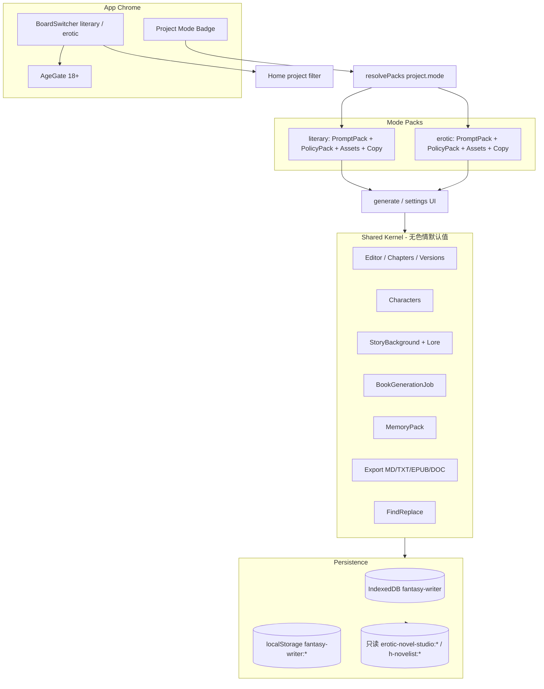
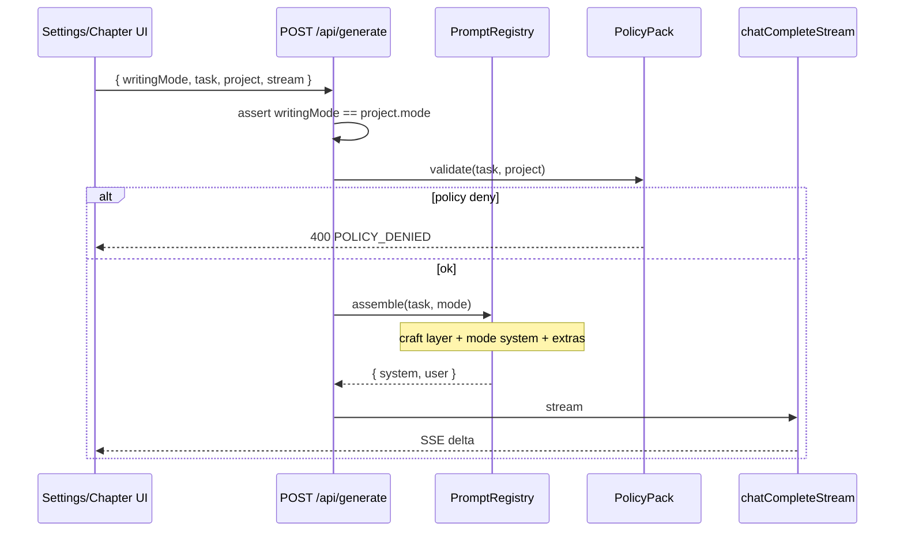
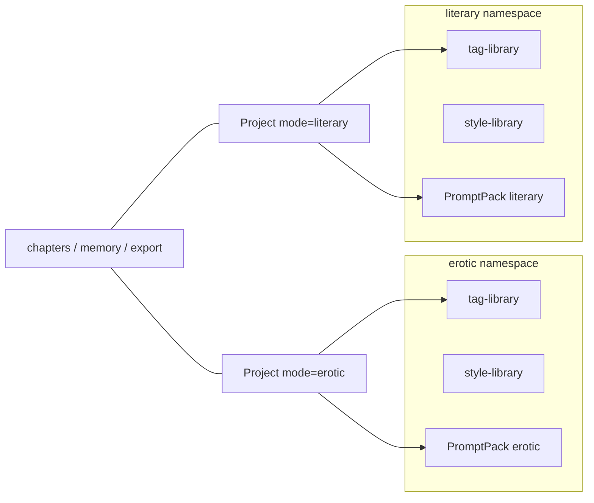

# Fantasy Writer（幻想作家）项目重构规划与开发方案

| 字段 | 值 |
|------|-----|
| **文档标题** | Fantasy Writer / 幻想作家 — 产品与架构重构规划 |
| **作者** | 待填（工程负责人 / 产品负责人） |
| **日期** | 2026-08-17 |
| **状态** | Draft |
| **基线版本** | `h-novelist` **1.8.1**（`package.json`） |
| **目标版本** | 2.0.0（M4 品牌落地） / 中间里程碑按 1.9.x 发过渡包 |
| **适用仓库** | `D:\Grisia Studio\H Nove List` |
| **schemaVersion** | 现网隐式 `1` → 目标 **`2`** |

---

## Overview

H-NoveList 1.8.1 已是一套可工作的 **local-first AI 长篇写作桌面/Web 应用**：设定 → 大纲 → 流式正文 → 全书队列 / 记忆包 / 版本 / 查找替换 / 多格式导出均已落地。但它的品牌、存储键、默认标签、生成参数、`ADULT_SYSTEM` 提示词栈全部把产品钉死在「色情小说专用工具」上。

本方案将产品正式更名为 **Fantasy Writer / 幻想作家**，在**不重写技术栈、不削弱 18+ 能力**的前提下，把产品升级为两个一等公民写作台：

- **常规小说写作**（`literary`）：主流 / 类型 / 文学向
- **色情小说写作**（`erotic`）：成年情色虚构，18+，现有能力完整保留

共享内核（编辑器、章节、人物、世界、导出、全书任务、记忆包、版本、查找替换）一份实现；模式隔离层（策略、提示词、安全审核、标签/文风库、文案、默认工作流）以 **feature pack / strategy object** 注入。所有现有项目迁移为 `mode=erotic` + 默认卷，旧键 `erotic-novel-studio:*` 只读兼容后写入 `fantasy-writer:*`。

---

## Background & Motivation

### 当前产品事实（已对照仓库复核）

| 项 | 证据 |
|----|------|
| 包名 / 版本 | `package.json`：`name=h-novelist`，`version=1.8.1`，`productName=H-NoveList`，`appId=com.hnovelist.app` |
| 栈 | Next.js **16.2.12** App Router + React **19.2.4** + Tailwind **4** + Electron **37.10.3** + electron-builder NSIS + `openai` SDK 7.x |
| 主存 | `src/lib/storage.ts`：IndexedDB `erotic-novel-studio` v1 store `kv`；localStorage 镜像 |
| 存储键 | `erotic-novel-studio:projects` / `tag-library` / `style-library` / `reader-prefs` / `usage-stats` / `backup-meta` |
| 主题/偏好键 | `src/lib/theme.ts`：`h-novelist:theme`、`h-novelist:app-prefs` |
| 项目页签键 | `src/app/project/[id]/page.tsx`：`h-novelist:project-tab:${id}` |
| 桌面桥 | `electron/preload.cjs` 暴露 `window.eroticNovelStudio`；`src/lib/desktop.ts` 读取同名 |
| 域模型 | `src/lib/types.ts`：`NovelProject` 无 `mode`、无卷；`GenerationSettings.eroticLevel` 硬编码 1–5；`OutlineChapter.eroticNote`；`LearnedStyle.erotic`；`DEFAULT_TAG_LIBRARY` 仅性行为标签 |
| 提示词 | `src/lib/prompts.ts`：全局 `ADULT_SYSTEM` + `SETTING_SYSTEM`，`buildOutlineSystemPrompt` / `buildChapterSystemPrompt` / `buildSettingSystemPrompt` 全部返回成人向；标签文案写死「强制行为标签」 |
| 生成 API | `src/app/api/generate/route.ts`：单一 `mode` 分发（outline/chapter/rewrite/continue/…），**不接收 WritingMode** |
| UI | 首页 `src/app/page.tsx` 三 Tab（项目/标签库/文风）；项目页三阶段（设定/创作/检视）+ 二级 Tab；`SettingsPanel` 首字段即「色情尺度」；`TagsPanel` 文案「本书强制标签 / 行为标签」 |
| 桌面更新 | `electron/main.cjs` `SETUP_RE = /H-NoveList-Setup-...exe/`；扫描桌面 `H-NoveList-Updates`、`%APPDATA%\h-novelist\updates`；`scripts/publish-update.mjs` 同步复制到这两处 |
| 已有能力（必须保留） | 记忆包 `src/lib/memory-pack.ts`；全书队列 `src/lib/book-job.ts`；导出 MD/TXT/EPUB/DOC `src/lib/export-book.ts`；章版本 `MAX_CHAPTER_VERSIONS=12`；伏笔 `PlotThread`；场景 `ChapterScene`；用量统计 |

### 痛点

1. **品牌与定位锁死**：安装包、窗口标题、README、EPUB author、`config.env` 注释全部是 H-NoveList；无法对常规作者诚实介绍产品。
2. **单一提示词栈污染**：任何「文学细腻」风格仍被 `ADULT_SYSTEM` 强制写成成人情色；`formatSettings()` 永远输出「色情尺度：n/5」。
3. **资产库不可分**：全局标签库默认「口交/肛交/…」，常规项目打开就会看见。
4. **无模式字段、无卷**：长篇类型小说缺少 作品→卷→章 结构（马良 / NovelForge 已验证这是长篇刚需）。
5. **内核与色情模块编译期耦合**：`prompts.ts` 一个文件同时服务设定扩写、大纲、正文、改写、学习文风。

### 为什么现在做

内核（队列、记忆包、版本、导出、一致性）已经够用，缺的是 **IA 与策略层**。继续在 `ADULT_SYSTEM` 上打补丁只会让文学模式永远漏色情，或反过来削弱 18+ 能力。双模式必须作为一等字段进入 schema v2，而不是 UI 开关。

---

## Goals & Non-Goals

### Goals

1. 官方品牌落地：**Fantasy Writer / 幻想作家**。
2. 两个一等写作台并存，一键切换看板，互不污染。
3. 共享内核复用现有实现，不重写编辑器 / 队列 / 导出。
4. 色情模式能力 **不降级**：尺度 1–5、行为标签硬性落实、`more_erotic`/`less_erotic` 改写、成人设定扩写、文风档案的情色技法字段全部保留。
5. 常规模式 **零色情泄漏**：system prompt、默认标签、UI 文案、生成参数、学习文风默认字段均不得注入情色指令或成人标签。
6. 全部旧项目 → `mode=erotic` + `schemaVersion=2` + 默认卷；旧存储键只读兼容。
7. 可执行分期：M0–M4，每期有验收标准与独立可审 PR。
8. 桌面更名后旧安装包仍能被扫描到（双正则 / 双目录）。

### Non-Goals

- 不重写为 Flutter / Spring / Vue / Python / Tauri。
- 不 fork NovelForge、SillyTavern 或任何 GPL/AGPL 源码入库。
- 不做云同步、多租户 SaaS、账号系统。
- M4 之前不做完整知识图谱 / Neo4j / 向量 RAG。
- 不做角色卡市场、插件商店。
- 不删除或「洗白」色情写作能力。
- 不把项目 `mode` 做成可随看板一键改写的软字段（必须走显式转换向导）。

---

# 1. 执行摘要

Fantasy Writer 是 H-NoveList 的就地演化，不是新产品重写。

**一句话决策**：保留 Next.js 16 + Electron 37 + IndexedDB local-first；把「模式」做成与项目同级的一等公民；用 PromptPack / PolicyPack / AssetLibrary 三件套隔离两个写作台。

**交付切片**：

| 里程碑 | 版本建议 | 核心交付 | 用户可感知 |
|--------|----------|----------|------------|
| M0 | 1.9.0 | `schemaVersion` + `WritingMode` + 存储双读；品牌字符串开始并列 | 旧数据不丢；UI 仍像 H-NoveList |
| M1 | 1.9.5 | 双看板 IA + prompt/policy 拆分 + 库按模式命名空间 | 首页可切「常规 / 色情」；项目带徽章 |
| M2 | 1.10.0 | 常规模式完整工作流，泄漏测试全绿 | 可认真写一部非成人长篇 |
| M3 | 1.11.0 | 卷结构 + Lore 条目 + Prompt Workshop lite | 长篇分卷；可改提示词模板 |
| M4 | 2.0.0 | 品牌全面更名、安装包/更新器、迁移烘烤、导出抛光 | 对外只叫 Fantasy Writer |

**关键数字（规划假设，用于排期与测试）**

- 现网单用户项目数：个位数～数十（local-first 单机）。按 **50 项目 × 平均 30 章 × 3k 字** 估算：正文约 4.5M 汉字 ≈ 9–13 MB JSON；加版本栈（每章最多 12 版）上限约 **80–120 MB / 库**。IDB 足够；localStorage 镜像继续允许失败。
- 生成延迟目标（相对 1.8.1 不退化）：大纲 JSON < 20s（4k tokens）；单章流式首字节 < 2s（网络允许时）；全书队列与现网一致可暂停/续跑。
- 模式切换（看板）：< 50ms，只改 chrome，不重载项目数据。
- 迁移：冷启动 `initStorage()` 一次完成，目标 < 500ms（50 项目）。

**最高优先级风险**

1. 常规模式提示词泄漏色情（产品级 bug，P0）。
2. 更名导致 Electron `userData` 路径漂移，API Key / 更新目录丢失（P0）。
3. 误把项目 `mode` 跟看板开关绑死，写脏数据（P0）。

---

# 2. 调研报告（项目对比表 + 可借鉴结论）

调研日期：**2026-08-17**。星标与许可证均来自 GitHub 页面或仓库 README / LICENSE，**未编造**。活动列以仓库近期可见提交 / Release 为准；「活跃」= 近数月仍有提交或发版说明。

## 2.1 常规 / 长篇写作类

| 项目 | 星标 | 许可证 | 栈 | 核心能力 | 架构要点 | 许可证风险 |
|------|------|--------|-----|----------|----------|------------|
| [vkbo/novelWriter](https://github.com/vkbo/novelWriter) | **3.1k** | **GPLv3** | Python + Qt6 / PyQt6 | 多文档长篇编辑、类 Markdown、synopsis / 交叉引用、纯文本稳健存储 | 无 AI；项目=多小文件，适合 VCS | **禁止拷代码**；只借 IA |
| [RhythmicWave/NovelForge](https://github.com/RhythmicWave/NovelForge) | **1.1k** | **AGPLv3 + 商用授权** | Electron + Vue3 + FastAPI + SQLite（图谱可选 Neo4j） | Schema 卡片、@DSL 上下文、知识图谱、Prompt Workshop、工作流、卷/阶段/章 | 卡片类型可自定义；审核结果卡片化 | **禁止 vendor AGPL**；产品形态过重 |
| [NousResearch/autonovel](https://github.com/NousResearch/autonovel) | **1.5k** | **仓库未见 LICENSE 文件**（调研日文件树无 LICENSE） | Python 管线 | foundation / draft / revision、anti-slop、`canon.md`、voice fingerprint、evaluate 循环 | 文档即世界状态；不是产品 UI | 无许可声明则**不得复制源码**；只借流程思想 |
| [Deng-m1/MaliangAINovalWriter](https://github.com/Deng-m1/MaliangAINovalWriter) | **851** | **Apache-2.0** | Flutter + Spring Boot 3 + Mongo + Chroma | 作品→卷→章→场景、提示词/预设、Next Outline、LLM 可观测性 | 重 SaaS / 管理后台 | 许可宽松，但栈与本产品不匹配，**不 fork** |
| [heider-x/vela](https://github.com/heider-x/vela) | **520** | **GPL-3.0** | Electron + React + TS + SQLite RAG | 本地 LLM + RAG 小说 IDE、大纲→章→Rewrite/Refine/Review | 与本栈最像，但 GPL | **禁止拷代码** |
| [Nigh/show-me-the-story](https://github.com/Nigh/show-me-the-story) | **~476**（topic 页约 474） | **MIT** | 单文件 Go + Vite/Svelte Web UI | 大纲后逐章、审核、伏笔、事实核查、叙事记忆、全书抛光 | 项目=目录 JSON/MD；上下文随章数线性增长有量化表 | 可合法参考实现思路；**不整仓搬迁** |
| [zy-zmc/tianming-novel-ai-writer](https://github.com/zy-zmc/tianming-novel-ai-writer) | **397** | **MIT**（README 另声明商用需联系作者） | .NET 8 + WPF | 15 维事实快照、12 类变更声明、6 道生成门禁 | 「状态回写」抗长篇漂移 | 思想可借鉴；商用条款需法务再确认 |
| [olivierkes/manuskript](https://github.com/olivierkes/manuskript) | **2.4k** | **GPL-3.0+** | Python / Qt | 雪花法、情节线、人物、非 AI 写作环境 | 经典桌面长篇 IA | 禁止拷代码 |
| [notnotype/neuro-book](https://github.com/notnotype/neuro-book) | **506** | **AGPL-3.0-only** | Nuxt 本地工作区 | 文件型 Project Workspace、Markdown Studio、lorebook、多智能体 | 小说 IDE + 角色扮演混合 | 禁止 vendor |
| [YuanShiJiLoong/author](https://github.com/YuanShiJiLoong/author) | **194** | **AGPL-3.0** | AI 写作平台（富文本） | 小说/剧本向编辑 + AI | 产品重叠但许可不可用 | 禁止拷代码 |
| [Xiaoyangy/novel-studio](https://github.com/Xiaoyangy/novel-studio) | **79** | **Apache-2.0** | Python，本地优先 | 多智能体世界推演、按弧规划、RAG、逐章审核、断点恢复 | 引擎而非桌面产品 | 可读协议/状态机，不换栈 |
| [raestrada/storycraftr](https://github.com/raestrada/storycraftr) | **155** | **MIT** | Python CLI | 世界、大纲、章节的 CLI 工作流 | 非 GUI | 可参考目录约定 |
| [jackaduma/Recurrent-LLM](https://github.com/jackaduma/Recurrent-LLM) | **205** | **MIT** | Python | RecurrentGPT：长文本循环状态 | 论文实现，非产品 | 可借鉴「短状态卡」抗漂移 |
| [91zgaoge/StoryMoss](https://github.com/91zgaoge/StoryMoss) | **~52–55** | **ISC**（README badge） | Tauri 2 + React + Rust | 幕前/幕后双界面、伏笔、StyleDNA、资产回流 | 重代理编排；测试密度高 | 许可宽松，但产品复杂度远超本阶段 |

## 2.2 成人 / 无审查 / RP 写作类（本产品必须覆盖）

| 项目 | 星标 | 许可证 | 栈 | 核心能力 | 架构要点 | 许可证风险 |
|------|------|--------|-----|----------|----------|------------|
| [SillyTavern/SillyTavern](https://github.com/SillyTavern/SillyTavern) | **32.2k** | **AGPLv3** | Node 本地前端 | WorldInfo / lorebooks、prompt presets、角色卡、扩展、无审查能力 | **预设与隔离**是业界标准 | **禁止 fork 进本仓库**；只借概念 |
| [kwaroran/Risuai](https://github.com/kwaroran/Risuai) | **1.6k** | **GPL-3.0** | Svelte 跨端 | 多 API、插件、lore、资源进对话 | 插件隔离思路 | 禁止拷代码 |
| [agnaistic/agnai](https://github.com/agnaistic/agnai) | **771** | **AGPL-3.0** | TypeScript 多用户聊天 | 多引擎、角色、preset | 多租户 SaaS 向 | 禁止 vendor |
| [malfoyslastname/character-card-spec-v2](https://github.com/malfoyslastname/character-card-spec-v2) | **183** | **规范文档，未见软件许可证** | Markdown 规格 | Character Card V2 字段（personality / scenario / first_mes / alternate_greetings / extensions） | 互操作标准 | 可按规格**自研导入导出**，不复制他人卡站代码 |
| [LostRuins/koboldcpp](https://github.com/LostRuins/koboldcpp) | **11.4k** | **AGPLv3**（Lite UI 亦 AGPL；底层 ggml/llama.cpp 为 MIT） | C++/Python 本地推理 | 一键跑 GGUF、面向创意写作 / 无审查本地前端谱系 | 是推理前端，不是长篇 IDE | 禁止拷代码；M4+ 可「连接」而非内嵌 |

## 2.3 能力维度对照（对 Fantasy Writer 的映射）

图例：● 强 / ◐ 有 / ○ 无或极弱。本产品列以 **1.8.1 现状** 计。

| 维度 | novelWriter | NovelForge | autonovel | 马良 | Vela | show-me-the-story | SillyTavern | **H-NoveList 1.8.1** | **FW 目标 M4** |
|------|-------------|------------|-----------|------|------|-------------------|-------------|----------------------|----------------|
| 编辑器 / 章节管理 | ● | ● | ◐ | ● | ● | ● | ○（聊天） | ● 章+场景+版本 | ● + 卷 |
| 人物 / 世界 | ◐ | ● 卡片 | ● md 层 | ● 设定树 | ● | ● | ● 角色卡+WI | ◐ Character + StoryBackground | ● + LoreEntry |
| 大纲 / 情节 | ◐ | ● | ● | ● 三级大纲 | ● | ● | ○ | ● Outline + PlotThread | ● + 卷大纲 |
| 多卷 | ◐ 文件夹 | ● | ◐ part | ● | ◐ | ◐ 按卷核查 | ○ | **○** | ● M3 |
| AI 生成 / 续写 | ○ | ● | ● 管线 | ● | ● | ● | ● 对话 | ● 流式+队列 | ● 保持 |
| 文风 / 热度控制 | ○ | ◐ | ● voice.md | ◐ 预设 | ◐ | ● skills | ● preset | ● 尺度1–5+学习文风 | ● 分模式 |
| 多模式切换 | ○ | ○ | ○ | ○ | ○ | ○ | ◐ preset | **○** | **● 一等** |
| 内容隔离 / 配置 | ○ | ◐ 提示词工坊 | ◐ 文件层 | ● 预设 | ◐ | ◐ 项目 prompts | **● preset/WI** | **○ 单栈** | **● pack** |
| 导入导出 | ● | ● | ● PDF/ePub | ◐ txt | ◐ | ● TXT/MD | 角色卡 | ● JSON/MD/TXT/EPUB/DOC | ● + 卡规格可选 |

## 2.4 「可借鉴 / 可改造 / 需自研」清单（带证据）

### 可借鉴（只借 IA / 协议 / 流程，不进仓库源码）

| 想法 | 来源 | 落到本项目的位置 |
|------|------|------------------|
| 多文档 + 卷/文件夹 IA | novelWriter、manuskript | M3 `Volume`；项目树左栏 |
| 作品→卷→章→场景 四级 | 马良 README「层级化内容管理」 | 域模型 v2；现有 `ChapterScene` 已是第四级雏形 |
| Schema / 卡片类型 | NovelForge Schema-first | M3 Lore / 角色扩展用 **自研瘦 Schema**，不引入其 DSL |
| Prompt Workshop + 知识库注入 | NovelForge、马良「提示词/预设管理」 | M3 `PromptPack` 可编辑模板；**自研**，字段远少于 NovelForge |
| @ 引用上下文 | NovelForge @DSL | M3 轻量：`@char:name` / `@lore:id` / `@vol:prev`，自己写解析 |
| foundation→draft→revision、canon、anti-slop | autonovel `PIPELINE.md` / `ANTI-SLOP.md` / `canon.md` | M2 常规模式增加「文笔守则」层；M3+ 一致性已有 `consistency_check` |
| 叙事记忆 / 伏笔状态机 | show-me-the-story（planted→progressing→resolved） | 已有 `PlotThread`；补超期告警即可 |
| 短状态回写抗漂移 | 天命「事实快照」、Recurrent-LLM、本仓库 `memory-pack.ts` | **已有** `buildMemoryPack`；常规模式复用，不注入情色 |
| WorldInfo / lorebooks 按关键词激活 | SillyTavern | M3 `LoreEntry.keys` + 生成前检索；**自研 80 行**，不搬 ST |
| Prompt Preset 隔离 | SillyTavern / Risu / Agnai | `PromptPack` + `PolicyPack` 按 `WritingMode` 分文件 |
| Character Card V2 字段超集 | character-card-spec-v2 | `Character` 扩展可选 `cardV2?`；导入导出自研 |
| 幕前写作 / 幕后资产 | StoryMoss | 已有三阶段（设定/创作/检视）对应；不必上双窗口 |
| BYOK + 本地优先 | Vela、本仓库 `src/lib/ai.ts` | **已有**：Key 在 `.env.local` / `userData/config.env` |

### 可改造（本仓库已有雏形，按模式拆开）

| 现有模块 | 文件 | 改造 |
|----------|------|------|
| 单一 `ADULT_SYSTEM` | `src/lib/prompts.ts` | 拆成 `craft` 共享层 + `literary` / `erotic` pack |
| `GenerationSettings.eroticLevel` | `src/lib/types.ts` | 文学模式改为 `intensity` 或隐藏；色情模式保留 |
| `DEFAULT_TAG_LIBRARY` | `types.ts` + `storage.ts` | 命名空间 `erotic.tags` / `literary.tags` |
| `LearnedStyle.erotic` | `types.ts` | 改为可选 `modeExtras`；文学档案不生成该字段 |
| 首页三 Tab | `src/app/page.tsx` | 顶栏看板开关 + 项目按 mode 分组 |
| `SettingsPanel` / `TagsPanel` 文案 | 对应组件 | 走 `copy.ts` pack |
| `/api/generate` | `route.ts` | 请求体强制带 `writingMode`，服务端按 pack 组 prompt |
| 存储键 / IDB 名 | `storage.ts` | 双读旧键，写新键 |
| 桌面桥名 | `preload.cjs` / `desktop.ts` | 双暴露一个过渡期 |

### 需自研（对标没有可安全复制的实现，或产品差异要求自建）

1. **双一等写作台 + 项目 mode 不可被看板误改** — 调研对象全部没有「常规/色情」产品级隔离。
2. **模式泄漏测试套件** — 必须自研，作为 P0 门禁。
3. **就地迁移 `erotic-novel-studio:*` → `fantasy-writer:*`** — 无现成工具。
4. **转换向导**（erotic ↔ literary）— 涉及标签剥离 / 尺度字段 / 二次确认。
5. **桌面更名双正则更新器** — 本仓库 `SETUP_RE` 与 `userData` 路径是私有约定。
6. **PolicyPack**（18+、禁未成年人、文学模式禁注入成人标签）— 产品红线，必须自研并测试。

## 2.5 技术选型与「为什么不 fork」

### 推荐默认：就地演化当前栈

| 层 | 选型 | 理由 |
|----|------|------|
| UI | **保持** Next.js 16 App Router + React 19 + Tailwind 4 | 项目页、流式 SSE、三阶段导航已绑定；`next.config.ts` 已 `output: "standalone"` |
| 桌面 | **保持** Electron 37 + electron-builder NSIS | 安装包、更新扫描、`config.env` 路径已跑通 1.8.1 |
| 数据 | **保持** IndexedDB 主存 + localStorage 镜像 | 单机 local-first；50 项目量级足够；M3 前不上 SQLite |
| AI | **保持** OpenAI 兼容 SDK → DeepSeek 默认 | `src/lib/ai.ts` 已支持 Base URL / 模型 / 桌面 `APP_CONFIG_PATH` |
| 模式层 | **新增** TS strategy packs | 编译期用动态 import 隔离色情默认资源 |

### 备选否决

**备选 A — 重写成 NovelForge 形态（Vue + FastAPI + SQLite）**  
否决。AGPL 污染；后端进程模型与当前「Electron 嵌 Next standalone」冲突；用户数据在浏览器 IDB，搬迁成本高于功能收益。本产品要的是双模式写作台，不是卡片操作系统。

**备选 B — fork SillyTavern 做长篇前端**  
否决。AGPLv3；ST 是 **多轮角色扮演前端**，没有章节队列、全书导出、三阶段长篇 IA。WorldInfo/preset 思想用 200 行自研即可，fork 会把产品做成聊天室。

**备选 C — 换成 Vela / 马良栈**  
否决。Vela 是 GPL-3.0；马良是 Flutter+Spring 云端。都与「已有 1.8.1 桌面分发 + 本地 IDB」冲突。Vela 的 RAG 可在 M4+ 作为可选连接，不换壳。

**结论**：在 `src/lib/prompts.ts` / `types.ts` / `storage.ts` / 首页与项目页 **就地拆包**，6–10 个可审 PR 即可达到 M1；完整 M4 不需要新语言或新运行时。

---

# 3. 产品与品牌重构说明

## 3.1 品牌

| 项 | 旧 | 新 |
|----|----|----|
| 对外英文名 | H-NoveList | **Fantasy Writer** |
| 对外中文名 | （无正式中文名 / 内部「色情小说工作室」语义） | **幻想作家** |
| 一句话定位 | AI 人物/大纲/正文编辑器（实际=成人情色） | 双写作台：常规小说与色情小说，本地优先，互不污染 |
| 包名 `package.json.name` | `h-novelist` | `fantasy-writer`（M4；M0–M3 可暂留以保 `userData`） |
| `productName` | `H-NoveList` | `Fantasy Writer`（安装包显示名，M4） |
| `appId` | `com.hnovelist.app` | **M4 仍建议暂留** `com.hnovelist.app`，避免 Windows 卸载条目分裂；文档写明内部 id |
| 快捷方式 | H-NoveList | Fantasy Writer（幻想作家） |
| 窗口标题 | H-NoveList | Fantasy Writer |
| 安装包文件名 | `H-NoveList-Setup-x.y.z.exe` | `Fantasy-Writer-Setup-x.y.z.exe`（更新器双认） |

定位扩展 **不是**「从色情转型文学」，而是：

- 常规小说写作 = 一等公民
- 色情小说写作 = 一等公民
- 二者共存、一键切看板、**内容与策略不交叉**

## 3.2 两个写作台的产品差异

| 面 | 常规 `literary` | 色情 `erotic` |
|----|-----------------|---------------|
| 默认受众文案 | 「类型 / 文学 / 网文长篇」 | 「成年向情色虚构 · 18+」 |
| 进入门槛 | 无年龄墙（仍禁止未成年人色情；文学可写非色情未成年角色须走政策包） | **首次进入看板必须确认 18+** |
| 默认标签库 | 流派/桥段/叙事手法（悬疑、成长、反转…） | **保留**现网 `DEFAULT_TAG_LIBRARY` 性行为标签 |
| 生成参数 | 人称、篇幅、文风、类型、节奏；**无色情尺度滑条** | **完整保留** 尺度 1–5 + 行为标签硬性落实 |
| System prompt | 文学工艺 + 禁止主动写色情 + 不注入成人标签 | 现 `ADULT_SYSTEM` 精神完整保留（可润色，不可削弱） |
| 改写模式 | polish / expand / shorten / dialogue / custom | 另加 `more_erotic` / `less_erotic` |
| 大纲字段 | `craftNote`（节奏/冲突） | 保留 `eroticNote` |
| 空状态 | 「从一句话梗概开始一部长篇」 | 「从人物欲望与冲突开始一部成人小说」 |
| 默认工作流 | 设定 → 卷/大纲 → 正文 → 检视 | 设定（含尺度/标签）→ 大纲（含情色规划）→ 正文 → 检视 |

## 3.3 看板开关 vs 项目 mode（产品铁律）

```
AppPreference.defaultBoard   ← 用户上次停留的看板（可随时点）
NovelProject.mode            ← 创建时选定，此后不可被看板改写
```

- 首页顶栏：**常规 | 色情** 分段控件。只过滤项目列表、切换空状态/默认库/文案。
- 新建项目：落在**当前看板**对应 mode；二次确认「这是一部常规小说 / 这是一部 18+ 色情小说」。
- 进入已有项目：chrome 跟随 **项目 mode**，不跟随看板。若用户在项目内点看板想看另一边，弹：「离开本书，回到首页的「常规/色情」列表？」而不是改 `project.mode`。
- 转换：设置 → 「转换写作台…」向导（见 6.4），两步确认 + 差异预览。

## 3.4 用户旅程

### 旅程 A — 常规长篇（文学/类型）

1. 打开 Fantasy Writer，看板停在「常规」（或点一次切换）。
2. 首页只列 `mode=literary` 的书；标签库是流派标签；看不到口交等默认项。
3. 「新建」→ 确认「常规小说」→ 进入设定：人物 / 世界 / **无尺度滑条** / 可选类型标签。
4. AI 扩写人物：system 为文学设定编辑，**不要求欲望戏**，不写「适合成人情色」。
5. 生成大纲：章节有冲突与节拍，无 `eroticNote` 必填；JSON 字段用 `craftNote`。
6. 一键全书队列 + 记忆包（角色状态卡 + 前情 + 伏笔），与现网相同。
7. 检视：一致性、大纲对照、查找替换、导出 MD/EPUB。EPUB author = `Fantasy Writer`。

### 旅程 B — 色情长篇（18+，能力不弱于 1.8.1）

1. 切到「色情」看板；若从未确认过 18+，先模态确认。
2. 看到全部旧 H-NoveList 项目（迁移后 `mode=erotic`）。
3. 标签库仍是（或包含）口交/肛交/… 默认集；可继续维护。
4. 新建或打开旧书：生成参数第一项仍是「色情尺度 1–5」，文案与 `EROTIC_LEVEL_LABELS` 一致。
5. 大纲强制规划标签落实；`eroticNote` 保留；`polish_chapter_outline` 仍要求有标签才能优化。
6. 正文 / 续写 / `more_erotic` 全部走成人 pack；未成年人禁令不变。
7. 导出、队列、版本、记忆包行为与 1.8.1 等价。

### 旅程 C — 看板误触

用户在色情书的正文页误点顶栏「常规」→ 模态：「当前书是色情写作台作品。切换看板将返回首页常规列表，不会修改本书。」选项：取消 / 回首页常规。

## 3.5 品牌更名落地清单

| # | 位置 | 现网值 | 目标值 | 里程碑 |
|---|------|--------|--------|--------|
| 1 | `package.json` `name` | `h-novelist` | `fantasy-writer` | M4（M0 注释并列） |
| 2 | `package.json` `productName` | `H-NoveList` | `Fantasy Writer` | M4 |
| 3 | `package.json` `appId` | `com.hnovelist.app` | **保持**（见 Key Decisions） | — |
| 4 | `package.json` `description` / `author` | H-NoveList… | Fantasy Writer / 幻想作家 | M4 |
| 5 | `build.nsis.shortcutName` / `uninstallDisplayName` | H-NoveList | Fantasy Writer | M4 |
| 6 | `build.win.artifactName` | `${productName}-Setup-${version}` | 随 productName 变 | M4 |
| 7 | `electron/main.cjs` `SETUP_RE` | 仅 `H-NoveList-Setup-` | **双正则** 新旧文件名 | M0 即双认，M4 主新 |
| 8 | `electron/main.cjs` 窗口 `title` | H-NoveList | Fantasy Writer | M4（M1 可「Fantasy Writer」） |
| 9 | 桌面更新目录 | `H-NoveList-Updates` | 双扫 + `Fantasy-Writer-Updates` | M0 双扫，M4 主写新 |
| 10 | `scripts/publish-update.mjs` | 复制到旧两目录 | 新旧目录都写 | M0 |
| 11 | `%APPDATA%\h-novelist` | Electron userData | **不改 name 则不变**；若改 name 必须迁移 `config.env` | M4 专项 |
| 12 | `src/app/layout.tsx` metadata | title H-NoveList | Fantasy Writer · 幻想作家 | M1 |
| 13 | `src/app/page.tsx` `<h1>` | H-NoveList | 幻想作家 / Fantasy Writer | M1 |
| 14 | `src/lib/ai.ts` 配置文件头注释 | `# H-NoveList · API 配置` | `# Fantasy Writer · API 配置` | M4 |
| 15 | `src/lib/export-book.ts` EPUB author | `H-NoveList` | `Fantasy Writer` | M4 |
| 16 | `src/lib/storage.ts` 键与 IDB | `erotic-novel-studio*` | 读旧写 `fantasy-writer*` | M0 |
| 17 | `src/lib/theme.ts` 键 | `h-novelist:*` | 读旧写 `fantasy-writer:theme` 等 | M0 |
| 18 | 项目 Tab 键 | `h-novelist:project-tab:` | `fantasy-writer:project-tab:` | M0 |
| 19 | `electron/preload.cjs` | `eroticNovelStudio` | 双暴露 `fantasyWriter` + 旧名 | M0 |
| 20 | `src/lib/desktop.ts` | `window.eroticNovelStudio` | 优先新名，回退旧名 | M0 |
| 21 | `README.md` | 全篇 H-NoveList / 色情尺度 | 双写作台说明 | M1 改定位，M4 改名 |
| 22 | 备份文件名 | `ens-backup-YYYY-MM-DD.json` | `fw-backup-YYYY-MM-DD.json` | M1 |
| 23 | EPUB bookId 前缀 | `ens-` | `fw-` | M4 |
| 24 | `PORT` 环境变量名 | `ENS_PORT` | 兼容 `ENS_PORT` + `FW_PORT` | M0 |
| 25 | docs / 本文件 | — | `docs/Fantasy-Writer-重构规划与开发方案.md` | 本文 |

---

# 4. 目标架构与双模式隔离方案

## 4.1 Proposed Design

### 逻辑架构



### 请求时序（生成）



### 数据流（隔离）



### 目录结构（建议）

```
src/
  app/
    page.tsx                          # 看板 + 项目列表
    project/[id]/page.tsx             # 三阶段；mode 来自项目
    api/generate/route.ts             # 接收 writingMode
    api/config/route.ts               # 不变
  components/
    chrome/BoardSwitcher.tsx
    chrome/ModeBadge.tsx
    chrome/AgeGate.tsx
    chrome/ConvertModeWizard.tsx
    kernel/                           # 现有面板迁入或保持扁平并逐步迁
  lib/
    mode.ts                           # WritingMode 类型与守卫
    flags.ts                          # 功能开关
    types.ts                          # 域模型 v2（扩展，不打碎）
    storage.ts                        # 双读旧键
    prompts/
      craft.ts                        # 共享工艺（连贯、人称、只输出要求内容）
      registry.ts                     # assemble(task, mode)
      literary.ts
      erotic.ts
    policy/
      literary.ts
      erotic.ts
    assets/
      literary-defaults.ts
      erotic-defaults.ts              # 迁入 DEFAULT_TAG_LIBRARY
    copy/
      literary.ts
      erotic.ts
    memory-pack.ts                    # 保持，不读 mode 默认色情
    book-job.ts
    export-book.ts
    ai.ts
  electron/
    main.cjs                          # 双 SETUP_RE
    preload.cjs                       # 双桥名
```

**编译期隔离规则**：`lib/assets/erotic-defaults.ts` 与 `lib/prompts/erotic.ts` **不得**被 `literary` pack 静态 import。`registry.ts` 用显式 map + 按 mode 分支 import（可用静态 import 两边，但 **literary 组装函数禁止调用 erotic 模块导出**）。测试会 grep 组装结果。

动态 import 更干净，但 Next 路由分析简单场景下静态分支 + ESLint `no-restricted-imports` 即可：

```
src/lib/prompts/literary.ts  禁止 import 自 ../prompts/erotic 或 ../assets/erotic-defaults
src/components 中 kernel/*   禁止直接 import erotic-defaults
```

## 4.2 WritingMode 一等字段

```typescript
/** 写作台。对外文案：常规 / 色情 */
export type WritingMode = "literary" | "erotic";

export interface AppPreference {
  schemaVersion: 2;
  theme: "dark" | "light";
  defaultBoard: WritingMode;
  adultConfirmedAt?: string; // ISO；仅色情看板需要
  autoConsistencyAfterBookJob: boolean;
  flags?: Record<string, boolean>;
}

export interface PromptPack {
  id: string;
  mode: WritingMode;
  version: string;
  system: {
    setting: string;
    outline: string;
    chapter: string;
    rewrite: string;
    styleLearn: string;
  };
  /** 覆盖 craft 层的额外硬规则 */
  extraRules: string[];
}

export interface PolicyPack {
  id: string;
  mode: WritingMode;
  requireAdultConfirmation: boolean;
  forbidMinorSexualContent: true; // 两模式都为 true
  allowEroticScale: boolean;
  allowActTags: boolean;
  allowRewriteModes: Array<
    | "polish"
    | "expand"
    | "shorten"
    | "dialogue"
    | "custom"
    | "more_erotic"
    | "less_erotic"
  >;
  /** 文学模式：禁止把这些子串注入 system/user（测试用夹具） */
  bannedPromptSubstrings: string[];
}
```

绑定点：

| 对象 | 字段 | 可变性 |
|------|------|--------|
| AppPreference | `defaultBoard` | 用户随时改 |
| NovelProject | `mode` | 创建后只读；仅转换向导可写 |
| PromptPack / PolicyPack / AssetLibrary | `mode` | 内置只读；用户自定义包可编辑 |

## 4.3 隔离必须覆盖的五层

1. **Prompt registry**  
   删除「全站一个 `ADULT_SYSTEM`」。组装公式：

   ```
   system = CRAFT_SYSTEM
          + pack.system[task]
          + project.settings.extraInstructions
          + (learnedStyleGuide?)
   ```

   - `CRAFT_SYSTEM`：成年人同意的虚构、只输出要求格式、尊重人物、学习文风优先。**不提色情。**
   - `erotic.system.chapter`：现 `ADULT_SYSTEM` 全文迁入（可小幅润色）。
   - `literary.system.chapter`：类型/文学作者；**禁止主动写入色情场面**；用户在 extraInstructions 里明确要求情色时，仍不得改用成人标签库。

2. **Safety policy**  
   - 两模式：禁止未成年人色情。年龄字段在色情模式下必须是明确成年数字（沿用现设定 prompt）。
   - 文学模式：`allowEroticScale=false`，`allowActTags=false`，`more_erotic` 从 UI 与 API 双删。
   - 色情模式：保留 18+ 规则与热度尺。

3. **Asset libraries**  
   存储形状：

   ```
   fantasy-writer:libraries = {
     literary: { tags: string[], styles: LearnedStyle[] },
     erotic:   { tags: string[], styles: LearnedStyle[] }
   }
   ```

   迁移：现 `tag-library` + `DEFAULT_TAG_LIBRARY` → `erotic.tags`；`style-library` 全部进 `erotic.styles`（旧档案含 `erotic` 字段）。文学库给一套非成人默认流派标签。

4. **UI copy / 空状态 / 默认工作流**  
   `copy/literary.ts` vs `copy/erotic.ts`：首页副标题、TagsPanel 说明、Settings 字段标签、大纲「情色说明」vs「节奏说明」。

5. **Home 过滤与项目内开关**  
   见 3.3。内核模块（`memory-pack.ts`、`book-job.ts`、`export-book.ts`）**不读取** `DEFAULT_TAG_LIBRARY`，不 import erotic pack。

## 4.4 API / Interface Changes

### `POST /api/generate`（`src/app/api/generate/route.ts`）

现网：`Body.mode` 表示 **任务类型**（`outline` | `chapter` | …），与 WritingMode 撞名。

**不改任务字段名**（避免一次改 15+ 调用点），新增并列字段：

```typescript
type GenerateRequest = {
  taskMode: string;          // 过渡期：仍接受 body.mode 作为任务
  writingMode: WritingMode;  // M1 起必填
  // …现有 characters / background / settings / …
};
```

兼容策略：

- M0：`writingMode` 可选，缺省=`erotic`（保护旧客户端）。
- M1：前端全部带上；服务端若 `writingMode !== project.mode`（若请求带了 projectId）→ 400。
- 文学请求走 `buildChapterSystemPrompt("literary")`；**禁止**再调用无参的旧函数。

现网系统函数全部改为：

```typescript
// 旧
export function buildChapterSystemPrompt(): string { return ADULT_SYSTEM; }

// 新
export function buildChapterSystemPrompt(mode: WritingMode): string {
  return assembleSystem("chapter", mode);
}
```

`/api/config` 不变。桌面 IPC 方法名不变，只改扫描正则与文案。

### 前端 `postGenerate` / `streamGenerate`（`src/lib/api.ts`）

封装强制注入 `writingMode`，调用方不再手写。漏传则 TypeScript 报错。

## 4.5 Data Model Changes

在 `src/lib/types.ts` **扩展**现有接口，不重命名 `NovelProject`（避免一次改 40+ 文件）。对外文档可用 Work 一词。

```typescript
export const CURRENT_SCHEMA_VERSION = 2 as const;

export interface Volume {
  id: string;
  order: number;
  title: string;
  summary: string;
}

export interface LoreEntry {
  id: string;
  title: string;
  body: string;
  keys: string[];          // WorldInfo 风格激活词
  category: "place" | "org" | "item" | "rule" | "other";
  enabled: boolean;
}

export type ContentRating = "unrated" | "general" | "mature" | "adult";

export interface GenerationSettings {
  // —— 共享 ——
  writingStyle: WritingStyle;
  customStyle: string;
  learnedStyleId: string;
  learnedStyleGuide: string;
  learnedStyleName: string;
  person: NarrativePerson;
  length: "short" | "medium" | "long";
  language: "zh" | "en";
  chapterCount: number;
  extraInstructions: string;
  // —— 色情模式；文学模式 normalize 时保留数值但不注入 prompt ——
  eroticLevel: EroticLevel;
  // —— 文学可选 ——
  genreTags?: string[];
}

export interface LearnedStyle {
  id: string;
  name: string;
  mode: WritingMode;       // 新；旧数据 → erotic
  createdAt: string;
  updatedAt: string;
  sourceLabel: string;
  sourceChars: number;
  overall: string;
  vocabulary: string;
  rhythm: string;
  narrative: string;
  dialogue: string;
  sensory: string;
  structure: string;
  avoid: string;
  styleGuide: string;
  fingerprints: string[];
  /** 仅 erotic 档案使用；文学学习不请求、不落盘 */
  erotic?: string;
}

export interface OutlineChapter {
  id: string;
  volumeId?: string;       // M3；M0 挂到 default volume
  order: number;
  title: string;
  summary: string;
  keyPoints: string;
  tags: string[];
  eroticNote: string;      // 文学项目可空；UI 换成 craftNote 别名
  craftNote?: string;
}

export interface NovelProject {
  id: string;
  name: string;
  schemaVersion: 2;
  mode: WritingMode;
  contentRating: ContentRating;
  createdAt: string;
  updatedAt: string;
  characters: Character[];
  background: StoryBackground;
  lore?: LoreEntry[];      // M3
  volumes?: Volume[];      // M0 起即写入默认一卷
  settings: GenerationSettings;
  tags: string[];
  outline: Outline | null;
  chapters: ChapterContent[];
  plotThreads?: PlotThread[];
  bookJob?: BookGenerationJob | null;
  promptPackId?: string;   // M3
}

export function createEmptyProject(
  name: string,
  mode: WritingMode
): NovelProject { /* … */ }
```

`Character` **扩展不替换**：

```typescript
export interface Character {
  id: string;
  name: string;
  gender: string;
  age: string;
  appearance: string;
  personality: string;
  background: string;
  relationships: string;
  role: string;
  notes: string;
  /** 可选：Card V2 互操作，M3+ */
  aliases?: string[];
  speechStyle?: string;
}
```

### 迁移策略（normalizeProject）

`normalizeProject` 是现网唯一兼容入口（`storage.ts` 读路径全部经过它）。v2 规则：

1. `schemaVersion` 缺省或 `< 2` → 视为 v1。
2. `mode` 缺省 → **`erotic`**（所有 H-NoveList 旧书）。
3. `contentRating` 缺省 → `adult`（随 erotic）。
4. `volumes` 空 → 插入 `{ id: stableUuid, order: 1, title: "第一卷", summary: "" }`；现有大纲章 `volumeId` 指向它。
5. 标签、伏笔、bookJob、learnedStyle 字段补齐逻辑保持 1.8.1 行为。
6. 写出时一律 `schemaVersion: 2`。

**不写破坏性 down-migration**。回滚 = 安装旧包 + 旧键里仍有镜像（M0 双写期）或用户恢复 `fw-backup-*.json`。

## 4.6 Alternatives Considered

### 方案 1 — 单一项目 + 每章「热度」（否决）

在 `ChapterContent` 上加 `heat`，不设 WritingMode。  
**优点**：改动面小。  
**缺点**：首页无法分组；默认标签仍混用；`ADULT_SYSTEM` 仍全局。无法完成「常规作者看不到成人库」的目标。

### 方案 2 — 两个独立应用 / 两套仓库（否决）

`Fantasy Writer` 与 `H-NoveList` 分开发。  
**优点**：物理隔离最强。  
**缺点**：队列、记忆包、导出、桌面更新要维护两份；用户无法一键切换；违背「共享内核」。

### 方案 3 — 就地双 pack（**采用**）

一个应用、一个内核、两套 pack。项目带不可变 `mode`。  
**优点**：符合 1.8.1 资产；许可干净；可分期。  
**缺点**：要纪律（lint + 泄漏测试），否则仍会 import 错包。用 ESLint 与 CI 对冲。

## 4.7 Security & Privacy Considerations

### 威胁模型

| ID | 威胁 | 严重度 | 缓解 |
|----|------|--------|------|
| T1 | 未成年人色情生成 | **Critical** | 两模式 PolicyPack 均 `forbidMinorSexualContent`；设定扩写强制成年年龄；系统提示保留「绝不描写未成年人」性内容。文学模式允许非性的未成年配角，但 policy 扫描用户 extraInstructions 中的性+未成年组合 → 拒绝。 |
| T2 | API Key 打进安装包 / 前端 | **Critical** | 维持现状：Key 只在服务端 `src/lib/ai.ts` 读 `.env.local` 或 Electron `userData/config.env`。安装包 asar **禁止**带 Key。验收：对 `dist-installer` 做字符串扫描。 |
| T3 | 模式泄漏（文学请求带上成人 system / 默认性行为标签） | **High（产品 bug）** | 组装单测 + 请求夹具；CI 失败即不可发版。见第 8 章。 |
| T4 | 看板开关误改 `project.mode` 导致策略错绑 | **High** | mode 只在 `createEmptyProject` 与 ConvertWizard 写入；`upsertProject` 断言 mode 未悄改。 |
| T5 | 本地 XSS 读 IDB 小说正文 | Medium | 持续 CSP；不 `dangerouslySetInnerHTML` 用户正文（除 EPUB 内部 XML 需转义，现 `escapeXml`）。 |
| T6 | 更新器扫到恶意 exe | Medium | 仅匹配文件名正则；不静默安装；需用户点「安装」。M4 不引入任意 URL 下载（除非 `UPDATE_FEED_URL` 且用户自配）。 |
| T7 | 备份 JSON 含全文被同步盘泄漏 | Low / 接受 | local-first 产品固有；备份文件名改 `fw-backup-`；文档说明。 |
| T8 | 18+ 看板被未成年人直接看到默认标签 | Medium | `AgeGate` 一次确认写入 `adultConfirmedAt`；未确认不渲染 erotic 默认标签文案。 |

**原则**：18+ only for erotic board；**任何模式都不写未成年人色情**；Key never in installer；mode leakage = 发版阻断。

## 4.8 Observability

现网已有 `UsageStats.byMode`（任务 mode，不是 WritingMode）和 `getEnvDiagnostics()`（无 Key 明文）。

增强：

| 信号 | 实现 | 用途 |
|------|------|------|
| `usage.byWritingMode.literary/erotic` | `recordUsage` 增加维度 | 看双板是否真在用 |
| `usage.policyDenied` | policy 拒绝时 +1 | 抓误伤 |
| `diag.lastPromptPackId` | 仅开发/桌面日志，**不落全文 prompt** | 排泄漏 |
| 生成错误 | 保持现网 Toast + `/api/generate` 401/500 | 不退化 |
| 迁移 | `console` + 首页一次性「已从 H-NoveList 导入 n 部作品」 | 可支持 |

**不**把章节正文、API Key、完整 prompt 打到远程。无远程遥测。桌面 `server.log` 维持现网，禁止 append Key。

告警（单机产品的「告警」= UI）：

- 文学生成若 policy 检测到禁用子串 → 红条「已拦截一次提示词泄漏，请升级或回报」。
- 更新扫描 0 个包且用户刚更名 → 提示双目录。

## 4.9 共享内核 vs 模式包：模块边界

| 可留在 kernel | 必须进 pack |
|---------------|-------------|
| `ChapterContent` / versions / scenes | `EROTIC_LEVEL_LABELS` 的 **展示** |
| `BookGenerationJob` | `DEFAULT_TAG_LIBRARY` |
| `buildMemoryPack` | `ADULT_SYSTEM` / `SETTING_SYSTEM` |
| `export-book`（author 字符串用品牌常量） | TagsPanel / Settings 文案 |
| `GlobalFindReplace` | `more_erotic` 按钮 |
| `PlotThread` | 18+ AgeGate |
| `progress.ts` | 文学默认流派标签 |

`formatSettings()` 按 mode 分支：文学输出不含「色情尺度」行。

---

# 5. 功能分期与里程碑

## Rollout Plan

功能开关（`AppPreference.flags` + 环境变量 `FW_FLAG_*`）：

| Flag | 默认 M0 | M1 | M2 | M3 | M4 |
|------|---------|----|----|----|----|
| `dualBoard` | false | true | true | true | true |
| `modeScopedPrompts` | false（仍成人栈，但 API 已收 writingMode） | true | true | true | true |
| `libraryNamespaces` | 双写，UI 仍单库 | true | true | true | true |
| `volumesUi` | 数据有默认卷，UI 隐藏 | false | false | true | true |
| `loreUi` | false | false | false | true | true |
| `promptWorkshop` | false | false | false | true | true |
| `brandRenameComplete` | false | false | false | false | true |

回滚：关 flag 即回到上一视觉；schema v2 向前兼容 v1 读取（旧包读新数据时 `normalize` 忽略未知字段——**旧 1.8.1 不认识 mode，会留下字段**，JSON 仍合法）。

若必须回退到 1.8.1：依赖 M0–M1 **双写旧键**。M4 停止双写前必须公告。

### M0 — 品牌并列 + schemaVersion + mode 字段（无双看板 UX）

**优先级 P0。建议版本 1.9.0。**

任务：

1. `CURRENT_SCHEMA_VERSION = 2`；`NovelProject.mode` 默认 erotic。
2. `normalizeProject` / `createEmptyProject` 写入默认卷。
3. `storage.ts`：读 `erotic-novel-studio:*` 与 `h-novelist:*`，写 `fantasy-writer:*`，并 **双写旧键**。
4. IDB：优先开 `fantasy-writer`；若空则从 `erotic-novel-studio` 拷 `projects` 与 `auto-backup`。
5. preload 双暴露；SETUP_RE 双认；publish-update 双目录。
6. 不改首页 IA。

验收见第 8 章 M0。

### M1 — 双看板 IA + prompt/policy 拆分 + 库隔离

**P0。版本 1.9.5。**

任务：

1. `BoardSwitcher` + 首页过滤 + `ModeBadge`。
2. 拆 `prompts.ts` → `prompts/*`；`/api/generate` 必填 `writingMode`（前端）。
3. 标签/文风库按 mode 分桶；旧库进 erotic。
4. AgeGate。
5. 文案 pack；`SettingsPanel` / `TagsPanel` 按项目 mode 切换。
6. 泄漏测试接入 `npm test`（引入 vitest，现网无测试框架）。

### M2 — 常规模式工作流闭环

**P0。版本 1.10.0。**

任务：

1. 文学设定/大纲/正文/续写/润色全路径不用成人 system。
2. 文学默认标签 + 空状态 + 优化参数不输出 `eroticLevel` 语义。
3. `learn_style` 文学路径不请求 `erotic` 字段。
4. 转换向导 MVP（仅 erotic→literary 剥离标签预览；反向保持标签）。
5. README 双写作台说明。

### M3 — 卷 + Lore + Prompt Workshop lite

**P1。版本 1.11.0。**

任务：

1. 卷 UI：创建/重排/按卷生成队列。
2. `LoreEntry` CRUD + 生成前按 `keys` 命中注入（上限 N 条，防爆上下文）。
3. 内置 pack 只读预览 + 用户自定义 `extraRules` 文本框（lite，不做 NovelForge 全工坊）。
4. Character 可选 `aliases` / `speechStyle`。

### M4 — 抛光 / 导出 / 桌面更名 / 迁移烘烤

**P0 品牌。版本 2.0.0。**

任务：

1. 执行第 3.5 清单剩余项。
2. 停止双写旧 localStorage 键（保留只读一轮）。
3. EPUB author / 备份文件名 / 窗口标题。
4. 更新器主文案改为 Fantasy Writer；旧 `H-NoveList-Setup-*.exe` 仍能装。
5. 若改 `package.json.name`：启动时检测旧 `%APPDATA%\h-novelist\config.env` 并复制。
6. 导出目录预览按卷分组。

桌面更新兼容：

```
SETUP_RE = /(Fantasy-Writer|H-NoveList)-Setup-(\d+\.\d+\.\d+(?:-[0-9A-Za-z.]+)?)\.exe$/i
```

扫描目录并集：`Fantasy-Writer-Updates`、`H-NoveList-Updates`、`userData/updates`、桌面、下载、文档。

---

# 6. 数据迁移与工程落地计划

## 6.1 存储迁移算法（`initStorage`）

```
open IDB fantasy-writer v1
if kv.projects 非空
    normalize 全部 → cache
    return
else
    尝试 IDB erotic-novel-studio / kv.projects
    否则 localStorage erotic-novel-studio:projects
    normalize（mode=erotic, schemaVersion=2, default volume）
    写入 fantasy-writer
    双写旧 IDB/LS（M0–M3）
迁移 libraries:
    旧 tag-library → erotic.tags（若空则 DEFAULT_TAG_LIBRARY）
    旧 style-library → erotic.styles（补 mode=erotic）
    literary.tags = DEFAULT_LITERARY_TAG_LIBRARY（仅当文学桶为空）
迁移 prefs:
    h-novelist:app-prefs + theme → fantasy-writer:app-prefs
    defaultBoard = erotic（老用户）
```

**幂等**：重复启动不得复制项目。以 `id` 去重。

**备份**：迁移前把旧 `projects` 快照写入 `kv.migration-backup-v2`，与现有 6h `auto-backup` 并存。

## 6.2 `normalizeProject` 伪代码

```typescript
export function normalizeProject(p: NovelProject): NovelProject {
  const base = /* 现网 1.8.1 补 tags/plotThreads/bookJob/learnedStyle */;
  const mode: WritingMode = p.mode === "literary" ? "literary" : "erotic";
  const volumes =
    Array.isArray(p.volumes) && p.volumes.length
      ? p.volumes
      : [createDefaultVolume()];
  const defaultVolId = volumes[0].id;
  return {
    ...base,
    schemaVersion: 2,
    mode,
    contentRating: p.contentRating ?? (mode === "erotic" ? "adult" : "unrated"),
    volumes,
    lore: Array.isArray(p.lore) ? p.lore : [],
    outline: base.outline
      ? {
          ...base.outline,
          chapters: base.outline.chapters.map((c) => ({
            ...c,
            volumeId: c.volumeId || defaultVolId,
            craftNote: c.craftNote || "",
          })),
        }
      : null,
  };
}
```

## 6.3 工程任务（与人无关，按文件）

| 序号 | 任务 | 主要文件 |
|------|------|----------|
| E1 | 类型与 normalize | `src/lib/types.ts` |
| E2 | 双读双写存储 | `src/lib/storage.ts`, `src/lib/idb.ts` |
| E3 | 偏好键 | `src/lib/theme.ts` |
| E4 | Prompt 拆包 | `src/lib/prompts.ts` → `src/lib/prompts/*` |
| E5 | Policy | `src/lib/policy/*` |
| E6 | API 收 writingMode | `src/app/api/generate/route.ts`, `src/lib/api.ts` |
| E7 | 首页看板 | `src/app/page.tsx` |
| E8 | 项目页徽章与面板分支 | `src/app/project/[id]/page.tsx`, `SettingsPanel`, `TagsPanel`, `OutlinePanel` |
| E9 | 桌面双正则/双桥 | `electron/main.cjs`, `preload.cjs`, `src/lib/desktop.ts`, `scripts/publish-update.mjs` |
| E10 | 测试 | `src/lib/**/*.test.ts` + `vitest.config.ts` |
| E11 | 文档与 README | `README.md`, `docs/` |

引入 **vitest**（仅 devDependency）。现网无测试运行器，这是落地门禁的前置。

测试策略：

- 单测：`normalizeProject` 旧夹具 → mode=erotic、有默认卷。
- 单测：`assemble("chapter","literary")` 快照 **不得**匹配 `/色情尺度|行为标签|ADULT|口交/`。
- 单测：`assemble("chapter","erotic")` **必须**含 18+ 与尺度说明。
- 单测：文学 `PolicyPack.allowActTags===false` 时 `formatTagBlock` 返回空。
- 组件测（M1）：BoardSwitcher 不调用 `upsertProject` 改 mode。
- 手工：1.8.1 真实备份导入 → 列表出现在色情看板。

## 6.4 转换向导

`ConvertModeWizard`：

1. 显示源/目标 mode、将删除或忽略的字段（文学←色情：全书/章行为标签移入「已归档标签」、`eroticLevel` 停止注入、`eroticNote` 保留为私有字段但 UI 隐藏）。
2. 输入书名确认。
3. 写 `project.mode`，`updatedAt`，可选复制为新项目（默认 **另存为**，避免不可逆）。

## 6.5 Docs / Release / Rollback

- 每个里程碑在 README Changelog 追加一节。
- Release 产物：`Fantasy-Writer-Setup-x.y.z.exe`（M4）+ 过渡期继续产出旧文件名的 **副本**（同一二进制 copy）直到 2.1，降低老用户「检查更新」失败率。
- Rollback：NSIS 覆盖安装旧版；双写期数据仍在旧键。M4 停双写后 rollback 需用户导入 `fw-backup`。

---

# 7. 风险与待决问题

## 7.1 风险登记

| ID | 风险 | 严重度 | 缓解 |
|----|------|--------|------|
| R1 | 文学模式泄漏成人 prompt/标签 | P0 | 泄漏测试门禁；registry 单一入口 |
| R2 | 改 `package.json.name` 导致 userData 丢失 Key | P0 | M4 前不改 name；若改则启动迁移 `config.env` |
| R3 | 更新器只认新文件名，1.8.1 客户端升不上去 | P0 | M0 即双正则；publish 双目录；过渡期双 artifact 文件名 |
| R4 | 双写导致 IDB 与 LS 不一致 | P1 | 仍以 IDB 为准（现网已如此）；迁移后读路径只信新 IDB |
| R5 | 大项目 localStorage 镜像失败（现网已知） | P2 | 保持 ignore；备份走 IDB |
| R6 | 拆 prompts.ts 引起回归（漏接一个 build*） | P1 | `route.ts` 只通过 registry；旧导出做成薄封装并标 @deprecated |
| R7 | 用户以为看板开关会「把书变成常规」 | P1 | 文案 + 模态；mode 不可静默变 |
| R8 | 文学作者用 extraInstructions 强行要色情 | P2 | 允许用户自然语言（不升级标签库、不切换 pack）；文档说明「请改用色情写作台」 |
| R9 | GPL/AGPL 代码被误粘贴 | P0 | PR 模板声明；Code review 禁外来大段 |
| R10 | 无测试框架导致 M1 延期 | P1 | M0 PR0 先加 vitest |

## 7.2 Open Questions

1. **`appId` / `name` 是否在 2.0 永久保留 `com.hnovelist.app` + `h-novelist`？**  
   建议：id 永久保留；name 在确认迁移脚本后于 2.0 再改。需产品拍板。

2. **文学模式是否允许「成年角色的性暗示」作为类型元素？**  
   建议：不注入、不提供尺度 UI；用户 extraInstructions 自担。需确认是否要在文学 policy 里硬拦性描写。

3. **转换向导默认另存还是原地转换？**  
   建议另存。

4. **文学默认看板给新安装、色情给迁移用户？**  
   建议：有旧数据 → `defaultBoard=erotic`；全新安装 → 首次启动问一次。

5. **是否在 M3 做 Character Card V2 导入？**  
   可并行，不阻塞卷结构。

6. **产品开源许可证？** 现仓库未见根 LICENSE。与「禁止吸入 AGPL」独立。需法务/负责人另定（建议保持专有或 Apache-2.0，**不要**用 AGPL）。

---

# 8. 验收标准

总原则：团队只凭本文即可开写；每条验收可勾选。

## 8.1 M0

- [ ] 旧 `erotic-novel-studio:projects` 在清空新键后仍能启动列出全部书。
- [ ] 每本书 `mode==="erotic"` 且 `schemaVersion===2` 且 `volumes.length>=1`。
- [ ] 新键 `fantasy-writer:projects` 有数据；旧键在双写期仍有。
- [ ] `H-NoveList-Setup-1.9.0.exe` 与未来新文件名都能被 `versionFromSetupName` 解析（单测正则）。
- [ ] `window.eroticNovelStudio` 与 `window.fantasyWriter` 均存在。
- [ ] 1.8.1 功能：生成大纲/章、队列暂停、导出、记忆包注入，手工冒烟通过。

## 8.2 M1

- [ ] 首页看板切换 < 1 次点击；列表按 mode 过滤，无交叉。
- [ ] 色情看板未 18+ 确认前不展示默认性行为标签原文。
- [ ] 项目顶栏徽章与 `project.mode` 一致；看板点击不改 `project.mode`（自动化）。
- [ ] `assemble("outline"|"chapter"|"setting","literary")` 快照无禁用子串表（见下）。
- [ ] `assemble(...,"erotic")` 仍包含 18+ 与尺度。
- [ ] 文学项目 Settings **无**「色情尺度」控件；色情项目有，且 1–5 可用。
- [ ] 文学项目 TagsPanel 不加载 `erotic.tags`。

**文学禁用子串表（夹具，可增补）**：`色情尺度`、`强制行为标签`、`口交`、`肛交`、`舔阴`、`成人向虚构小说写作者`、`情色小说`、`more_erotic`。

## 8.3 M2

- [ ] 用文学项目走完：扩写人物 → 背景 → 大纲 → 生成本章 → 续写 → 润色 → 全书队列 → 导出。
- [ ] 抓包或日志中该路径 system 不含禁用子串。
- [ ] 色情项目对照路径：尺度 5 + 两个行为标签，大纲 `eroticNote` 与正文能体现标签（人工抽检 + 大纲 JSON 字段存在）。
- [ ] `learn_style` 文学结果 JSON 无必填 `erotic`；色情结果可有。
- [ ] 转换向导另存后源项目 mode 不变。

## 8.4 M3

- [ ] 可创建第 2 卷；全书队列可「仅生成本卷」。
- [ ] Lore 条目 keys 命中时出现在 priorBlock；未命中不出现。
- [ ] 用户 extraRules 出现在 system 末尾；清空则恢复内置。

## 8.5 M4

- [ ] 窗口标题、首页、README、EPUB author、快捷方式显示 Fantasy Writer / 幻想作家。
- [ ] 安装包 `Fantasy-Writer-Setup-2.0.0.exe` 可装；旧 1.8.1 能扫到该包（若同时发布一份 `H-NoveList-Setup-2.0.0.exe` 副本则更佳）。
- [ ] 字符串扫描安装包：**无** `DEEPSEEK_API_KEY=` 真实值。
- [ ] 停双写后：只读旧键仍能在「修复工具」里导入一次。
- [ ] 第 3.5 清单全部勾完。

## 8.6 跨版本回归（每期）

- [ ] 记忆包仍注入角色状态卡 / 前情 / 上章结尾 / 未回收伏笔。
- [ ] `MAX_CHAPTER_VERSIONS === 12` 行为不变。
- [ ] 查找替换跨章可用。
- [ ] 流式取消（AbortSignal）可用。

---

## Key Decisions

| # | 决策 | 选择 | 理由 |
|---|------|------|------|
| KD1 | 技术栈 | **就地保留** Next.js 16 + Electron 37 + IDB | 1.8.1 已交付队列/记忆包/NSIS；对标中可换栈的项目要么 AGPL/GPL，要么 SaaS |
| KD2 | 产品结构 | 单应用双写作台，非双仓库 | 共享内核；一键切换 |
| KD3 | WritingMode | `literary` \| `erotic` 一等字段 | 中文文案「常规 / 色情」；项目 mode 创建后只读 |
| KD4 | 旧数据 | 全部 → `erotic` + schemaVersion 2 + 默认卷 | 不削弱也不误判用户意图 |
| KD5 | 存储 | 读旧 `erotic-novel-studio:*` / `h-novelist:*`，写 `fantasy-writer:*`，M0–M3 双写 | 可回滚 |
| KD6 | 提示词 | 废弃全局 `ADULT_SYSTEM` 单一出口；craft + mode pack | 根因修复泄漏 |
| KD7 | 不 fork NovelForge / SillyTavern | 灵感 only | AGPL + 产品形态不匹配 |
| KD8 | `appId` | 2.0 仍用 `com.hnovelist.app` | 避免卸载项与权限分裂 |
| KD9 | `package.json.name` | M4 前保持 `h-novelist` | 锁死 `%APPDATA%\h-novelist` |
| KD10 | 更新器 | 双文件名正则 + 双目录 | 1.8.1 用户可升 2.0 |
| KD11 | 测试 | M0 引入 vitest；泄漏测试为发版门禁 | 现网零测试无法保证隔离 |
| KD12 | 卷 | M0 写默认卷，M3 才露 UI | 减少 M1 范围，避免二次迁移 |
| KD13 | 许可证吸入 | 禁止 GPL/AGPL 源码进仓 | 保护产品许可灵活度 |
| KD14 | 文学色情 | 不提供尺度/行为标签；不主动写色情 | 看板语义清晰；用户可换台 |

---

## PR Plan

每条 PR 独立可审。顺序即合并顺序。依赖未合并则后一条不得含其行为假设。

| PR | 标题 | 文件 / 组件 | 依赖 | 说明 |
|----|------|-------------|------|------|
| **PR0** | chore: 引入 vitest 与基础夹具 | `package.json`, `vitest.config.ts`, `src/lib/types.test.ts`（先测现网 `normalizeProject` / `parseTagsFromText`） | 无 | 不改产品行为。为后续泄漏测试铺路。 |
| **PR1** | feat(schema): schemaVersion=2、WritingMode、默认卷 | `src/lib/types.ts`, `src/lib/types.test.ts` | PR0 | 扩展类型与 `normalizeProject` / `createEmptyProject(name, mode?)`。缺省 mode=erotic。无 UI。 |
| **PR2** | feat(storage): fantasy-writer 键双读双写 | `src/lib/storage.ts`, `src/lib/idb.ts`, `src/lib/theme.ts`, `src/app/project/[id]/page.tsx`（tab key） | PR1 | IDB 新库名；迁移单测用 fake localStorage。首页行为不变。 |
| **PR3** | feat(desktop): 更新器双正则与 preload 双桥 | `electron/main.cjs`, `electron/preload.cjs`, `src/lib/desktop.ts`, `scripts/publish-update.mjs` | 无（可与 PR1 并行） | `SETUP_RE` 捕获两组前缀；`getDesktop()` 回退旧桥。 |
| **PR4** | refactor(prompts): registry + craft + erotic 迁入 | `src/lib/prompts.ts`（变薄再导出）、`src/lib/prompts/craft.ts`, `erotic.ts`, `registry.ts` | PR1 | **行为字节级兼容**：无参 `buildChapterSystemPrompt()` 仍返回成人 system。文学文件可先占位但不接线。 |
| **PR5** | feat(prompts): literary pack + policy + API writingMode | `src/lib/prompts/literary.ts`, `src/lib/policy/*`, `src/app/api/generate/route.ts`, `src/lib/api.ts`, 泄漏测试 | PR4 | 缺省 writingMode=erotic。文学组装首次可测。前端尚未切看板。 |
| **PR6** | feat(ui): 双看板、AgeGate、ModeBadge、库分桶 | `src/app/page.tsx`, `src/app/layout.tsx`, `src/components/chrome/*`, `src/lib/storage.ts`（libraries 分桶）, `TagEditor`, `StyleLearnPanel` | PR2, PR5 | `dualBoard` flag 默认开。首页过滤。 |
| **PR7** | feat(ui): 项目内文案与参数按 mode 分支 | `SettingsPanel.tsx`, `TagsPanel.tsx`, `OutlinePanel.tsx`, `StyleLearnPanel.tsx`, `src/lib/copy/*` | PR6 | 文学隐藏尺度与行为标签；大纲字段标签切换。 |
| **PR8** | feat(workflow): 文学路径闭环与学习文风分模式 | `route.ts` learn_style 分支, `src/app/project/[id]/page.tsx` 创建流 | PR7 | M2。含转换向导 MVP 组件。 |
| **PR9** | feat(volumes): 卷模型露出 UI 与按卷队列 | `types` 已有字段, 新 `VolumesPanel`, `book-job.ts`, `export-book.ts` | PR8 | M3。导出按卷分节。 |
| **PR10** | feat(lore): LoreEntry + 关键词注入 | `src/lib/lore.ts`, `memory-pack.ts` 或 priorBlock 拼接, 新面板 | PR9 | 限制注入条数与字符。 |
| **PR11** | feat(workshop): PromptPack extraRules lite | `src/lib/prompts/registry.ts`, 设置页文本框 | PR5, PR8 | 不引入工作流引擎。 |
| **PR12** | feat(brand): 2.0 对外更名与停双写开关 | `package.json` productName 等、`layout.tsx`、`README.md`、`export-book.ts`、`ai.ts` 注释、`main.cjs` title | PR3, PR8 | `brandRenameComplete`。name 字段单独评估（见 KD9）。 |
| **PR13** | chore(docs): Changelog、迁移说明、验收清单勾选记录 | `README.md`, `docs/` | PR12 | 发布说明；含「旧 Setup 文件名仍可用」。 |

**并行许可**：PR0∥PR3；PR1→PR2→PR6；PR4→PR5→PR7。禁止在 PR6 之前改首页 IA。

每个 PR 的审查要点：

- 是否引入 GPL/AGPL 代码？
- 文学路径是否新增对 `erotic-defaults` 的 import？
- `project.mode` 是否只在创建/向导被赋值？
- 是否破坏 1.8.1 色情生成（PR4/PR5 必须附色情夹具）。

---

## References

### 本仓库（基线 1.8.1）

- `package.json` — 版本、appId、NSIS、artifactName
- `src/lib/storage.ts` — 键名、IDB、备份
- `src/lib/types.ts` — 域模型、`DEFAULT_TAG_LIBRARY`、`normalizeProject`
- `src/lib/prompts.ts` — `ADULT_SYSTEM`、`SETTING_SYSTEM`、全部 build* 
- `src/app/api/generate/route.ts` — 任务分发
- `src/app/page.tsx` / `src/app/project/[id]/page.tsx` / `src/app/layout.tsx`
- `src/components/SettingsPanel.tsx` / `TagsPanel.tsx`
- `src/lib/memory-pack.ts` / `book-job.ts` / `export-book.ts` / `ai.ts` / `theme.ts` / `desktop.ts` / `api.ts`
- `electron/main.cjs` / `electron/preload.cjs`
- `scripts/publish-update.mjs`
- `README.md`

### 外部项目（调研日 2026-08-17，星标取自 GitHub 页面）

- https://github.com/vkbo/novelWriter — 3.1k★, GPLv3
- https://github.com/RhythmicWave/NovelForge — 1.1k★, AGPLv3+商用
- https://github.com/NousResearch/autonovel — 1.5k★, 未见 LICENSE 文件
- https://github.com/Deng-m1/MaliangAINovalWriter — 851★, Apache-2.0
- https://github.com/heider-x/vela — 520★, GPL-3.0
- https://github.com/Nigh/show-me-the-story — ~476★, MIT
- https://github.com/zy-zmc/tianming-novel-ai-writer — 397★, MIT（README 商用声明）
- https://github.com/olivierkes/manuskript — 2.4k★, GPL-3.0+
- https://github.com/notnotype/neuro-book — 506★, AGPL-3.0-only
- https://github.com/YuanShiJiLoong/author — 194★, AGPL-3.0
- https://github.com/Xiaoyangy/novel-studio — 79★, Apache-2.0
- https://github.com/raestrada/storycraftr — 155★, MIT
- https://github.com/jackaduma/Recurrent-LLM — 205★, MIT
- https://github.com/91zgaoge/StoryMoss — ~52–55★, ISC
- https://github.com/SillyTavern/SillyTavern — 32.2k★, AGPLv3
- https://github.com/kwaroran/Risuai — 1.6k★, GPL-3.0
- https://github.com/agnaistic/agnai — 771★, AGPL-3.0
- https://github.com/malfoyslastname/character-card-spec-v2 — 183★, 规范文档
- https://github.com/LostRuins/koboldcpp — 11.4k★, AGPLv3

### 规格

- Character Card V2: https://github.com/malfoyslastname/character-card-spec-v2/blob/main/spec_v2.md
